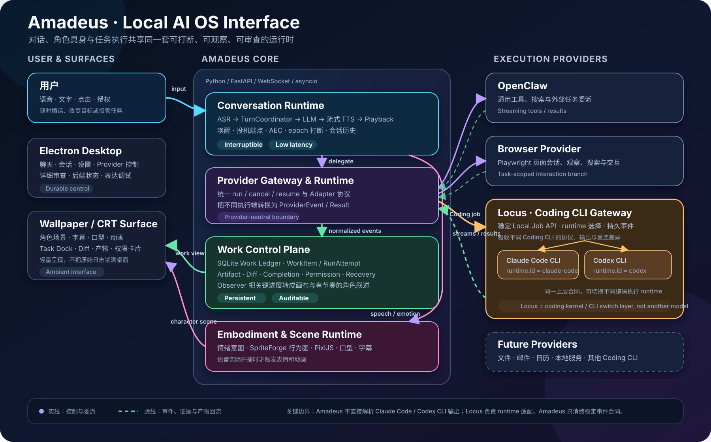

<div align="center">

# Amadeus

**具身实时桌面 AI Agent · 面向本地 AI OS 的交互界面**

[观看 B 站演示](https://www.bilibili.com/video/BV1783G6hEYY/)

</div>

> [!IMPORTANT]
> Amadeus 的源码正在整理与发布审计中。当前仓库用于公开项目进展和承接后续源码发布，暂未包含可供构建运行的源代码，因此目前还不构成正式的开源发布。

## Amadeus 是什么

Amadeus 是一个以**实时对话、角色具身、桌面感知和任务执行**为核心的本地桌面 AI Agent。

它并不打算只做一个带立绘的聊天窗口，也不打算把传统 IDE 缩小后塞进桌面。Amadeus 更像一层持续存在的 AI OS 交互界面：

- 用户可以随时通过语音或文字与角色交流，并在她说话时自然打断；
- 角色的语音、字幕、口型、情绪和动画沿同一条时间线同步发生；
- OpenClaw、Browser，以及经 Locus 接入的 Claude Code / Codex 等执行端在后台完成工作，Amadeus 负责意图理解、状态呈现、权限边界、结果解释和用户接管；
- 桌面上的角色与 CRT 工作画布提供轻量反馈，详细控制和审查则留给 Electron 主界面。

项目当前围绕实时对话、角色具身和任务执行三条相互连接的闭环演进。点击下图可以查看原始尺寸：

[](./assets/architecture-overview.svg)

## 演示

### 我在牧濑红莉栖生日这天把她装进了桌面｜这会是 Amadeus 的终极形态吗？

本次视频主要展示 Amadeus 的实时语音、角色表现和桌面交互：

**[前往哔哩哔哩观看演示](https://www.bilibili.com/video/BV1783G6hEYY/)**

Coding Agent 和游戏陪玩等方向仍在继续开发，后续将通过新演示和本仓库更新逐步公开。

## 当前已经实现的核心能力

### 1. 可打断的实时语音对话

- **共享麦克风与多 ASR 后端**：支持 Qwen3-ASR、SenseVoice 等识别路径，并统一管理麦克风、设备选择、监听和空闲释放。
- **唤醒与连续对话**：唤醒词、一次性监听和连续会话共享同一套语音生命周期。
- **两段式投机端点**：在最终静音端点确认前并行启动转写，缩短用户说完到系统开始理解之间的等待。
- **AEC 与回声保护**：将实际播放音频送入回声参考链，降低角色把自己的声音重新识别成用户输入的概率。
- **自然插话与全链路打断**：用户说话时可以中止正在进行的 LLM 输出、待合成语句和物理播放；epoch 机制阻止旧轮次的文本或音频在打断后“复活”。
- **统一轮次账本**：`TurnCoordinator` 管理轮次身份、确认/作废、聊天/TTS/播放 epoch 和真正的播放完成时刻。

### 2. 流式 LLM、TTS 与字幕时间线

- **多 LLM 后端**：支持 DeepSeek、Gemini、AWS Bedrock、OpenAI 兼容接口和本地模型服务。
- **Hybrid 对话路径**：可由本地模型快速生成首句，再由远端模型接力后续内容。
- **边生成边说话**：LLM 流式输出经过标签解析和分句后立即进入 TTS，不等待整段回复完成。
- **有序并发播放**：TTS 可以并发合成，`PlaybackManager` 保证语句仍按原顺序播放，并在中断时丢弃过期音频。
- **反压与句子调度**：通过有界队列、首句优先、语句聚合和播放余量估计，在延迟与自然连贯之间动态取舍。
- **双轨字幕**：原文和翻译字幕跟随实际播放进度，而不是只跟随模型文本生成进度。
- **可替换语音后端**：当前低延迟语音能力与 [Aqua-TTS](https://github.com/Lucas1479/Aqua-TTS) 协同开发。

### 3. 与语音同步的角色表现

- **情绪意图标签**：LLM 可以输出结构化情绪/行为意图，运行时会剥离控制标签，不让它们出现在正常台词中。
- **播放时刻才触发表演**：表情动作绑定到具体句子，并在该句真正开始播放时触发，避免表情先于语音发生。
- **SpriteForge 图状态机**：通过带权节点图、触发入口搜索、说话/待机/思考状态和自然过渡驱动角色动画。
- **PixiJS 与无头渲染桥**：Python 后端发送结构化渲染事件，前端运行时负责高频动画和场景表现，减少后台调度抖动。
- **口型、字幕与状态同步**：播放振幅驱动口型，语句生命周期驱动字幕和说话状态。
- **多渲染路径**：当前主路径是 SpriteForge + 前端场景运行时，同时保留 Live2D / VTuber Studio 等兼容能力。

### 4. 桌面壁纸场景与 CRT 工作界面

- **桌面角色场景**：支持桌面壁纸/场景化呈现，而不只是独立聊天窗口中的立绘。
- **Wallpaper Engine / Lively 桥接**：通过本地资源服务和事件流把角色、字幕、动画和工作状态投射到壁纸运行时。
- **CRT Canvas**：在场景内展示 Markdown、工作流、结构化 Diff、文件、命令、图片、任务状态和权限卡片。
- **场景行为联动**：对话、思考、说话和 Provider 工作会驱动不同的角色行为状态。
- **晚连接状态重放**：壁纸或渲染页面重新连接后，可以恢复当前表情、说话、字幕、画布和行为图状态。

### 5. Provider Runtime：把执行能力放在统一边界之后

Amadeus 不要求所有任务都由主对话模型亲自执行。它通过统一的 Provider Runtime 接入不同执行端：

- **OpenClaw**：通用工具调用、搜索和外部任务委派；
- **Browser Provider**：基于 Playwright 的页面打开、搜索、观察、文本点击和连续会话；
- **Locus / Coding CLI Gateway**：面向代码仓库、终端、文件修改、测试和 Diff 的编码执行入口，在同一份任务合同下选择 **Claude Code CLI** 或 **Codex CLI**；
- **未来 Provider**：文件、邮件、日历及其他本地或在线服务。

Provider Runtime 统一处理运行、取消、实时事件、语义进度、工具调用、终端输出、产物、权限请求和最终结果。执行端负责完成工作，Amadeus 负责让工作过程可见、可打断、可审查。

#### Locus 与 Claude Code / Codex 的关系

Locus 不是第三个 Coding Agent，也不是另一个模型。它更接近一个面向 Coding CLI 的稳定接入层或 runtime switch：

```text
Amadeus
  → Locus Local Job API
      → runtime.id = claude-code  → Claude Code CLI
      → runtime.id = codex        → Codex CLI
```

Amadeus 向 Locus 提交任务、工作目录、模式和 runtime 选择；Locus 负责启动相应 Coding CLI，并吸收不同 CLI 的协议、流式输出、持久化和断线续读差异。返回 Amadeus 的始终是统一的运行状态、工具事件、终端输出、文件产物、Diff 和最终结果。

这种分层类似于 Coding CLI 的切换与适配层，但还额外提供了稳定 Job API、事件序列和任务恢复能力。因此 Amadeus 不需要分别耦合 Claude Code 与 Codex 的内部输出格式。

### 6. 持久任务控制面

- **SQLite Work Ledger**：把用户目标保存为持久 `WorkItem`，而不是把一次 Provider 运行误认为整个任务。
- **任务与尝试分离**：同一任务可以 Continue、Retry、Resume；每次执行都有独立 `RunAttempt` 和证据边界。
- **多维状态模型**：分别记录执行结果、目标完成度、是否需要用户介入以及用户最终处置；“进程成功退出”不等于“用户目标已经完成”。
- **重启恢复**：运行时重启后能够恢复任务、尝试、焦点、权限和可继续处理的孤立状态。
- **Task Dock**：在桌面 Slice 中区分当前任务、需要用户处理的任务和历史任务，并支持 focus、pin、continue、retry、accept、reopen、archive 等动作。
- **Artifact Registry 与 Completion Evaluator**：发现文件、Diff 和外部产物，并结合证据判断任务是完成、部分完成还是仍被阻塞。
- **结构化 Diff**：按一次尝试的 Git baseline 展示文件导航、hunk 和双行号 Diff，而不是只显示一段不可交互的文本。
- **并发任务呈现保护**：一个任务结束时不会错误清除仍在运行的兄弟任务状态。

### 7. 权限、产物与可审计性

- **明确作用域的权限对象**：权限请求绑定具体 WorkItem、RunAttempt、动作、能力、目标范围和幂等身份。
- **一次性本地导出**：外部产物可先进入暂存区，经过用户允许后再由宿主侧事务性导出到准确目标。
- **过期与重复操作保护**：画布动作携带版本和选择身份，服务端拒绝 stale revision 及重复决策。
- **窄化本地动作接口**：打开文件、定位目录、查看 Diff、运行受控命令等动作走本地 token 和白名单路由，不把网页画布变成任意执行入口。
- **叙述与原始日志分离**：角色只播报意图、关键进展、阻塞和结果；详细工具事件保留在画布或审计记录中。
- **叙述节奏治理**：工作事件会合并、限流，并避让正常对话和正在播放的语音，防止角色把日志逐条念出来。

### 8. 有上下文边界的浏览器交互

- 浏览器技术会话可以跨页面导航持续存在，但语义任务使用独立的短生命周期 Interaction Branch。
- 当前页内的点击、填写、观察和提取可以继续复用同一浏览器状态。
- 当用户切换网站或任务目标时，旧分支会被关闭或替换，避免先前页面目标污染新请求。
- 原始 DOM、页面引用和 Provider trace 保持在分支内部，主聊天只合并有用结论和简洁上下文。
- 最新用户指令始终高于旧目标，主对话模型拥有 continue / new / close 的单一语义路由权。

### 9. Electron 控制面与本地优先架构

- **Electron 主界面**：提供聊天、会话管理、Provider、后端状态、表达控制和设置页面。
- **Python 无头后端**：FastAPI + WebSocket 负责 LLM、ASR、TTS、渲染、Provider 和工作控制面编排。
- **事件驱动边界**：前端、壁纸和渲染运行时通过结构化事件消费状态，而不是直接持有核心业务真相。
- **本地优先**：后端、壁纸桥和本地 Provider 默认绑定本机；模型后端可按场景选择云端或本地。

## 实验能力与当前边界

以下能力已经有代码、原型或后端 MVP，但尚不能等同于首次公开版本中的稳定功能：

| 能力 | 当前状态 |
|---|---|
| 自动 Worktree 隔离 | 代码和离线测试已完成，默认开关仍关闭，等待完整真机验收 |
| 多模态视觉运行时 | 浏览器观察链已工作；通用屏幕/窗口/摄像头视觉上下文仍在收敛，目标是显式、可控、隐私友好的按需观察 |
| VN Player | 后端 MVP 已支持脚本文本匹配、有限前瞻、角色反应决策、上下文存储及玩家 note/ask/pin；前端控制和通用 Hooker 桥仍待完成 |
| Google Live API | 保留为实验性实时模式，长期会作为可选 Provider，而不是第二套默认对话人格 |
| 完整权限 Broker | 已有持久权限对象、一次性导出和拒绝/重试链；更细粒度的能力租约与所有 Provider 的统一授权仍在建设 |
| 公开发行包 | 尚未完成依赖、素材、模型和许可证边界整理，目前不能直接安装运行 |

> [!NOTE]
> “仓库内部已经实现”不代表“已经整理为可复现的公开发行版”。当前内部运行环境仍包含本机模型、外部 Provider、角色素材和实验配置，首次源码发布会优先保证边界清晰、配置诚实和最小可运行。

## 开源进度

- [x] 建立公开仓库
- [x] 发布项目介绍与演示链接
- [ ] 冻结首次公开版本的功能与依赖边界
- [ ] 完成敏感信息和第三方许可证审计
- [ ] 移除或替换个人角色、语音、模型及本地运行资产
- [ ] 整理安装流程、配置示例和最小运行文档
- [ ] 发布首个可运行源码版本
- [ ] 确定并发布开源许可证

首次源码发布预计包含核心运行时代码、必要的配置示例和基础使用文档。具体范围以发布说明为准。

以下内容不会随源码直接发布：

- API Key、Token、个人配置和本地会话数据
- 模型权重及大型运行时文件
- 未获得再分发许可的角色、语音、图片和其他素材
- 日志、缓存、生成内容及个人知识库数据
- 依赖个人机器路径或尚未完成许可审查的实验环境

## 关于提交历史

本公开仓库的提交历史从开源准备阶段开始。此前的内部研发历史会保留在私人仓库中，不会直接公开；正式发布的源码将作为经过整理和审计的公开版本提交到这里。

## 相关项目

- [Aqua-TTS](https://github.com/Lucas1479/Aqua-TTS)：为 Amadeus 优化的 GPT-SoVITS V3 实时推理运行时
- [GPT-SoVITS](https://github.com/RVC-Boss/GPT-SoVITS)：语音合成推理基础

## 当前许可证状态

本仓库目前尚未发布源码，也尚未选择开源许可证。在许可证随首个源码版本正式公布之前，请勿将当前仓库视为已经授予代码使用或再分发许可。

欢迎 Star 或 Watch 本仓库以关注源码发布进度。

---

*El Psy Kongroo.*
