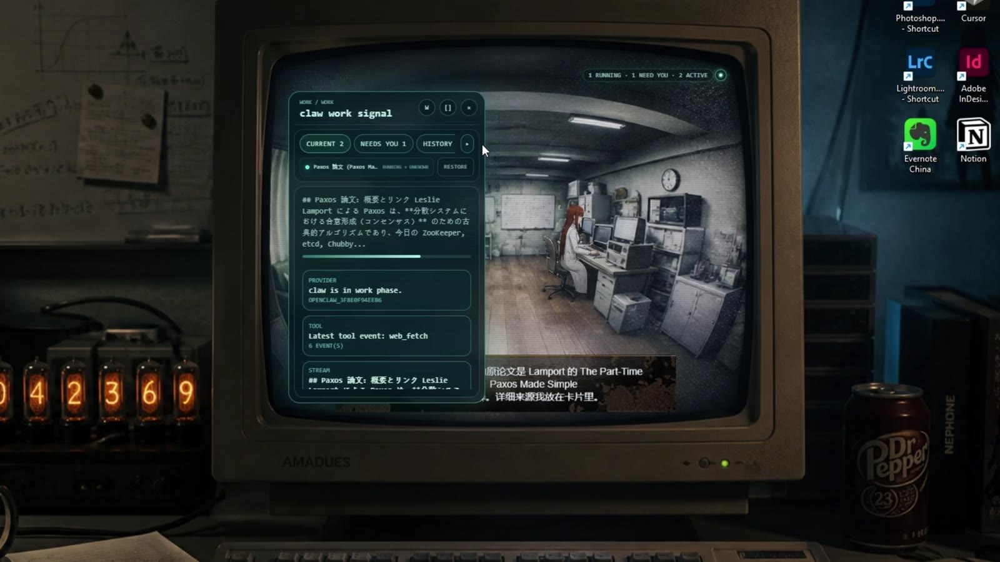
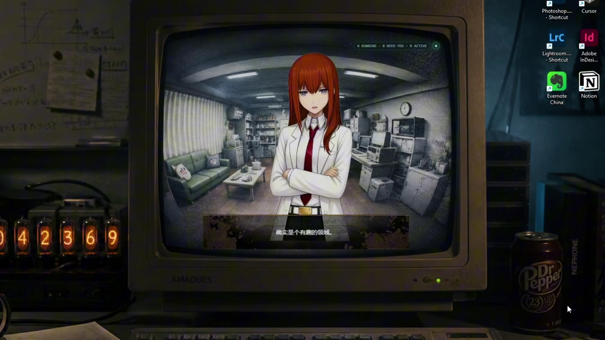
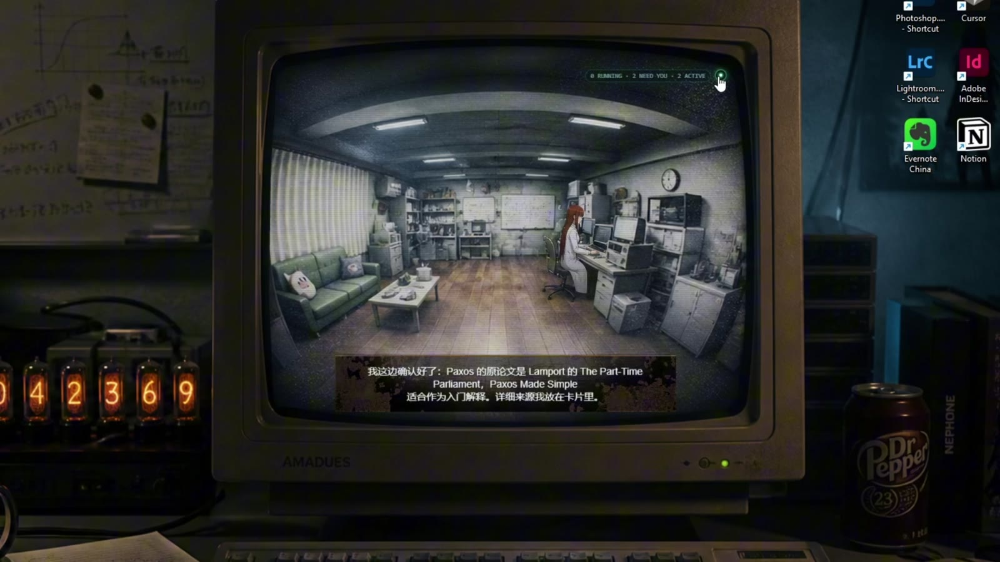
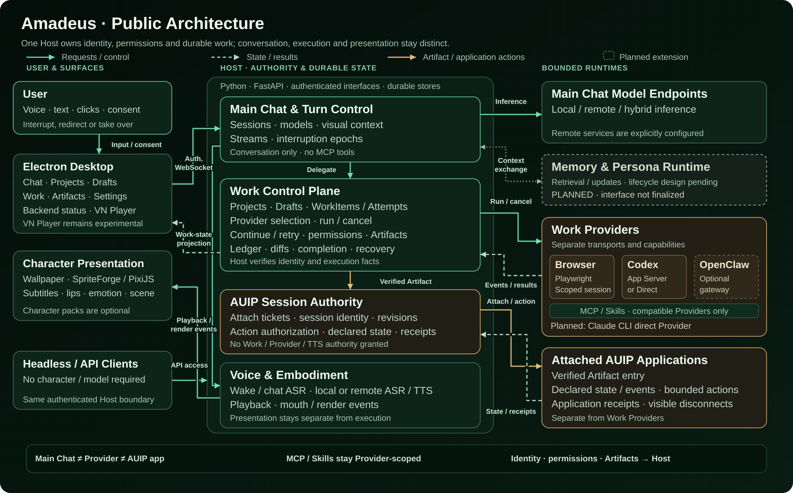
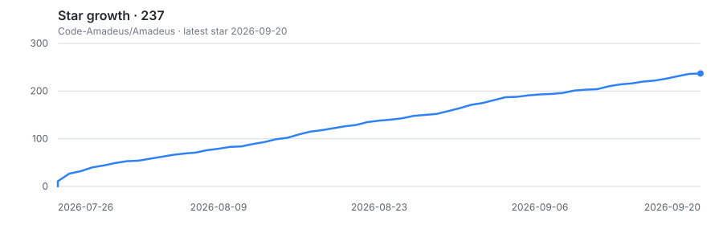

<div align="center">

<h1>Amadeus: Real-Time Multimodal AI Agent for Desktop Interaction</h1>

<p>An interaction layer for a local AI OS</p>

<p>
  <a href="./README.md">中文</a> | English
</p>



<p>
  <a href="https://www.bilibili.com/video/BV1783G6hEYY/"></a>
  <a href="./assets/architecture-overview-crt.svg"></a>
  
  
  
</p>

[](https://www.bilibili.com/video/BV1783G6hEYY/)

<sub>Click the image to watch the full 10-minute demo</sub>

</div>

> [!IMPORTANT]
> This repository contains buildable, runnable source. The current version is
> **0.1 α**, not a packaged desktop release.
> First-party code is licensed under
> [PolyForm Noncommercial 1.0.0](LICENSE): noncommercial use, modification, and
> redistribution are permitted; commercial use requires separate written
> permission. Third-party code and external assets retain their own terms.

## What Amadeus is trying to solve

Voice assistants, desktop characters, and execution agents usually live in
separate windows: one chats, one performs, and another works in a terminal or
browser. Once a long task starts, it is difficult to see what is happening,
which permission is needed, or whether the work can recover after a failure.

Amadeus connects those experiences into one loop:

1. **Talk — communicate naturally:** speak or type, with interruption across generation, synthesis, and physical playback.
2. **Embody — make the agent present:** voice, subtitles, lip sync, expression, and scene behavior share one playback timeline.
3. **Act — delegate real work:** the main role delegates to registered Work Providers instead of receiving every tool directly.
4. **Control — stay in charge:** Projects, Drafts, Artifacts, progress, permissions, diffs, and results remain visible and recoverable.

The character communicates and narrates, specialized Providers execute, and
the Host owns identity, state, permissions, persistence, and recovery.

## Demo highlights

| Real-time conversation and performance | Scene-aware working state |
|---|---|
|  |  |
| Voice, subtitles, lip sync, and expression follow actual playback. | Background work drives character behavior, scene state, and result narration. |

The video demonstrates real-time voice, character performance, desktop scenes,
Browser / OpenClaw tasks, and a paper-research flow. The desktop UI, Provider
integration, and asset boundaries have continued to evolve, so the video is a
product slice rather than a pixel-exact installation preview.

> [!NOTE]
> Characters, scenes, voices, and other third-party material visible in the
> demo are used only to present the prototype. They are not granted rights by
> the Amadeus code license. Public source does not include character packs,
> model weights, reference audio, or authoring intermediates without confirmed
> redistribution rights.

## Current capabilities

| Area | Current public source |
|---|---|
| **Interruptible real-time conversation** | Shared microphone lifecycle, independent Wake / Conversation ASR, two-stage endpointing, AEC / barge-in, and interruption across LLM, TTS, and physical playback. |
| **Local models and voice** | llama.cpp Main Chat; Qwen3-ASR / SenseVoice; embedded GPT-SoVITS v3 streaming synthesis, continuous playback, and mouth values published before matching PCM windows. |
| **Character and desktop presentation** | SpriteForge graph state, a KTX2/PixiJS runtime, subtitle, lip-sync, and emotion timing; Chat, Work, and headless startup remain available without a character pack. |
| **Provider Runtime** | Browser, Codex App Server / Direct Codex, and optional OpenClaw are current Providers. Claude CLI is a committed future direct Provider. |
| **Durable Work control plane** | Projects, default Drafts, WorkItems / Attempts, Continue / Retry, restart recovery, permissions, the Artifact Registry, and structured diffs. |
| **Artifacts and AUIP** | A Work Artifact can be previewed, opened, or attached as a bounded AUIP AppSession so Amadeus can interact with it without turning narration into execution authority. |
| **Unified settings** | Models, Voice, Providers/MCP, vision, character-pack status, and chat appearance are managed in Electron Settings. |

MCP and Skills remain compatible-Provider capabilities even when they share a
Host registry; **Main Chat cannot invoke MCP tools directly**. Remote Chat,
ASR, and TTS are explicit compatibility routes. A local failure never silently
uploads data or creates a second billable request.

## Architecture

[](./assets/architecture-overview-crt.svg)

Three separations are deliberate:

- Main Chat, Work Providers, and AUIP applications are distinct authority domains.
- A shared MCP/Skill registry does not expose those capabilities directly to Main Chat.
- Artifacts, identity, permission, and receipts are Host-verified facts; model narration cannot replace them.

Codex currently connects through App Server or Direct transport without the
retired Locus gateway. Claude CLI will join the same boundary later as an
independent direct Provider, not by restoring Locus.

## AUIP application sessions

AUIP is Amadeus's cooperative application protocol. It is not a Provider, MCP,
or Main Chat tool system. It addresses a different problem: once Work has
created a runnable Artifact, how can Amadeus continue collaborating with that
application while preserving Host authority?

```text
verified Work Artifact
  -> Host prepares a short-lived attach ticket
  -> application registers declared state/events/actions
  -> bounded AppSession
  -> character receives scoped projection and action receipts
```

- The ticket binds the current Session, an immutable Artifact reference, and a TTL. The application submits an Artifact id, not an arbitrary path.
- The Host validates workspace ownership, type, digest, and launch entry, and owns AppSession identity, revision, and action authority.
- The application may publish only declared state and semantic events and receive only declared, authorized typed actions.
- AUIP grants no `work.*`, `provider.*`, `tts.*`, arbitrary filesystem, or other-Session authority.
- Disconnects become visible state and invalidate pending actions instead of continuing against stale application state.

The current schema is `amadeus.auip/v0` and is implemented here. See
[AUIP application sessions](docs/auip_application_sessions.md). The separate
[Code-Amadeus/auip](https://github.com/Code-Amadeus/auip) repository is still a
public namespace placeholder; this release does not claim a standalone SDK or
conformance suite.

## Quick start — CUDA 12.4 local baseline

The first release follows the current full local Amadeus experience: Windows
11, CUDA 12.4, local llama.cpp, Qwen/SenseVoice, and GPT-SoVITS v3.
CPU/model-less and third-party APIs remain compatibility routes.

### Reference hardware

- Windows 11
- CPython **3.12** (`3.12.10` is the current reference)
- Node.js **22** (`22.21.1` is the current reference)
- CUDA 12.4-compatible NVIDIA GPU, targeting **8 GiB VRAM**
- **16 GiB system RAM minimum; 32 GiB recommended**

Peak memory depends on LLM size, context, llama.cpp offload, and which voice
models remain resident. This target describes the intended first-release
configuration; it cannot guarantee every model combination fits in 8 GiB.

### Install

```powershell
git clone https://github.com/Code-Amadeus/Amadeus.git
cd Amadeus

py -3.12 -m venv .venv_cu124
.\.venv_cu124\Scripts\python.exe -m pip install --upgrade pip==26.2 setuptools==83.0.0 wheel==0.47.0
.\.venv_cu124\Scripts\python.exe -m pip install -r requirements-cu124.txt
.\.venv_cu124\Scripts\python.exe -m pip install --no-deps --no-build-isolation -e .
.\.venv_cu124\Scripts\python.exe tools\verify_python_environment.py --profile cu124 --require-cuda-device

cd electron
npm ci
npm run build
cd ..
```

`npm ci` uses the project postinstall hook to fetch the pinned Electron runtime.
The cu124 profile fixes `torch==2.5.1+cu124`, `torchaudio==2.5.1+cu124`, and the
local-model dependency set. It follows the current working installation for
the first release without claiming a universal one-click guarantee on every
fresh machine.

### Configure and launch

```powershell
Copy-Item .env.example .env
```

Replace relevant `<...>` placeholders, then review:

- **Models:** `local`, llama.cpp endpoint/model, and external or managed launch;
- **Voice:** Qwen3-ASR / SenseVoice paths, GPT-SoVITS **v3** checkpoints, reference audio/text, microphone, AEC, and barge-in;
- **General:** optional character-pack status and presentation settings.

For an `external` llama.cpp profile, start it in another terminal:

```powershell
.\start_llm_server.bat
```

Then launch Amadeus:

```powershell
.\run_electron_cu124.bat
```

Use **Restart backend to apply** after changing startup settings. A
**Not installed** character pack is healthy and does not disable Chat, Work,
or headless startup.

## CPU and remote compatibility routes

CPU/model-less remains available for CI, headless development, and text
Chat/Work:

```powershell
py -3.12 -m venv .venv
.\.venv\Scripts\python.exe -m pip install --upgrade pip==26.2 setuptools==83.0.0 wheel==0.47.0
.\.venv\Scripts\python.exe -m pip install -r requirements.txt
.\.venv\Scripts\python.exe -m pip install --no-deps --no-build-isolation -e .
.\.venv\Scripts\python.exe tools\verify_python_environment.py --profile cpu
$env:AMADEUS_PYTHON = (Resolve-Path .\.venv\Scripts\python.exe)
.\run_electron_utf8.bat
```

Set `TTS_BACKEND=disabled` and disable Wake for a strict text-only profile.
OpenAI-compatible remote ASR/TTS and remote Chat Providers can be selected
explicitly in Settings, but they are not the first-release default experience.

### Optional remote model recommendations

These are recommended profiles for the current APIs. They do not replace the
local baseline, and Amadeus never switches Providers silently after an endpoint
failure:

| Responsibility | Recommended profile | Current boundary |
|---|---|---|
| Main Chat API | DeepSeek-V4-Flash-0731: `DEEPSEEK_BASE_URL=https://api.deepseek.com` and `DEEPSEEK_MODEL_NAME=deepseek-v4-flash` | `deepseek-v4-flash` is the stable API alias currently pointing to the 0731 release; the dated version is not used as the runtime model id. |
| Multimodal / Vision | Prefer `gemini-3.7-flash`; use `gemini-3.5-flash` as a more conservative compatibility profile | Host-owned visual context performs capture in-process, while image delivery still follows the Main Chat Provider. Independent Gemini Vision API routing is not implemented and does not imply restoring the retired Gemini Live sidecar. |
| Work execution Provider | Prefer Codex App Server; use the optional OpenClaw Gateway second | This is a recommendation order, not an automatic failure fallback. Browser remains the specialized Provider for web tasks. |
| Work execution model | Codex App Server may explicitly select a GPT-5.6-family model or `deepseek-v4-flash` | The execution model belongs to the Work Provider and does not share Main Chat routing or credentials. |
| AUIP runtime action decisions | `AUIP_ACTION_PROVIDER=openai`, `AUIP_ACTION_MODEL=gpt-5.6-terra`, `AUIP_ACTION_REASONING_EFFORT=low`, and `AUIP_ACTION_SERVICE_TIER=fast` | This model decides AppSession actions and participation; it is not the execution Provider that authors an AUIP Artifact. `fast` requires availability for the API project. |

## External models and runtime assets

Model weights, reference audio, character packs, and large or copyright-
sensitive media are distributed separately. The source repository keeps the
required icons, default wallpaper, schemas, validators, and installation tool.

```powershell
py -3.12 tools\external_assets.py verify C:\path\to\asset-bundle.zip
py -3.12 tools\external_assets.py install C:\path\to\asset-bundle.zip
py -3.12 tools\external_assets.py status
```

A SpriteForge character package ultimately lands at:

```text
assets/spriteforge/runtime/kurisu/
  runtime_manifest.json
  graph_config.json
  spriteforge_mouth_config.json
  textures/
```

The installer preserves the canonical `assets/...` layout, verifies SHA-256,
skips identical files, and rejects unexpected overwrites. See
[external asset bundles](docs/external_asset_bundles.md) and the
[character-pack contract](docs/character_pack_authoring.md).

## Configuration ownership

Startup values use one precedence order:

1. Parent-process environment variables (highest authority; shown as locked in the GUI)
2. Electron desktop settings
3. Repository-root `.env`
4. Defaults in `config/settings.py`

Settings never rewrites `.env`. Ordinary models, voice, microphones,
Providers/MCP, vision, avatars, and character-pack status belong in the GUI;
advanced diagnostics, experimental thresholds, and test-only flags remain in
`.env`. Secrets use the operating system's `safeStorage` encryption. See
[configuration ownership](config/README.md) and
[local instance authentication](docs/local_instance_authentication.md).

## Current release boundaries

| Scope | Status |
|---|---|
| Windows + CUDA 12.4 local experience | First-release product baseline, following the current working installation |
| 8 GiB VRAM / 16–32 GiB RAM | Target configuration; actual use depends on model selection |
| CPU/model-less | CI and compatibility path |
| Remote Chat / ASR / TTS | Explicit compatibility path, never a silent fallback |
| Electron installer | Not provided yet; launch from source |
| Docker | Not a supported desktop installation path |
| SpriteForge character pack | Externally distributed; source starts without it |
| VTS | Disabled-by-default compatibility route |
| VN Player | Experimental |
| PyQt / old wallpaper hosts | Retired from public mainline |
| Claude CLI Provider | Committed future mainline Provider; no live caller yet |
| Multi-platform support | Future direction, not a current support promise |

## Development and contribution

```powershell
.\.venv\Scripts\python.exe -m pip install -r requirements-dev.txt
.\.venv\Scripts\python.exe -m pip install --no-deps --no-build-isolation -e .
.\.venv\Scripts\python.exe tools\verify_python_environment.py --profile ci
.\.venv\Scripts\python.exe -X utf8 tools\run_tests.py

cd electron
npm run build
npm audit --audit-level=high
```

Read [CONTRIBUTING.md](CONTRIBUTING.md) and [ROADMAP.md](ROADMAP.md) before
submitting a change. Product semantics, authority, protocols,
Providers/MCP/Skills, Projects/Drafts/Artifacts, or AUIP changes should start
with an Issue. Small fixes, documentation, tests, and presentation-only UI
changes may open a PR directly. Report security issues privately under
[SECURITY.md](SECURITY.md).

## Repository map

```text
electron/       Electron main, preload, React renderer, and Settings
server/         authenticated local backend, Host control plane, and AUIP
core/           Main Chat runtime and session integration
agent_host/     Provider contracts, adapters, Work identity, and capabilities
asr/            Conversation / Wake recognition backends
tts/            synthesis backends, sentence pipeline, playback, and mouth signal
render/         SpriteForge runtime adapter and PixiJS renderer
wallpaper/      Electron/Lively hosts and Win32 desktop placement
vn_player/      experimental VN Player integration
assets/         Git-owned UI assets and external runtime-asset destinations
release/        public-source selection, provenance, and deterministic archive policy
```

`main.py` is not an application entry; it prints a retirement notice. The
Python entry is `python -m server.app --port 17777`, and the desktop launcher is
`run_electron_cu124.bat`.

## Public history and license

The public repository begins with one prepared root commit. Internal development
commits, experimental branches, deleted character media, models, credentials,
sessions, personal paths, and original co-author metadata were not migrated.
The source itself remains included according to the reviewed release boundary.

Amadeus first-party source and modifications use
[PolyForm Noncommercial 1.0.0](LICENSE). This is a public-source,
noncommercial license, not an OSI open-source license. Third-party components
are recorded under [LICENSES](LICENSES/README.md) and
[THIRD_PARTY_NOTICES.md](THIRD_PARTY_NOTICES.md). The code license grants no
automatic rights to character, model, reference-audio, or external asset packs.

## Related projects

- [Aqua-TTS](https://github.com/Lucas1479/Aqua-TTS): an MIT-licensed low-latency GPT-SoVITS v3 inference runtime. Amadeus does not require Aqua to start today.
- [Amadeus SpriteForge](https://github.com/Code-Amadeus/amadeus-spriteforge): the public namespace for the character authoring and graph/KTX2 toolchain; currently a release placeholder.
- [AUIP](https://github.com/Code-Amadeus/auip): the public namespace for the application-session / typed-action protocol; currently a release placeholder.
- [GPT-SoVITS](https://github.com/RVC-Boss/GPT-SoVITS): the embedded speech-synthesis inference foundation.
- [OpenClaw](https://github.com/openclaw/openclaw): an optional external Work gateway.

<details>
<summary>Star History</summary>
<br />
<p align="center">
  <a href="https://github.com/Code-Amadeus/Amadeus/stargazers">
    
  </a>
</p>
</details>

---

<div align="center"><em>El Psy Kongroo.</em></div>
