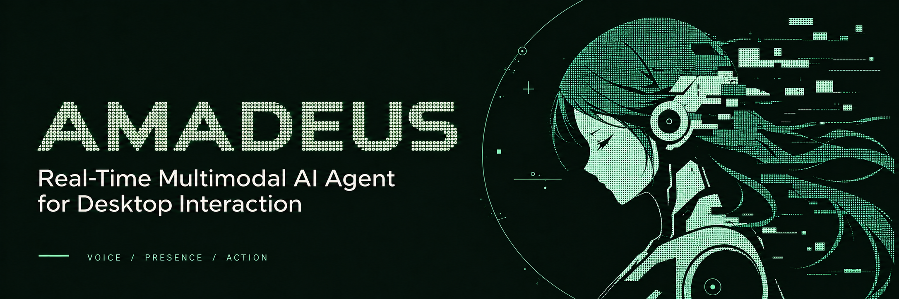
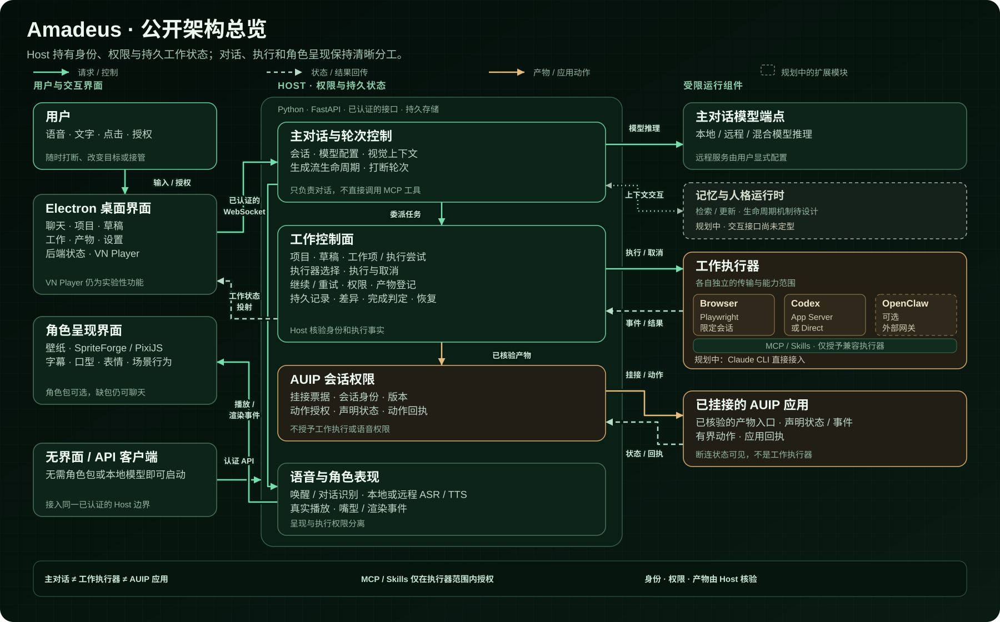

<div align="center">

<p></p>

<p><picture>
  <source media="(max-width: 600px)" srcset="./assets/header-strip.zh.mobile.svg"/>
  
</picture></p>

<p>
  <a href="https://www.bilibili.com/video/BV1783G6hEYY/"></a>
  <a href="#系统架构"></a>
  <a href="./docs/alpha-0.15.md"></a>
  <a href="./LICENSE"></a>
  <br/>
  <a href="#快速开始"></a>
  <a href="#快速开始"></a>
  <a href="#linux"></a>
</p>

<p><a href="./README.md">English</a> · <strong>简体中文</strong></p>

<p>
  <sub><strong>本地模型:</strong> <a href="./docs/install_profiles.md">NVIDIA CUDA cu124</a> &nbsp;·&nbsp; <a href="./tools/rocm_sidecar/README.md">AMD ROCm / Windows (实验性)</a> &nbsp;·&nbsp; <a href="./docs/torch27_candidates.md">Apple MPS</a></sub>
  <br/>
  <sub><a href="#快速开始">快速开始</a> &nbsp;·&nbsp; <a href="./docs/install_profiles.md">安装配置</a> &nbsp;·&nbsp; <a href="#开发与贡献">参与开发</a></sub>
</p>

</div>

Amadeus 是一个**实时多模态桌面 Agent**，将语音、角色表现与 Agent 工作连接在同一个交互界面中。你可以通过语音或文字交流，把任务交给专业 Provider，并随时查看进度、审批权限或接管工作。

桌面应用与 Host 在本地运行，模型按配置使用远程服务或本地推理；角色包是可选项，缺包时仍可使用 Chat 与 Work。

## Amadeus 想解决什么

语音助手、桌面角色与执行型 Agent 往往分散在不同窗口：一个负责聊天，一个
负责表演，另一个在终端或浏览器中工作。长任务开始后，用户又很难知道它进行
到了哪里、需要什么权限，以及失败后能否继续。

Amadeus 试图把这些体验连成一个闭环：

1. **Talk — 自然交流**：语音或文字对话，并能在生成、合成和真实播放过程中随时打断。
2. **Embody — 角色具身**：语音、字幕、口型、表情和场景行为沿同一条播放时间线发生。
3. **Act — 委派执行**：主角色把工作交给注册的 Work Provider，而不是直接获得所有工具。
4. **Control — 保持掌控**：Project、Draft、Artifact、进度、权限、Diff 和结果保持可见，并可继续、重试或接管。

角色负责交流和叙述，专业 Provider 负责执行，Host 负责身份、状态、权限、
持久化与恢复。

> [!IMPORTANT]
> 本仓库包含可构建、可运行的公开源码，本分支为 **0.15 Alpha 候选版**，
> 不是带安装器的正式桌面发行版。Amadeus 第一方代码依据
> [GNU Affero General Public License v3.0（AGPL-3.0）](LICENSE) 开源。
> 第三方代码与外部资产保留各自条款。
>
> **想先跑起来？** → [快速开始](#快速开始)。想先了解项目，从
> [Amadeus 想解决什么](#amadeus-想解决什么) 开始。

## 演示切片

[](https://www.bilibili.com/video/BV1783G6hEYY/)

点击画面观看 10 分钟完整演示。

| 实时对话与角色表现 | 场景化工作状态 |
|---|---|
|  |  |
| 语音、字幕、口型与表情绑定到真实播放进度。 | 后台任务驱动角色行为、场景状态和结果叙述。 |

演示视频展示了实时语音、角色表现、桌面场景、Browser / OpenClaw 任务以及
论文检索流程。当前源码的桌面界面、Provider 接入和资产边界已经继续演进，
视频应被视为一次产品切片，而不是逐像素安装预览。

> [!NOTE]
> 顶部横幅是品牌插画，演示截图展示实际原型。横幅和演示中的角色、场景、声音
> 及其他第三方素材不属于 Amadeus
> 代码许可证授权范围。公开源码不包含未获得再分发许可的角色包、模型权重、
> 参考音频或创作中间资产。

## 当前核心能力

| 能力 | 当前公开源码 |
|---|---|
| **可打断实时对话** | 共享麦克风生命周期、独立 Wake / Conversation ASR、两段式端点、AEC / barge-in，以及贯穿 LLM、TTS 与物理播放的中断。 |
| **远程主 Chat 与本地语音** | DeepSeek V4 Flash Main Chat；Qwen3-ASR / SenseVoice；内嵌 GPT-SoVITS 流式合成（默认 v3，可选实验性 v2Pro）、连续播放与播放前口型发布。 |
| **角色与桌面呈现** | SpriteForge 图状态、KTX2/PixiJS 运行时、字幕、口型和情绪同步；没有角色包时 Chat、Work 与 headless 仍可启动。 |
| **Provider Runtime** | [Pi 原生 RPC](docs/pi-rpc-provider.md) 默认负责日常任务，Codex App Server / Direct Codex 负责复杂开发，Browser 保留受管页面操作，OpenClaw 保留为可选 Provider；Claude CLI 是已确定的后续 direct Provider。 |
| **持久 Work 控制面** | Project、默认 Draft、WorkItem / Attempt、Continue / Retry、重启恢复、权限、Artifact Registry 与结构化 Diff。 |
| **Artifact 与 AUIP** | Work 产物可预览、打开，或在校验后附加为有界 AUIP AppSession，让 Amadeus 与应用交互而不把叙述变成执行权限。 |
| **统一设置入口** | Models、Voice、Providers/MCP、视觉、角色包状态和聊天外观在 Electron Settings 中集中管理。 |

MCP 与 Skills 即使共用 Host registry，也只授予兼容 Provider；**Main Chat
不能直接调用 MCP 工具**。远程 DeepSeek 是主 Chat 基线；远程 ASR/TTS 是显式
兼容路径，不会在本地语音失败后静默上传或产生第二笔计费请求。

## 仓库地图

```text
electron/       Electron main、preload、React renderer 与 Settings
server/         认证后的本地后端、Host 控制面与 AUIP
core/           Main Chat runtime 与会话集成
agent_host/     Provider contracts、adapters、Work identity 与 capabilities
asr/            Conversation / Wake 识别后端
tts/            合成后端、分句 pipeline、播放与口型信号
render/         SpriteForge runtime adapter 与 PixiJS renderer
wallpaper/      Electron/Lively host 与 Win32 桌面放置
vn_player/      Experimental VN Player integration
assets/         Git-owned UI 资产与外部 runtime 资产落点
release/        公开源码选择、provenance 与 deterministic archive policy
```

`main.py` 不是应用入口，只输出退役提示。Python 主入口是
`uv run --locked --no-sync python -m server.app --port 17777`，桌面入口是
Windows `run_electron_utf8.bat` / macOS `npm run electron:dev`（自动发现 `.venv`，L1–L4 通用）。

## 系统架构

[](./assets/architecture-overview-crt.zh.svg)

虚线框中的**记忆与人格运行时**是规划中的扩展模块，与主对话的双向点线表示拟议的上下文检索与更新；具体存储、记忆形成、人格更新及生命周期机制仍待设计。

图中有三个刻意的“不合并”：

- Main Chat、Work Provider 与 AUIP application 是不同权限域；
- MCP/Skills 不会因为 registry 共用而直接暴露给 Main Chat；
- Artifact、identity、permission 与 receipt 是 Host 核验的事实，模型叙述不能替代。

当前 Codex 由 App Server 或 Direct transport 接入，不依赖旧 Locus 网关。
Claude CLI 将在后续作为独立 direct Provider 进入同一边界，而不是恢复 Locus。

## AUIP 应用会话（application sessions）

AUIP 是 Amadeus 的 cooperative application protocol，不是 Provider、MCP 或主
Chat 工具系统。它解决的是：当 Work 已生成一个可运行 Artifact，用户如何在
保留 Host 权限边界的前提下，继续让 Amadeus 与这个应用协作。

```text
verified Work Artifact
  -> Host prepares a short-lived attach ticket
  -> application registers declared state/events/actions
  -> bounded AppSession
  -> character receives scoped projection and action receipts
```

- ticket 绑定当前 Session、不可变 Artifact 引用与有效期；应用提交 Artifact id，而不是任意路径。
- Host 校验 workspace 归属、类型、digest 和启动入口，并拥有 AppSession identity、revision 与 action authority。
- 应用只能发布 manifest 中声明的状态和语义事件，只能接收已声明且经过授权的 typed action。
- AUIP 不授予 `work.*`、`provider.*`、`tts.*`、任意文件系统或其他 Session 权限。
- 断连成为可见状态并使待确认动作失效，不会在陈旧状态上静默继续。

当前 schema 是实验性的 `amadeus.auip/v0`；协议实现、[Web SDK](sdk/auip-web/)、
[Managed Core](sdk/auip-core/)、应用示例和集成测试均位于本仓库。详见
[AUIP 应用会话文档](docs/auip_application_sessions.md)。
[Code-Amadeus/AUIP](https://github.com/Code-Amadeus/AUIP) 维护协议现状、实现入口与
后续 SDK 发布条件；目前尚未发布独立版本的 SDK 或独立 conformance suite。

## 快速开始

依赖按能力分四级：先装最小的 L1 跑通，再按需升梯（默认阶梯中 torch 在 L3/L4 进入安装；可选 RAG 也会引入
本地 embedding/Torch 依赖）。Windows 是当前参考平台，macOS 的 Apple Silicon MPS 与 Linux
源码运行路径均已实机跑通；macOS 的 L1/L2 安装与 CI 单独验证。L3 可选择 CPU VAD，**无需 NVIDIA GPU**；
L4 的当前 cu124 配置面向 Windows + NVIDIA。Windows ROCm 7.2.1 已有互斥的
`local-rocm` 实验锁与验证入口，面向 AMD 官方支持矩阵内的 GPU；Apple Silicon MPS
使用已验证的 `local-mps` 配置，RTX 50 系 cu128 仍为实验配置。
统一使用 [uv](https://docs.astral.sh/uv/) 与 Python 3.12，CI 固定 uv 0.12.8。

Linux 用户请从下方的 [Linux](#linux) 章节开始。

| 梯级 | 能力 | 平台 | 安装方式 |
|---|---|---|---|
| L1 core | 文字聊天、工作、Provider、角色渲染 | Windows / macOS | `uv sync --locked` |
| L2 voice | 说（远程 TTS、播放、口型）+ 听（麦克风、远程 ASR）| Windows / macOS | `uv sync --locked --extra voice` |
| L3 CPU VAD | 实时打断（角色说话时可以插话）| CPU，无 NVIDIA GPU 前提 | `uv sync --locked --extra voice --extra vad --extra torch-cpu` |
| L4 local-cu124 | 本地 GPT-SoVITS / Qwen3 ASR / 唤醒词 | Windows + NVIDIA GPU | `uv sync --locked --extra voice --extra vad --extra local-cu124` |
| 实验 local-rocm | 本地 GPT-SoVITS / Qwen3 ASR sidecar | Windows + AMD 官方矩阵内 GPU | `uv sync --locked --extra voice --extra vad --extra local-rocm` |

各安装配置均使用**同一个 `.venv`**。每次给出完整目标配置：
`uv sync` 会精确同步，漏带会移除已装层。`torch-cpu`、`local-cu124`、`local-cu128`、`local-mps` 与
`local-rocm` 两两互斥；切换构建时替换对应 extra，并保留 `voice`、`vad`。
详见[安装配置与迁移](docs/install_profiles.md)。

- 主 Chat 默认远程 DeepSeek；llama.cpp 是可选本地 LLM profile（见
  [兼容路径](#兼容路径)），不是安装前提。
- L2 无 vad 层时，语音端点自动降级为能量检测；安装 vad 后恢复
  silero 精准端点与打断。
- Windows 上每装完一级可验证导入合同（`ci` 同 `cpu`）：
  `uv run --locked --no-sync python tools/verify_python_environment.py --profile <cpu|voice|vad-cpu>`，
  L4 用 `--profile cu124 --require-cuda-device`；ROCm 实验入口用 `--profile rocm`
  并继续执行 GPU compute probe。导入/构建验证不替代真实模型与音频设备测试。
- 纯文字 / headless（CI）场景用 L1 即可：`uv run --locked --no-sync python -m server.app --port 17777`
  直接启动后端；严格文字模式设置 `TTS_BACKEND=disabled` 并关闭 Wake。

### 参考硬件

**L1/L2（Windows / macOS）**

- CPython **3.12**（由 uv 管理，无需系统安装）
- Node.js **22**（当前参考 `22.21.1`）
- 无 GPU 要求

**L4 cu124（Windows 本地模型）追加**

- CUDA 12.4-compatible NVIDIA GPU，目标 **8 GiB VRAM**
- **16 GiB 内存起步，32 GiB 推荐**

具体峰值取决于本地 ASR/TTS 模型与并发配置；8 GiB / 16–32 GiB
描述的是远程 Chat + 本地语音配置。选用本地 LLM 时需要按模型、量化、
context 和 GPU offload 另行评估内存。

### 基础环境（L1/L2，Windows / macOS）

安装 uv（Windows：`winget install astral-sh.uv`；macOS：`brew install uv`），
然后克隆并按梯级安装——两个平台的命令完全一致：

```bash
git clone https://github.com/Code-Amadeus/Amadeus.git
cd Amadeus

uv venv .venv --python 3.12
uv sync --locked                              # L1 core
uv sync --locked --extra voice                # L2 voice（可选）
```

macOS 上 PyAudio（L2 语音采集）从源码编译，需要先 `brew install portaudio`。

venv 固定命名为 `.venv`：Electron 启动器会自动发现它（Windows
`Scripts\python.exe`，macOS `bin/python3`），无需手动设置 `AMADEUS_PYTHON`。

Electron 前端（全平台）：

```bash
cd electron
npm ci
npm run build
cd ..
```

`npm ci` 会通过项目 postinstall 安装 Electron 和固定版本的 Pi 运行时，桌面用户
无需另外安装默认日常工作 Agent，也不需要再做一次 Agent 登录。默认 Pi 连接复用
Settings -> Models 或 `.env` 中主 Chat 的 `DEEPSEEK_API_KEY`；重启后端时会先检查
固定版本运行时和所选模型凭据，再把 Pi 标记为可用。纯后端安装、原生认证和自定义
模型地址见 [Pi 配置说明](docs/pi-rpc-provider.md)。
国内网络可为 npm/Electron 配置镜像（如 `ELECTRON_MIRROR=https://npmmirror.com/mirrors/electron/`）。

### Linux

**Linux 源码运行路径已在实机上跑通。**
[第一阶段 Linux CI（#63）](https://github.com/Code-Amadeus/Amadeus/pull/63) 已通过
Ubuntu 24.04 上的 L1 + dev 锁定安装、环境导入与无模型依赖检查、基础契约测试、
Ruff、架构视图检查及 Electron 构建。另有独立 Voice source-build CI，验证锁定安装、
AEC 导入、bundled Abseil 选择及相关契约。CI 不覆盖 Electron GUI、真实音频设备、
VAD/本地模型推理、Wayland 会话或壁纸集成。
另有 cu128 候选安装、依赖和 CPU VAD 回切检查，均不替代真实 GPU 模型验收。

社区已报告 Arch Linux / Wayland 下的桌面与角色渲染等实机结果；这些结果不代表
所有发行版或桌面环境均已验证。环境记录、已知问题和后续进展见
[Linux 跟踪 issue #64](https://github.com/Code-Amadeus/Amadeus/issues/64)。

先安装 Git、[uv](https://docs.astral.sh/uv/)（CI 使用 `0.12.8`）和 Node.js 22
（CI 使用 `22.21.1`），从无需 GPU 或语音包的 L1 开始：

```bash
git clone https://github.com/Code-Amadeus/Amadeus.git
cd Amadeus
uv venv .venv --python 3.12.10
uv sync --locked
cp .env.example .env
```

编辑 `.env`，填写 `DEEPSEEK_API_KEY`，设置 `TTS_BACKEND=disabled`，并保持
`WAKE_ENABLED=false`，先验证文字路径。然后在项目根目录检查环境：

```bash
uv run --locked --no-sync python tools/verify_python_environment.py --profile cpu
```

在 Linux 图形桌面会话中构建并启动 Electron；启动器会自动发现
`.venv/bin/python3` 并启动后端：

```bash
cd electron
npm ci
npm run build
npm run electron:dev
```

桌面的 `npm ci` 同样会安装 Pi；默认 Pi 复用基础配置中的 DeepSeek 凭据，并在后端
启动时检查。自定义模型认证见 [Pi 配置说明](docs/pi-rpc-provider.md)。

如只需 headless 后端，可改为在项目根目录运行：

```bash
uv run --locked --no-sync python -m server.app --port 17777
```

需要远程语音、录音和播放时，可在同一 `.venv` 安装 L2。Ubuntu 24.04 先安装
CI 使用的源码构建前置包；其他发行版请使用对应的软件包名称：

```bash
sudo apt-get update
sudo apt-get install --no-install-recommends -y build-essential pkg-config portaudio19-dev
uv sync --locked --extra voice
uv run --locked --no-sync python tools/verify_python_environment.py --profile voice
```

语音、本地模型和桌面集成的组件说明：

- **Voice / AEC**：Linux 使用基于官方 `aec-audio-processing==1.0.1` sdist 的仓库内
  源码，强制选择 bundled Abseil 20240722.0，避免选中新版 system Abseil 导致的构建
  失败。该修改不更改系统 Abseil；Windows/macOS 继续使用 registry 包。来源、独立
  补丁与移除条件见 [AEC provenance](vendor/aec-audio-processing.PROVENANCE.md)。
  构建/导入通过不代表真实设备上的回声消除或完整语音交互已验收。
- **VAD / NVIDIA**：Linux CPU VAD 与 `local-cu128` 候选已有明确的 Torch 构建选择
  和安装/契约 CI；cu124 参考配置仍面向 Windows。真实 GPU 模型推理及完整语音
  交互继续按设备验收，见下方候选配置说明。
- **桌面 / 壁纸**：GUI 与 Wayland compositor 集成仍需分别验收；GNOME 的社区结果
  不代表 niri、KDE 或其他桌面也可用。

### VAD 与本地模型

与 L1/L2 共用同一个 `.venv`，选择完整的能力与构建组合：

**L3 vad — 实时打断**（torch 随之以 CPU 版进入安装）：

```powershell
uv sync --locked --extra voice --extra vad --extra torch-cpu
uv run --locked --no-sync python tools\verify_python_environment.py --profile vad-cpu
```

**L4 local-cu124 — 本地语音模型栈**：在同一 `.venv` 上选择 CUDA 配置，torch 换为
CUDA 12.4 构建（经 `pyproject.toml` 的 `[tool.uv.sources]` 路由到
PyTorch cu124 index，仅 Windows + 本 extra 生效）：

```powershell
uv sync --locked --extra voice --extra vad --extra local-cu124
uv run --locked --no-sync python tools\verify_python_environment.py --profile cu124 --require-cuda-device
```

L4 profile 固定 `torch==2.6.0+cu124`、`torchaudio==2.6.0+cu124` 和本地模型
依赖集；它以当前实际运行环境为第一版基线。

**实验 local-rocm（Windows）**：面向 AMD 官方 ROCm 7.2.1 Windows PyTorch
支持矩阵内的 GPU。同一 `.venv` 可选择 ROCm 7.2.1、Torch/Torchaudio 2.9.1
与完整本地模型依赖；Qwen ASR 和 GPT-SoVITS 在常驻 sidecar 子进程中运行，
默认使用当前 `.venv` 的解释器。该配置与 cu124/CPU Torch 构建互斥。
安装后先进行环境检查与 GPU compute 验证，再加载模型。支持的硬件、安装命令
和验证步骤见 [Windows ROCm sidecar 指南](tools/rocm_sidecar/README.md)。

**Torch 2.7 配置**：`local-cu128`（Windows/Linux x86_64）与
`local-mps`（Apple Silicon）提供锁定的 Torch/Torchaudio 2.7.0 安装入口。
Apple Silicon MPS 已实机跑通；cu128 仍为 NVIDIA 实验配置。
现有 Windows cu124 仍保留为参考配置，Windows ROCm 继续使用 AMD 配套的 2.9.1。

```bash
# Windows/Linux NVIDIA 候选，包含完整模型依赖
uv sync --locked --extra voice --extra vad --extra local-cu128
uv run --locked --no-sync python tools/verify_python_environment.py --profile cu128

# Apple Silicon MPS
uv sync --locked --extra voice --extra vad --extra local-mps
uv run --locked --no-sync python tools/verify_python_environment.py --profile mps
```

以上为互斥选择，按当前平台只执行一组。安装检查与 CPU 契约 CI 不代表 GPU 推理、
麦克风、连续播放和打断已验收。#67 报告了 M4 Max 上独立 Qwen-ASR MPS 实测；
当前应用内 Qwen 仍只支持 CPU/CUDA 设备选择，安装此配置不会自动接通 ASR MPS。
GPT-SoVITS 支持通过 `local-mps` 环境运行 MPS 路径。

RTX 50 系应评估 cu128 候选，不能使用旧 cu124 作为 Blackwell 运行依据。
FlashAttention 保持可选；已找到匹配 cp312/Torch 2.7/cu128 的 Windows 社区 wheel
和 Linux 上游 wheel，来源、哈希与验证范围见
[Torch 2.7 与 FlashAttention 候选](docs/torch27_candidates.md)。

### 安装外部运行资产

另提供默认关闭的[角色知识 RAG 选项](docs/character_rag.md)，支持远程和本地 Main Chat。
它包含可直接构建的中日文基础资料，也支持自己的知识目录；Settings 可查看实际阈值和加载状态。
RAG 会额外安装本地 embedding/Torch 依赖。资料、索引构建、诊断与验证范围见说明。

默认本地语音配置使用 Qwen ASR 与 GPT-SoVITS v3 语音包；视觉和角色包可选：

```powershell
uv run --locked --no-sync python tools\external_assets.py verify C:\Downloads\amadeus-asr-qwen3-0.6b.zip
uv run --locked --no-sync python tools\external_assets.py install C:\Downloads\amadeus-asr-qwen3-0.6b.zip
uv run --locked --no-sync python tools\external_assets.py verify C:\Downloads\amadeus-voice-kurisu-gpt-sovits-v3.zip
uv run --locked --no-sync python tools\external_assets.py install C:\Downloads\amadeus-voice-kurisu-gpt-sovits-v3.zip

# 可选：场景与 KTX2 角色动画
uv run --locked --no-sync python tools\external_assets.py install C:\Downloads\amadeus-visual-runtime.zip
uv run --locked --no-sync python tools\external_assets.py install C:\Downloads\amadeus-character-kurisu.zip
uv run --locked --no-sync python tools\external_assets.py status
```

要试用 **Kurisu v2Pro**，先安装上面的 v3 语音包，再安装独立提供的实验附加包。
附加包包含 v2Pro GPT/SoVITS 权重组合和 ERes2Net 说话人编码器，复用 v3 包中的
BERT、CNHuBERT 与参考音频：

```powershell
uv run --locked --no-sync python tools\external_assets.py verify C:\Downloads\amadeus-voice-kurisu-gpt-sovits-v2pro-experimental.zip
uv run --locked --no-sync python tools\external_assets.py install C:\Downloads\amadeus-voice-kurisu-gpt-sovits-v2pro-experimental.zip
```

在 **Settings → Voice → Voice backends → Embedded GPT-SoVITS model** 中，
将 **Voice checkpoint profile** 选为 **Kurisu v2Pro · experimental**，然后重启后端。
使用 `.env` 配置时，设置 `TTS_VOICE_PROFILE=kurisu_v2pro`；`.env.example` 仍默认
使用 `kurisu_v3`。预设会同时选择匹配的两份权重。内嵌运行时支持 v1、v2、v2Pro、
v2ProPlus 和 v3；其他兼容权重组合可选择 `custom`，并填写 `TTS_GPT_MODEL_PATH`
与 `TTS_SOVITS_MODEL_PATH`。v2Pro/v2ProPlus 还需要附加包中的说话人编码器权重。
选择 v2Pro 不会自动开启可选的 `TTS_T2S_FLASH_ATTN` 路径，该开关默认关闭。

**v2ProPlus 也受支持，并复用同一条推理管线**，包括说话人条件、会话缓存、
CUDA Graph 和流式播放。使用时选择 **Custom checkpoint pair**
（`TTS_VOICE_PROFILE=custom`），将 GPT 与 SoVITS 路径设为兼容的 v2ProPlus
权重组合，然后重启后端；说话人编码器与 v2Pro 共用同一份 ERes2Net 权重。
目前没有独立的 Kurisu v2ProPlus 预设或 Plus 资产包，上面的实验 Kurisu 包提供的是
v2Pro 权重。本次改动的真实推理验证使用 v2Pro，尚未单独实测 v2ProPlus 权重。

如果没有预制 Qwen 包，可直接把上游 snapshot 下载到同一个固定落点；运行时
保持离线，不会在第一次录音时临时联网：

```powershell
uv run --locked --no-sync python -c "from huggingface_hub import snapshot_download; snapshot_download('Qwen/Qwen3-ASR-0.6B', local_dir='assets/models/asr/qwen3-asr-0.6b')"
```

GPT-SoVITS 日文前端第一次使用会准备 OpenJTalk 字典。希望正式启动时不再下载，
可预先运行一次：

```powershell
uv run --locked --no-sync python -c "import pyopenjtalk; print(pyopenjtalk.g2p('準備完了'))"
```

### 配置与启动

复制 `.env` 并填写 DeepSeek API key（Windows：`Copy-Item .env.example .env`；
macOS：`cp .env.example .env`），然后在 Settings 中核对：

- **Models**：`deepseek`、官方 endpoint、`deepseek-v4-flash` 与 API key；
- **Voice**：远程 TTS 推荐 Fish Audio S2.1 + Kurisu，也支持 MiMo / OpenAI-compatible；L4 本地栈另需 Qwen model 目录、兼容的 GPT-SoVITS 权重组合（默认 **Kurisu v3**，可选实验性 **Kurisu v2Pro**）、reference audio/text、麦克风、AEC 和 barge-in；
- **General**：可选角色包状态与呈现设置。

启动：

- Windows：`run_electron_utf8.bat`（单一启动器；自动发现 `.venv`，L1–L4 通用）
- macOS：`cd electron && npm run electron:dev`

macOS 登录后自动启动壁纸可使用原生 `Amadeus Wallpaper.app`；构建、验证和
LaunchAgent 安装步骤见 [macOS 壁纸自启动](docs/macos_wallpaper_startup.md)。

启动型设置变更后按 **Restart backend to apply**。角色包显示
**Not installed** 是健康状态，不影响 Chat、Work 或 headless 启动。

默认 B2 AppSession 动作路径不会阻塞首次配置。尚未配置受支持的 AUIP
动作模型凭据时，Chat 和 Settings 仍可启动；应用动作保持 fail-closed，
Settings 会明确显示缺少的能力。

## 兼容路径

### 可选本地 LLM

需要 llama.cpp 时，显式设置 `LLM_PROVIDER=local`，配置 executable / GGUF
或已存在的 OpenAI-compatible endpoint，再按需启动：

```powershell
.\start_llm_server.bat
```

LM Studio、Ollama、llama-cli 和 hybrid profiles 仍保留，但不会在
DeepSeek 失败后自动切换。

### 可选远程模型建议

下表是面向当前 API 的推荐 profile，不改变上述角色分工，也不会在端点
失败后自动切换 provider：

| 职责 | 推荐 profile | 当前边界 |
|---|---|---|
| 主 Chat API | DeepSeek-V4-Flash-0731：`DEEPSEEK_BASE_URL=https://api.deepseek.com`，`DEEPSEEK_MODEL_NAME=deepseek-v4-flash` | `deepseek-v4-flash` 是稳定 API alias，当前指向 0731 版本；不把日期写进运行时 model id。 |
| 远程语音合成 TTS | 推荐 **Fish Audio S2.1**：`TTS_BACKEND=fish_audio`、`FISH_TTS_MODEL=s2.1-pro-free`；Kurisu 音色：`FISH_TTS_REFERENCE_ID=b450b19370434173b121446057622e9b` | WebSocket 双向流式 API；本地分句片段按 `text → flush` 发送，音频逐块接收。主 Chat 保留现有分句调度；不直接发送原始 LLM token。 |
| 多模态 / Vision | 优先 `gemini-3.7-flash`；需要较保守的兼容 profile 时可用 `gemini-3.5-flash` | 当前由 Host 内部 visual-context 链负责图像采集，图像发送仍跟随主 Chat provider；独立 Gemini Vision API 路由尚未实现，也不代表恢复旧 Gemini Live sidecar。 |
| Work 执行 Provider | 日常任务默认 Pi；复杂开发使用 Codex App Server | 桌面安装已包含固定版本的 Pi 运行时，仍需[配置模型凭据](docs/pi-rpc-provider.md)。OpenClaw 保留为可显式选择的 Provider，Browser 保留受管页面操作。 |
| Work 执行模型 | Codex App Server 可显式选择 GPT-5.6 family 或 `deepseek-v4-flash` | 执行模型属于 Work Provider，不与主 Chat 共用路由或密钥。 |
| AUIP 运行时动作判定 | `AUIP_ACTION_PROVIDER=openai`、`AUIP_ACTION_MODEL=gpt-5.6-terra`、`AUIP_ACTION_REASONING_EFFORT=low`、`AUIP_ACTION_SERVICE_TIER=fast` | 这是 AppSession 的动作 / 参与判定模型，不是 AUIP Artifact 的执行 Provider；`fast` 需要对应 API 项目可用。 |

### 推荐远程 TTS：Fish Audio + Kurisu

安装 L2 voice 后，在 **Settings → Voice** 的 Speech synthesis 中选择
**Fish Audio**，填写 API key，确认以下两个不同的 ID，再重启后端：

| 设置 | 推荐值 |
|---|---|
| Fish 推理模型 ID（S2.1 免费模型） | `s2.1-pro-free` |
| Kurisu 音色 / reference ID | `b450b19370434173b121446057622e9b` |
| 音色页面 | [牧濑红莉栖 / Makise kurisu](https://fish.audio/zh-CN/app/text-to-speech/?modelId=b450b19370434173b121446057622e9b) |
| WebSocket endpoint | `wss://api.fish.audio/v1/tts/live` |
| 延迟模式 | `balanced` |

也可在本机 `.env` 中配置：

```dotenv
TTS_BACKEND=fish_audio
FISH_TTS_API_KEY=<your-fish-api-key>
FISH_TTS_MODEL=s2.1-pro-free
FISH_TTS_REFERENCE_ID=b450b19370434173b121446057622e9b
FISH_TTS_LATENCY=balanced
```

这是日语 Kurisu 音色；推理模型 ID 和音色 ID 不能互换。GUI 中的 API key
进入现有加密凭据存储。推荐远程配置不改变默认的本地 GPT-SoVITS 后端。
在一台 Windows 主机上，DeepSeek + 此 Fish 配置的三次基线测试中，
从发送 `chat.send` 到首个非静音音频写入声卡的中位数为 **3.70 秒**
（另有约 91 ms 声卡输出延迟；不代表所有网络或冷启动表现）。
配置、增量 chunk 试验与音频检查见 [Fish Audio 接入说明](docs/fish_audio_websocket.md)。

## 外部模型与运行资产

模型权重、参考音频、角色包及大型/版权敏感素材独立分发；源码仓库只保留
必要图标、默认壁纸、schema、validator 和安装工具。

本地语音的目录合同包括 `asr-qwen3-0.6b`、`voice-kurisu-gpt-sovits-v3`，以及可选的
`voice-kurisu-gpt-sovits-v2pro-experimental` 附加包。v3 包提供附加包所需的共享资源。
`visual-runtime` 与 `character-kurisu` 用于场景和角色呈现。各包内容与安装细节见
[外部资产包说明](docs/external_asset_bundles.md)。

```powershell
uv run --locked --no-sync python tools\external_assets.py verify C:\path\to\asset-bundle.zip
uv run --locked --no-sync python tools\external_assets.py install C:\path\to\asset-bundle.zip
uv run --locked --no-sync python tools\external_assets.py status
```
`external_assets.py` 是纯标准库工具，在任一梯级的 `.venv` 下运行均可。运行本地语音
模型还需匹配的模型依赖与硬件，安装资产包本身不会补齐这些依赖。cu124 正式配置和
ROCm 实验边界见[安装配置](docs/install_profiles.md)。

SpriteForge 角色包最终应落在：

```text
assets/spriteforge/runtime/kurisu/
  runtime_manifest.json
  graph_config.json
  spriteforge_mouth_config.json
  textures/
```

安装器保持标准 `assets/...` 路径、校验 SHA-256、跳过相同文件并拒绝意外覆盖。
详见[外部资产包](docs/external_asset_bundles.md)与
[角色包合同](docs/character_pack_authoring.md)。

### 壁纸模式（推荐 Lively Wallpaper）

Windows 下推荐用开源的
[Lively Wallpaper](https://github.com/rocksdanister/lively) 托管 Amadeus 网页壁纸；
Windows 现在默认自动启动壁纸模式，管理 Lively 2.2.1.0 的准备、挂载和退出恢复。
从 Amadeus 托盘菜单选择 **Quit Amadeus** 会恢复原壁纸；`--no-wallpaper`
可启动普通窗口。首次缺少宿主时通过 winget 安装，源码环境首次构建辅助程序需要 .NET 8 SDK。
详见 [Windows 生命周期与实验](docs/windows_wallpaper_lifecycle.md)。

Wallpaper Engine 仍保留兼容。设置 `AMADEUS_WALLPAPER_HOST=external` 可使用原有手工流程：
启动 Amadeus，将下列本地网页 URL 添加到 Lively（推荐 WebView2），再点击 **Wallpaper**：

```text
http://127.0.0.1:17777/wallpaper/lively/index.html
```

该稳定入口会自动发现实际 asset/bridge 端口；壁纸模式关闭时会原地等待，
不要手工写死 `17778` 或 `17797`。诊断时可运行
`uv run --locked --no-sync python tools\run_wallpaper_engine_bridge.py` 并使用它打印的 `Lively URL`。
详见 [Lively 入口说明](wallpaper/lively/README.md)。

macOS 没有对应的 Lively/Wallpaper Engine 桌面宿主。点击 **Wallpaper** 后，
Electron 会直接创建桌面层的全场景窗口，并用独立透明窗口承载可交互 Canvas；
场景本身保持鼠标穿透，不会挡住 Finder 桌面图标。macOS Electron 壁纸宿主已有社区实机验证；
依赖与 CI 由 [#46](https://github.com/Code-Amadeus/Amadeus/pull/46)
承接，目前也不包含签名、公证或安装器。

### 图形性能配置

所有 PixiJS 角色与壁纸表面共享一个图形预设。可在 **设置 → 图形与性能** 中配置，
也可使用 `.env`：

[界面预览](docs/images/graphics-performance-settings.png)（自定义设置已保存，等待重启）。

| `GRAPHICS_PROFILE` | 最大帧率 | resolution | 用途 |
|---|---:|---:|---|
| `standard`（默认） | 60 FPS | 原生 device-pixel ratio | 保持动画设计质量 |
| `power_saving` | 30 FPS | 最高 1.5× | 降低 GPU、功耗与发热 |
| `custom` | `RENDER_MAX_FPS` | `RENDER_MAX_RESOLUTION` | 自定义性能预算 |

自定义帧率支持 10–240 FPS，resolution 支持 0.25–4.0。示例：

```dotenv
GRAPHICS_PROFILE=custom
RENDER_MAX_FPS=45
RENDER_MAX_RESOLUTION=1.25
```

Wallpaper Engine 通过
[`applyGeneralProperties().fps`](https://docs.wallpaperengine.io/en/web/performance/fps.html)
提供用户 FPS 设置时，运行时采用该设置与项目 Profile 中较低的有效值；Electron、
Lively 及普通角色表面没有该宿主设置，直接使用项目 Profile。
选择“自定义”后，GUI 会显示帧率和像素密度上限；切换预设会保留自定义数值。
保存后需重启后端，再重新打开现有角色与壁纸窗口。页面会单独显示当前后端的渲染上限，
不会将尚未应用的设置显示成已生效。这些上限不是实测帧率，Wallpaper Engine 还可能进一步降低帧率。

#### 实验性纹理采样（默认关闭）

`RENDER_TEXTURE_SAMPLING=false` 为默认值，保持现有的全帧加载与播放规则。
**16GB 或其他内存压力较大的设备**，可在图形页展开“实验性纹理采样”并试用 30 FPS 节能档。
开关独立于预设，默认仍关闭。等效 `.env` 配置为：

```dotenv
GRAPHICS_PROFILE=power_saving
RENDER_TEXTURE_SAMPLING=true
```

开启后，角色动画按有效帧率选择要加载的源帧，保留关键停留帧、动作时长与嘴型索引。
本机 30 FPS 离屏实验中，CPU 纹理缓冲约减少 50%，播放帧间隔与原版接近；
这不代表整机 RAM 或显存减半，16GB 实机及长期运行仍待验证。
详见[实验数据与限制](docs/fps_texture_sampling_experiment_2026-09-16.md)。

修改后需重启 Amadeus/后端并重开壁纸。仅切换绘制 FPS 不会立即重建纹理缓存。
如需恢复原行为，将 `RENDER_TEXTURE_SAMPLING=false` 后按同样步骤重启。

## 配置所有权

启动值优先级固定为：

1. 父进程环境变量（最高权威，在 GUI 中显示为 locked）；
2. Electron desktop settings；
3. 仓库根目录 `.env`；
4. `config/settings.py` 默认值。

Settings 不会回写 `.env`。普通模型、语音、麦克风、Provider/MCP、视觉、头像和
角色包状态应从 GUI 配置；高级诊断、实验阈值和测试开关留在 `.env`。密钥通过
操作系统 `safeStorage` 加密。详见[配置所有权](config/README.md)与
[本地实例认证](docs/local_instance_authentication.md)。

## 当前发布边界

| 范围 | 状态 |
|---|---|
| L1/L2（文字 + 远程语音）| Windows、macOS 与 Linux 源码部署；Windows 为参考平台，macOS L1/L2 与 Linux 有独立 CI |
| Linux | 源码运行路径已实机跑通；Ubuntu 24.04 的 L1、L2 Voice 源码构建与 Electron 构建有 CI，具体环境说明见 [Linux 章节](#linux) |
| L3 CPU VAD | 不要求 NVIDIA GPU；使用明确的 CPU 构建配置 |
| L4 cu124（本地 CUDA 12.4 语音）| Windows + NVIDIA；以当前实际运行环境为参考 |
| AMD ROCm 7.2.1 | 面向 AMD 官方 Windows 支持矩阵内的 GPU；提供 `local-rocm` 实验配置与 Qwen ASR / GPT-SoVITS sidecar，见 [安装与验证](tools/rocm_sidecar/README.md) |
| NVIDIA cu128 | Torch 2.7.0 实验锁与安装 CI；完整设备和模型回归待完成 |
| Apple Silicon MPS | 通过 `local-mps` 支持，已实机跑通 |
| 8 GiB VRAM / 16–32 GiB RAM | 目标配置；实际占用由模型组合决定 |
| 远程 DeepSeek Main Chat | 第一版默认 profile |
| 远程 ASR / TTS | 显式兼容路径，不静默 fallback |
| Electron installer | 尚未提供；当前从源码启动 |
| macOS Electron 壁纸宿主 | 已有社区实机验证；依赖/CI 由 #46 承接，尚无签名、公证或安装器 |
| Docker | 不是支持的桌面安装路径 |
| SpriteForge 角色包 | 外部分发；缺包仍可启动 |
| VTS | 默认关闭的兼容旁路 |
| VN Player | Experimental |
| 壁纸宿主 | Windows 使用 Lively / Wallpaper Engine；macOS Electron 宿主已有社区实机验证 |
| PyQt / 旧壁纸 host | 已退出公开主线 |
| Claude CLI Provider | 已确定的后续主线 Provider；当前没有 live caller |

## 开发与贡献

```powershell
uv sync --locked --extra dev      # core + 开发工具；会移除未选择的语音/模型层
# 保留语音/模型能力时，在完整安装命令末尾追加 --extra dev
uv run --locked --no-sync python tools\verify_python_environment.py --profile ci
uv run --locked --no-sync python -X utf8 tools\run_tests.py

cd electron
npm ci
npm run build
npm audit --audit-level=high
```

提交前请阅读 [CONTRIBUTING.md](CONTRIBUTING.md) 与 [ROADMAP.md](ROADMAP.md)。
产品语义、权限、协议、Provider/MCP/Skill、Project/Draft/Artifact 或 AUIP 边界变化
应先开 Issue；小型修复、文档、测试和纯呈现 UI 变更可直接发 PR。安全问题请按
[SECURITY.md](SECURITY.md) 私下报告。

## 公开历史与许可证

公开仓库从一个整理后的初始提交开始。内部研发 commit、实验 branch、已删除角色
素材、模型、密钥、会话、本地路径及原始共作者元数据没有迁入公开 Git 历史。
代码本身按当前发行边界保留。

Amadeus 第一方源码和修改依据
[GNU Affero General Public License v3.0（AGPL-3.0）](LICENSE) 开源。
第三方组件保留各自许可证，见 [LICENSES](LICENSES/README.md) 与
[THIRD_PARTY_NOTICES.md](THIRD_PARTY_NOTICES.md)。代码许可证不会自动授予角色、
模型、参考音频或外部资产包的权利。

## 相关项目

- [Aqua-TTS](https://github.com/Lucas1479/Aqua-TTS)：MIT 的低延迟 GPT-SoVITS v3 推理运行时；Amadeus 当前不要求安装 Aqua 才能启动。
- [Amadeus SpriteForge](https://github.com/Code-Amadeus/Amadeus-SpriteForge)：已公开源码的 **0.1.0 Source Alpha**，提供本地 sprite 资产检查、行为图编辑与 KTX2 角色包预览/导出；项目代码采用 AGPL-3.0-only，生成服务与 Amadeus 运行时独立。
- [AUIP](https://github.com/Code-Amadeus/AUIP)：已在 Amadeus 中实现的实验性 application-session / typed-action 协议；独立仓库维护现状与公开实现入口，独立版本 SDK 和 conformance suite 尚未发布。
- [GPT-SoVITS](https://github.com/RVC-Boss/GPT-SoVITS)：内嵌语音合成推理基础。
- [OpenClaw](https://github.com/openclaw/openclaw)：可选外部 Work gateway。

<details>
<summary>Star History</summary>
<br />
<p align="center">
  <a href="https://github.com/Code-Amadeus/Amadeus/stargazers">
    
  </a>
</p>
</details>

---

<div align="center"><em>El Psy Kongroo.</em></div>
