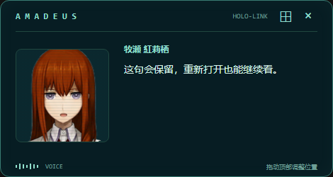

# Compact companion panel — 0.15 Alpha candidate

The optional panel brings a small portrait and speaking card beside a selected Work
preview. It uses the optional Companion Lite pack at `assets/companion/kurisu/` and
existing Host presentation signals. It does not start another VN session, TTS
pipeline, Work, or AUIP authority.

Install the separately supplied `companion-kurisu` archive with
`python tools/external_assets.py install <bundle.zip>`. It is derived from the same
SpriteForge character sources but is independently installable; Companion does not
need the multi-gigabyte wallpaper textures or an authoring workspace. Missing media
keeps the text/avatar presentation available. An explicit
`AMADEUS_COMPANION_PORTRAIT_CACHE` still supports the existing PNG cache. There is no
implicit sibling `visual novel player` directory lookup.

The Lite renderer uses lossless WebP atlases and a small CPU Canvas2D surface. The
manifest preserves the source clip's complete duration; additional frames improve
motion detail without speeding it up. Two atlas bitmaps and at most 16 MiB of
explicit decoded atlas pixels are retained. This is not a cap on total Electron or
browser decoder memory. Hidden windows pause; closing destroys the renderer and
closes its bitmaps. Static frames do not run a redraw timer.

The `动` / `静` button selects gentle or static idle and remembers the choice.
The reviewed pack uses `idle_static_saved`, `speaking_short`, and both thinking
speaking variants. Thinking variants alternate between speech runs, never halfway
through a sentence. After speech ends the expression returns to neutral idle after
350 ms. A new expression or new speech cancels that deadline. Captions remain intact.
Other expressions retain their approved closed-mouth idle frames; `disappointed`
retains the older three-frame artwork because no matching new source was selected.

See [the source, edge-processing and performance experiment](companion-lite-2026-09-19.md).

VN Player keeps its original Tk window and uses a native portrait-only adapter for
the same optional Lite assets, timelines and cache budget. No window or outer-frame
replacement is needed. The Tk/Canvas adapters are different display backends with
cross-renderer timing tests, not the same JavaScript engine. See the
[VN integration record](vn-shared-companion-2026-09-19.md) for measurements and limitations.

Historical UI preview in the speaking state, using the optional VN portrait cache and
test presentation events. The still image shows the signal bars during animation.

Speech completion must leave the just-spoken line on an already open card. Empty
subtitle cleanup and the transition to standby must not replace it with a welcome
line; only the next non-empty subtitle replaces it. The card also restores the
latest line on reopening or reconnecting, including speech received while closed.
This is a presentation snapshot held in memory for the current bridge lifetime;
it is not saved conversation history. A fresh bridge starts without a retained line.
Wallpaper subtitles continue to clear normally. The VN-style `VOICE` indicator and
animated signal bars follow the Host's speaking state, flattening at standby or
disconnect. They indicate speech activity, not measured audio amplitude.

Use the companion button in the Electron Slice to open or close it. Docking reserves
space beside the selected preview; dragging detaches the panel. Closing restores a
preview whose Host-adjusted bounds have not subsequently changed. Missing optional
portrait media leaves the text/avatar presentation available.

Only an attached companion suppresses the corresponding wallpaper portrait/captions.
Disconnecting or closing restores presentation without stopping audio or work.
Subscription replay and credential refresh keep a reconnecting Slice on current Host
state. The existing macOS wallpaper and keyboard input lifecycle remain intact.

This PR covers presentation and window lifecycle. It is separate from routing and ACP.
Automated projection, docking/layout, reconnect and build checks do not claim complete
packaged desktop or physical microphone acceptance.
