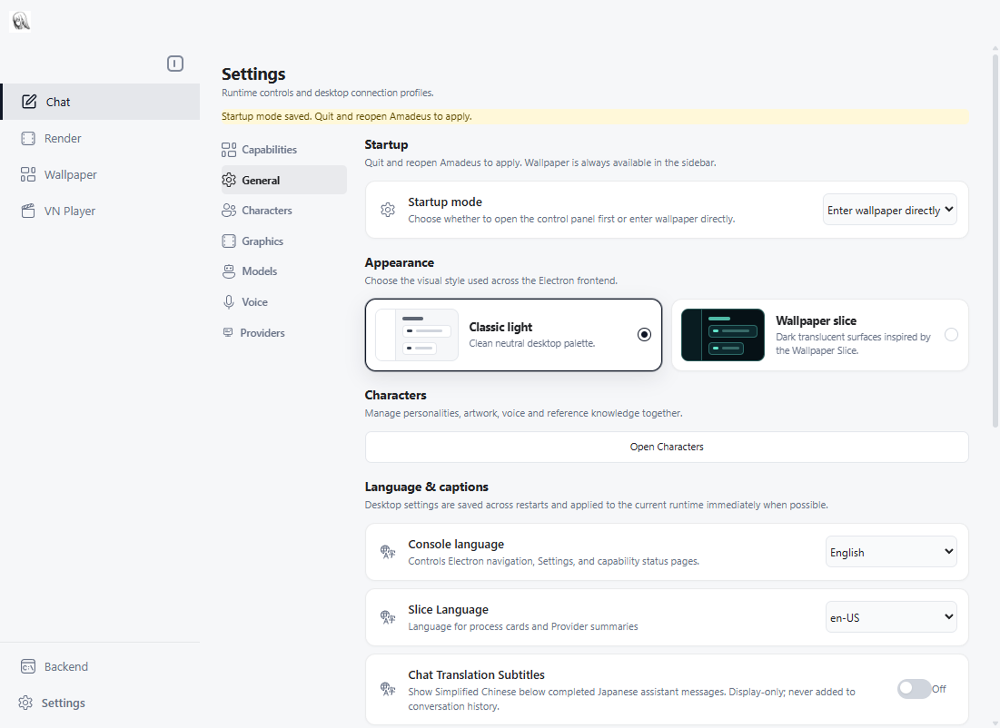
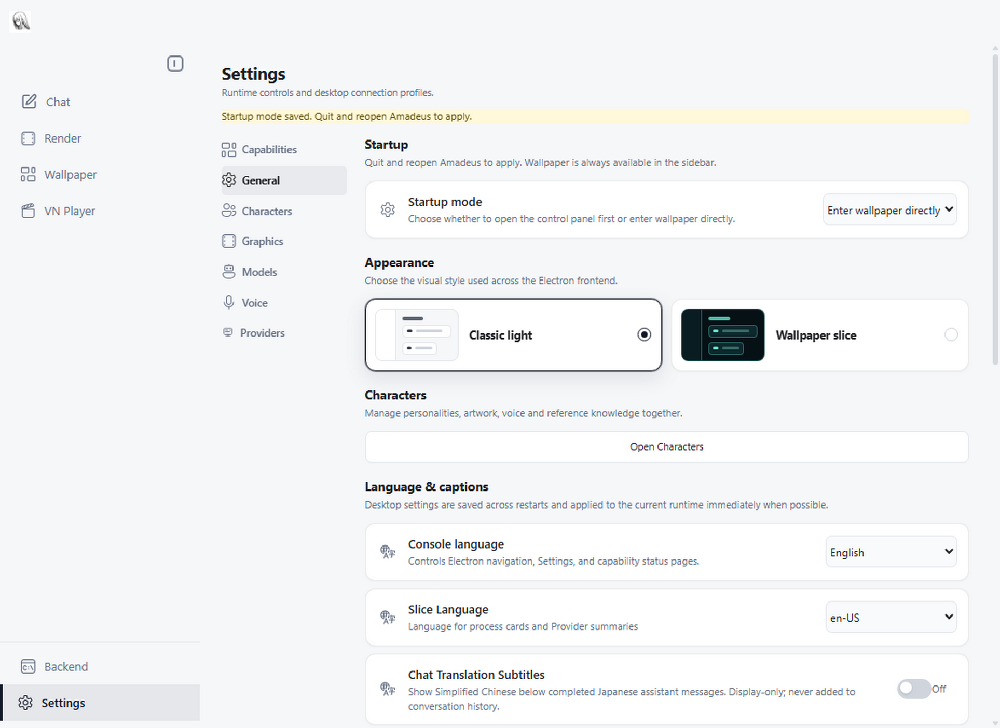

# 配置与设置统一施工计划

本轮把已经验证的 TTS 和图形声明扩展到桌面 Settings 的其余配置，并修复值来源显示缺口。完成后，普通设置的字段定义、保存白名单、基本校验、启动解析和表单来自同一份声明；运行时能力、继承关系、复合控制和授权仍由原有业务模块负责。

## 基线和审计方式

- 分支：`codex/configuration-convergence`。
- 基线提交：`019e29e`，包含前一轮完成的 24 个配置字段和语音域 handler 组装。
- 基线遗留：桌面白名单中仍有 118 个普通键、7 个密钥键手写；不是全部环境变量的数量。
- 每阶段单独提交实现、相关测试和本计划的执行记录。首轮施工仅保留本地提交；后续经用户明确授权，审计修复后推送本分支并创建草稿 PR，不合并、不发布。
- 保留本轮开始前的 ChatPage、视觉测试、资源和其他草稿修改；提交只包含本任务路径。
- 继续使用当前分支工作区，不搬动用户已有修改。构建和运行验证使用独立测试数据目录；不启动真实模型、麦克风或收费 API。

## 必须保持的语义

1. 启动输入的优先级保持为：显式父进程环境、桌面保存值、项目 dotenv、声明默认值。空值、未设置和显式 false 按现有解析契约区分。
2. 表单显示的拟启动值与运行时实际生效值分开；来源、锁定状态和值必须对应。后端离线且无法取得某项有效值时，明确未知。
3. 密钥只通过主进程加密存储和受控后端环境传递；renderer、配置状态和生成文件不包含真实密钥。
4. 保存成功不等于应用成功。沿用 pending revision，旧回执不能清除较新的修改。
5. 动态默认值、模型继承、设备枚举和能力状态保留明确 owner。声明中不加入任意表达式或执行脚本。
6. 安装的第三方扩展不因声明配置而获得运行、读取其他密钥或修改 Host 的权限。
7. 不改变已保存文件格式或重命名现有键来完成迁移。真实旧别名和已退役键保留有调用证据的兼容处理。

## 阶段一 值来源与表单投影

修复已复现的问题：环境变量把模型锁定为 B，而表单仍显示以前保存的 A。

主进程负责提供已知的启动值和来源，renderer 按来源选值；后端提供运行时有效值和状态。复用现有 snapshot、来源和 revision，不新建持久化副本。非密钥字段可投影已知值；密钥仍只有 configured 状态。清空桌面覆盖后应回到下一有效来源。

主要文件：`desktopSettings.ts`、`configCatalog.ts`、各配置目录、`SettingsPage.tsx` 和相关测试。

验收覆盖：环境锁定覆盖旧存储、dotenv、默认值、离线状态、待重启修改、清空覆盖、显式空值和 false、连接后有效值回填、秘密字段不回传。

## 阶段二 生成器与一致性检查

生成器从声明重建受管理的 env 示例段；删除或改名的组不能留下旧段，段外重复键必须报错。保留各字段刻意不同于默认值的安装示例。

建立可减少的遗留基线：未迁移键可暂时存在，新增手写白名单、默认值、字段定义和已迁移键的重复读取不得增加。检查 Python 与 Electron 的声明覆盖、键名、类型及基本约束；业务专用校验继续由 owner 测试。

主要文件：生成器、`tests/test_config_catalog.py`、Electron catalog 测试、配置检查脚本及必要的遗留清单。

验收覆盖：新增、删除和更名组；重复键；过期产物；错误默认值、选项、范围和 secret 定义；未声明键被拒绝；原有保存文件正常加载。

## 阶段三 语音字段与重复读取

迁移对话 ASR、远程 ASR、唤醒、AEC、共享参考音频和情绪参考字段。静态字段来自声明，麦克风列表、模型安装状态和实时开关逻辑由原有模块提供。

核对并收口 8 个双读产品键：`AEC_REALTIME_DELAY_MS`、`EXP_TTS_MAX_CONCURRENCY`、4 个麦克风选择键、`QWEN3_ASR_DEVICE`、`QWEN3_ASR_REQUIRE_CUDA`。同进程普通读取使用同一解析结果；sidecar 只接收父进程明确传递的启动快照，保留自身进程边界。环境变量来源的存在性检查不等于重新解析值。

主要文件：语音声明、`settings.py`、ASR 与 TTS 对应读取方、前后端语音目录及测试。

验收覆盖：设备别名、自动设备选择、非法值、显式覆盖、sidecar 输入、未选择后端配置不完整、ASR 与 Wake 独立、语音参考功能开关和重启要求。

## 阶段四 模型连接

迁移 DeepSeek、OpenAI 兼容、Gemini、Bedrock、本地模型、混合模型端点和 RAG 设置。保留 Bedrock 凭据链、不同本地引擎的字段选择、混合模型继承及路径解析。

主要文件：模型声明、`modelConnectionCatalog.ts`、`system_handler.py`、`settings.py`、桌面存储及测试。

验收覆盖：无后端也能配置连接；凭据缺失状态正确；本地引擎切换不丢失其他引擎值；明确覆盖与继承可区分；RAG 的范围和开关行为保持。

## 阶段五 模型角色与 Provider

迁移 Work、Browser、VN 等角色的模型覆盖以及 Provider 连接设置。静态字段不再在前后端分别定义；角色继承、路由选择、Provider 注册和连接可用性继续由对应 owner 决定。

ACP 和 MCP 的结构化连接记录沿用现有专用校验器、加密存储和授权范围。`CODEX_PROVIDER_TRANSPORT` 等复合选择仍由明确的转换函数映射，不能作为普通环境变量盲目转发。已退役键只允许按现有契约清除。

主要文件：角色和 Provider 声明、`modelRoleCatalog.ts`、`providerConnectionCatalog.ts`、对应状态投影、桌面存储和测试。

验收覆盖：继承与显式覆盖两侧；Provider 不可用时仍可编辑连接；Codex 传输互斥；ACP/MCP 校验和秘密边界；现有配置升级保留值。

## 阶段六 即时设置和最终清理

迁移其余桌面字段，包括角色、UI、语言、视觉及即时设置的静态定义。声明明确生效方式：前端立即应用、Host 实时应用、重启后端、重启桌面。沿用现有应用函数和 revision 确认。

一对一的 runtime key 映射从声明派生；TTS 模式和语言等复合转换保留已有实现并明确记录。清除已被声明取代的白名单、类型列表、默认值和字段文案。对于确实不能作为普通字段处理的特殊记录，登记具体 owner、原因和测试，不留下笼统的兼容后门。

验收覆盖：保存失败、应用失败、离线保存、重连与重启、旧回执、新 revision、前端设置不注入后端、退出重开生效的设置不误报为后端重启。

## 最终验收

- 桌面支持的每个配置键有唯一声明或有明确测试的结构化 owner；不再维护可增长的手写普通设置白名单。
- 新增普通设置只修改所属声明和使用它的实现；增加测试和生成产物不算人工胶水。
- 补齐最初的 handler 验收：内置工厂表统一构造并注册全部 handler；新增 handler 不修改 `app.py`。保留业务运行时绑定，不扩展第三方执行权限。
- 没有来源与显示值矛盾；未知值、拟启动值、运行值和 pending 状态可区分。
- 全部相关 Python 测试、完整 Electron 测试、类型检查和生产构建通过。
- 实际离线 Settings 页面和独立无模型后端验证通过。
- Python 包、Electron 构建和源码发布清单包含所需声明、生成器与文档。
- `git diff --check` 通过；提交按阶段可审计；最终记录范围、测试结果及有证据的保留边界。

## 执行记录

| 阶段 | 状态 | 提交与验证 |
| --- | --- | --- |
| 审计基线 | 完成 | `019e29e`；此前 293 个 Python、348 个 Electron 测试和应用冒烟通过 |
| 一 值来源 | 完成 | 351 个 Electron 测试、类型检查、生产构建、真实离线表单及环境锁定冒烟通过；dotenv 由 Python 解析，离线无法解析时显示未知 |
| 二 一致性检查 | 完成 | 删除/改名旧段清理、段外重复拒绝、手写定义递减基线；351 个 Electron、26 个 Python 配置/发布测试通过，扩展解析别名检查后 13 个配置测试复验通过 |
| 三 语音与双读 | 完成 | 28 个字段迁移，修正离线默认值漂移；187 个 Python、351 个 Electron 测试、构建、真实离线表单及无模型后端冒烟通过。Qwen 重启保留选定设备 |
| 四 模型连接 | 完成 | 32 个字段及 LM Studio 别名迁移；353 个 Electron、98 个 Python 用例覆盖（修复 ACP 状态参数后 32 个系统设置用例复验通过），类型检查通过；别名清空另经 9 个目录用例验证 |
| 五 角色与 Provider | 完成 | 38 个字段迁移，累计 122 个；353 个 Electron 用例通过，新增角色默认值测试后 3 个角色用例通过；125 个 Python 用例覆盖（更新私有 helper 调用后 41 个配置/ACP 用例复验通过）；类型检查通过 |
| 六 即时设置与收尾 | 完成 | 新迁移 23 个字段，累计 42 组、145 字段；普通桌面白名单、约束、文案和 14 个一对一 runtime 映射从声明派生。父代理完成来源、继承、边界和整体验收 |
| 原验收补齐：handler 注册 | 完成 | 内置 handler 工厂表替代 app.py 构造和注册清单；37 个注册/语音/WS 测试通过，真实后端新 handler WebSocket 往返和正常退出通过 |

## 最终验证记录

- 完整 Electron 回归：370 个测试通过。最后的主题锁定、未知文本值投影修正后，40 个配置专项复验通过。
- Python 相关回归覆盖 39 个测试文件、525 个用例。集中运行 524 通过；1 个 ACP 用例受测试目录干扰：仓库内临时 workspace 被 Git 识别为当前仓库，将开发改动识别为产物。使用正常仓库外临时目录重跑 ACP 文件，26 个用例全部通过。没有为测试环境干扰增加产品补丁。
- `npm run build` 通过，包含 TypeScript 和声明一致性检查。原有大 bundle 提示仍存在，不影响构建。
- 真实隐藏 Electron 窗口：离线启动方式、Fish/MiMo/OpenAI 配置保存、图形自动/显式值、环境锁定优先级和主题锁定通过；网络请求被测试脚本阻断。
- 真实独立后端：禁用模型与外部代理，新增 fixture handler 的认证 WebSocket 往返、配置状态、语音路由和正常退出通过。
- 新构建 wheel 中 42 个 JSON 与源码逐字一致，解包后独立加载 145 个字段通过。Electron 编译产物包含共享目录；源码发布策略包含 52 个所需声明、组装代码及文档路径。此项验证配置资源打包，不等同于完整安装器发布验证。
- `git diff --check` 通过。所有任务提交留在 `codex/configuration-convergence`，未推送、合并或发布。

## 保留边界

- TTS 模式/语言、字幕旧组合输入、图形采样和模型继承属于明确的计算 owner；JSON 不执行表达式。
- 窗口枚举、角色管理和主题预览保留专用 UI 行为；普通字段的定义、选项、校验和文案不再分散维护。
- ACP/MCP 结构化记录、秘密存储和授权沿用既有 owner；已退役的路由键只允许清除。
- 不在桌面 Settings 范围内的内部 Python 调优参数留在递减基线中；本轮没有把所有内部环境变量变成用户设置。
- 这份目录只接受随应用打包的数据。第三方插件生命周期与权限、记忆试点属于后续扩展协议工作，本轮不新增执行权限。

## 草稿 PR 前复审（2026-10-10）

审计范围为 `c07e009..codex/configuration-convergence`，包括首批 TTS/图形目录。远端主线检查至 `f61ce25`；其新增提交仅调整 source-map-js 锁文件，与本分支无重叠。机械核对迁移前 149 个桌面键后，未覆盖项为零：145 个 canonical 字段、兼容别名及 ACP/退役键的专用 owner 覆盖全部入口。另以 7 组隔离合成输入执行迁移前后 settings，旧公开值保持一致。

发现并修复以下来源边界问题（`5491850`）：

1. 保存的旧别名没有在加载 dotenv 前转成 canonical 名称，可能被 dotenv 中的新名称覆盖；Provider 摘要还可能把只保存旧别名的选择显示成 `undefined`。启动输入与摘要现在遵循同一来源优先级。
2. 图形预设变更时，dotenv 中明确设置的纹理采样可能被新的自动默认值代替。计算默认值与后端解析出的显式值已分开。
3. 语音卡片状态只认字符串 `true`，与控件对 `1/yes` 的解析、清空后的默认值不一致。状态现在直接读取同一投影结果。
4. 离线开启视觉功能时，旧运行快照可能把已保存的 `watching` 改回 `on_demand`。控制动作现在读取拟启动模式；离线保存仍保持 pending，直到真实应用回执到达。

验证与限制：

- 完整 Python 隔离入口按 4 个分片运行，共收集 5,457 个用例。首轮 5,437 通过，5 个跳过、5 个预期失败；10 个失败集中在 4 个旧测试文件。两个 AST 生命周期夹具补齐提取后的真实语音清理函数；RAG 文案断言改为验证唯一声明；普通合成夹具显式关闭其不测试的实验情绪功能。4 个文件共 78 个用例复验全部通过，关闭次序、取消与异常继续清理等原断言保留。合计验证 5,447 个通过用例；未把首轮失败报告成一次全绿运行。
- 工作区 Electron 373 个测试通过；从提交中提取、排除用户其他修改的干净快照另跑 371 个测试全部通过，类型检查和生产构建通过。
- 干净快照真实离线表单覆盖主题来源锁定、启动方式、TTS/图形、旧 Provider 别名及离线视觉保存；真实整应用模型关闭冒烟覆盖后端认证、导航、重连与退出；新增 handler 的真实 WebSocket 往返与关闭通过。
- GPU/CUDA/ROCm 真实模型推理、付费远端 API 和完整安装器发布未执行；相关运行契约由无模型测试与既有隔离夹具覆盖。未发现这些已审路径之外的新回归证据，不以测试替代独立代码审查。

可复验命令（Python 使用已有开发环境；四个分片的 `N` 分别为 0、1、2、3）：

```text
python -X utf8 tools/run_tests.py --shard-count 4 --shard-index N
python -m pytest -q tests/test_character_rag.py tests/test_chat_ingress_lifecycle.py tests/test_gpt_sovits_sidecar_backend.py tests/test_vts_worker_lifecycle.py
cd electron
npm test
npm run build
electron scripts/smoke-startup-settings.cjs
cd ..
python -X utf8 tools/smoke_electron_model_less.py
python tools/smoke_builtin_handler_catalog.py
```

界面对照采用同样的隔离配置与隐藏窗口。基线截图的 IPC fixture 补齐空后端失败状态，不改产品实现；新版截图中的主题由环境锁定。

| 迁移前（`c07e009`） | 迁移后（`5491850`） |
| --- | --- |
|  |  |
