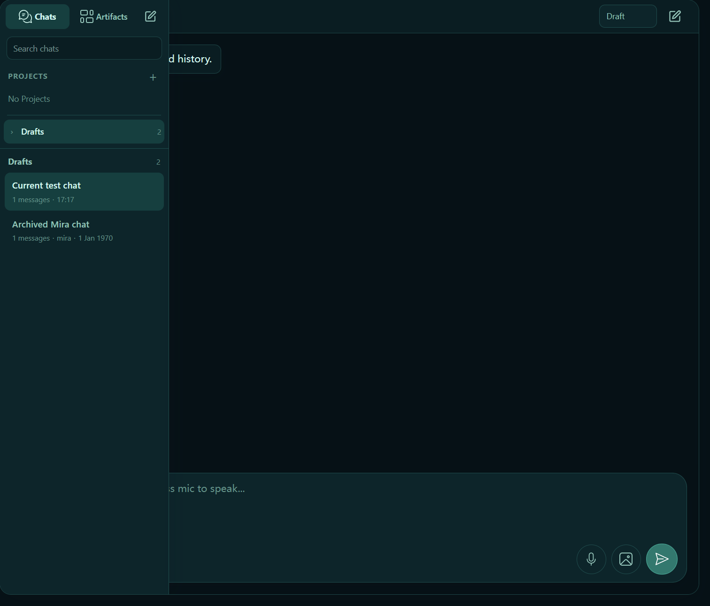
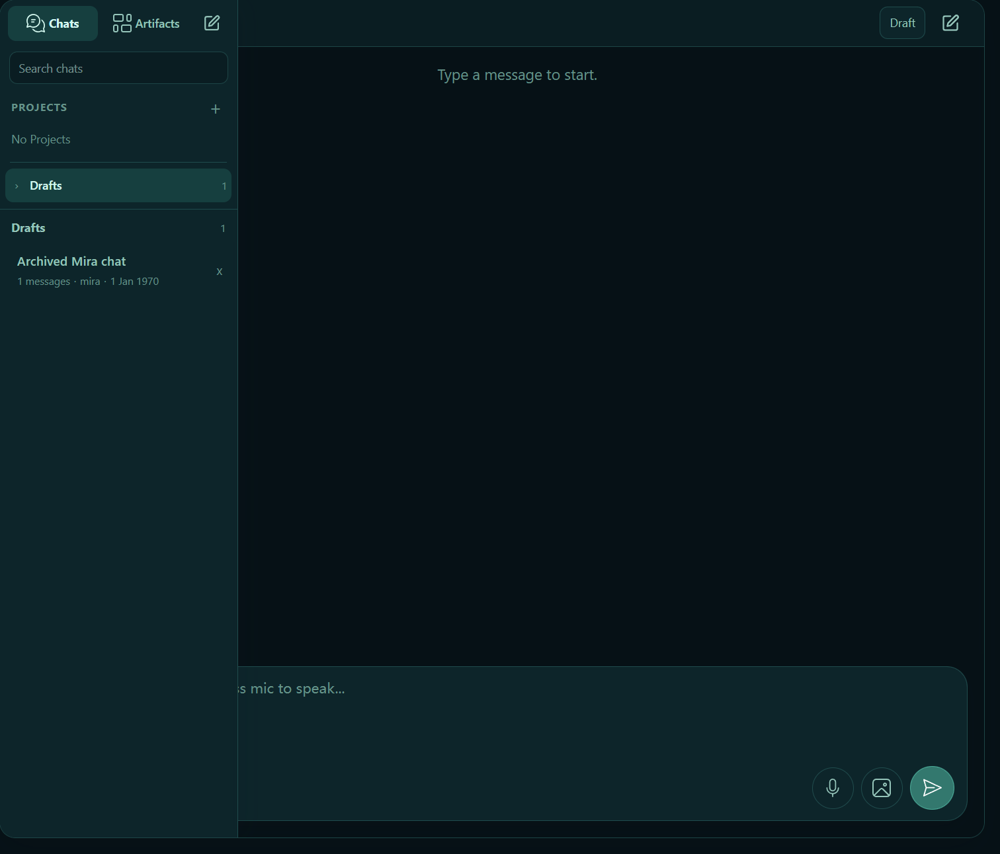

# Conversation ownership and deletion evidence

These are actual Electron screenshots from an isolated, model-less profile on
2026-10-08 (Pacific/Auckland). Both conversations and their text are synthetic.
Only the chat area was captured; no character artwork, personal data, credentials
or machine paths are included.

The images show two states of the current code, not a pixel comparison against an
older revision:

| Before deleting the last owned conversation | After deleting it |
| --- | --- |
|  |  |

The backend was started as Kurisu. The automated journey verified that:

- the current conversation has no redundant role label;
- the foreign conversation retains its Mira label;
- opening the foreign conversation reports the restart requirement and preserves
  the current history;
- its delete control is disabled, double-click does not start rename, and direct
  `session.rename` / `session.delete` requests are rejected without changing the
  session list or selection;
- the same-role rename API succeeds, and reloading displays the new title while
  preserving its history;
- deleting the last owned conversation clears its history, leaves the composer
  available, and returns no active session from the real `session.list` endpoint;
- no replacement conversation is created and the foreign conversation is not
  activated.

The official model-less smoke launcher plus these eight additional checks passed
19/19 and confirmed clean Electron/backend shutdown. No chat turn, live model
request or dependency installation was performed.

The first screenshot-capture attempt timed out waiting for the chat input to
become enabled after the backend connected. It reported no renderer console/page
errors. A repeat with unchanged code, timeouts and assertions passed 15/15; the
earlier implementation-validation run also passed 15/15. The initial timeout is
retained as an unresolved startup-timing observation, not counted as a pass.
Raw logs and isolated runtime state remain local.

The later ownership-boundary run also attempted the native double-click rename
dialog for the owned conversation. No title change was observed before timeout,
and no renderer console/page error was reported; that native dialog journey is
not counted as passing. The final run verifies the real rename API and reloaded
rendering instead, while component callback tests cover rename feedback. This
does not claim the native dialog interaction has been validated.
