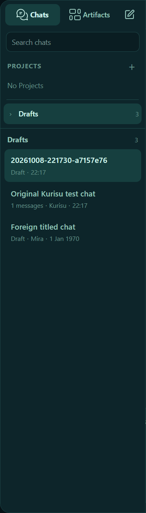
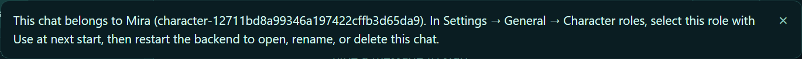
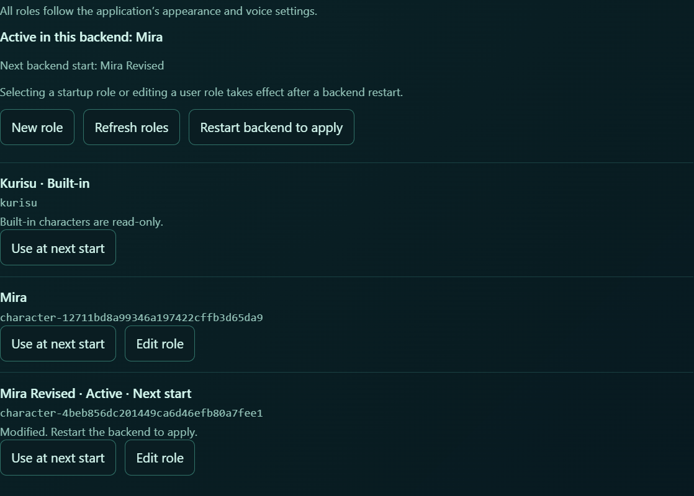
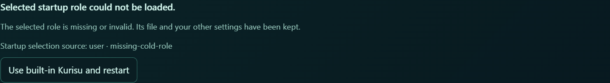
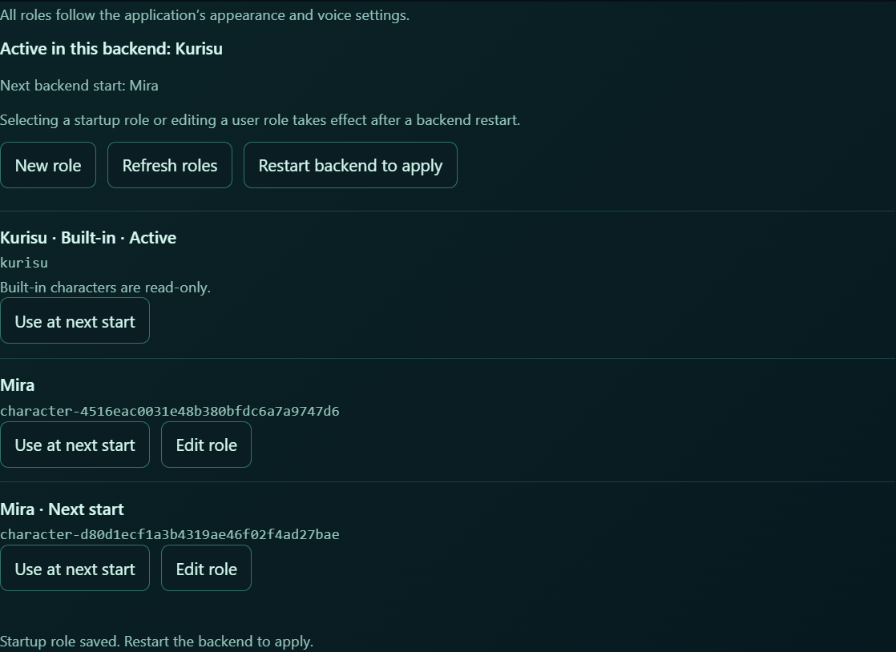
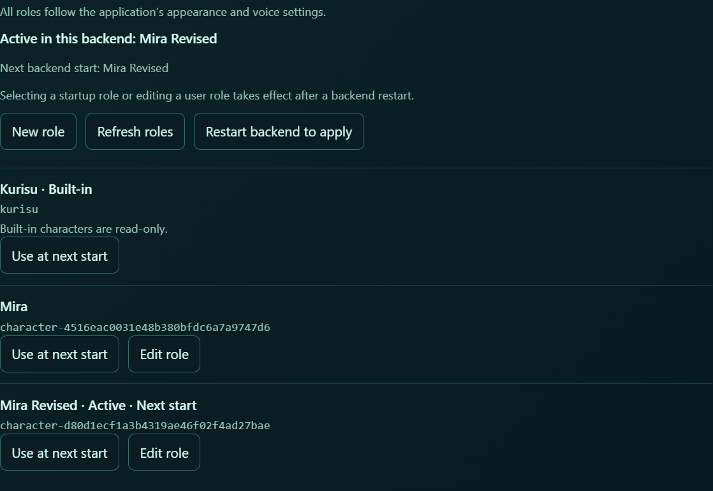
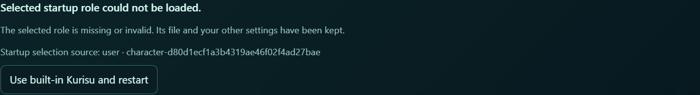

# Character management M1 acceptance — 2026-10-08

Base: `f66c5f95a693727453a6eb614118500e271a730d`. Scope is local character
management, active identity labels and explicit startup recovery. The original
M1 results exclude Live2D. The latest integration results below include the
merged Live2D mainline.

## Review repairs — 2026-10-09

[Review fix scope and fresh regression evidence](review-fixes-2026-10-09.md)
records the later repairs, including the Wallpaper activation follow-up,
321 Electron tests, exact prompt captures and desktop recovery revalidation. The integration evidence below describes its own earlier
revision and retains its original diagnostic limits.

## Live2D mainline integration — 2026-10-09

Merged main `0851af8` (Live2D #164) into M1 at `3590c82`. Only ChatPage imports and
translation additions conflicted; both sides were retained. Role identity and
application visual profiles remain independent. General role management and
Character visuals keep their current sections; a unified Role page is a later UI
change. [Sanitized integration evidence](integration-2026-10-09.json) records the
exact revisions, checks and diagnostic distinction.

Integration acceptance revision: **`dbee4d8`**. Joint testing exposed an existing main bug:
clicking Render before its backend WebSocket was connected could leave an active
empty iframe after the request failed. App now clears projection state on failure
or a missing URL, preserving the shared presentation route. The actual-callback
regression failed before the repair and passed after it. A real disconnected
click followed by a normal reopen also passed.

- Complete Python on `3590c82`: **426 files, 5388 passed, 16 skipped, 5 expected
  failures**, both shards exit 0. Shard 0: 2417 passed/12 skipped; shard 1:
  2971 passed/4 skipped/5 xfailed. The later repair changed only App.tsx and its
  Electron test. All **25** Python contracts reading App's source were rerun;
  Python runtime and test sources are unchanged from the complete regression.
- Final Electron **296/296**, production build and Ruff with repository exclusions
  passed. Ruff considered 1016 tracked Python paths without pulling excluded
  upstream sources into first-party lint scope.
- All **465** prompt captures match the original pre-M1 main baseline again.
  Prompt and phrase fixtures were not rewritten.
- Actual combined functionality: **48/48** checks passed. Kurisu, Mira, edited
  Mira and recovered Kurisu retained the shared saved Live2D profile. Native
  Render showed the real model/texture and matching Host ready receipt. Sprite
  round trips preserved identity/profile; ready previews were destroyed on
  navigation; independent Companion windows showed the current speaker. The
  original M1 session, pending-restart, input-limit and recovery checks remain.
- The real Render click was observed while Chat was disabled and the same
  backend-restart promise was pending. After two animation frames no empty
  iframe remained. The same restart completed with identity/profile/history
  preserved; a normal open then loaded Live2D and reported ready again.
- Parent independently ran the **unmodified official smoke: 11/11, passed**, and
  **negative cold-start plus failed Render recovery: 6/6, passed**, on `dbee4d8`.
  Test-owned windows/processes exited and backend/debug ports were released.

**The extended joint run's raw generic smoke report remains `failed`.** Exactly
four browser console errors came from the absent optional Companion Lite
`manifest.json`, one per Companion window. Their real HTTP URLs, 404 responses
and visible fallback were verified; there were no other console or page errors.
The 48-check functional conclusion does not rewrite that original report. The
ordinary unmodified smoke above does not add the Companion exercise and passed
its original diagnostic gate.

All attempts remain local. Earlier attempts exposed a harness-owned startup-mode
lock, hover-rail screenshot instability, and queries into an iframe before its
real URL loaded. The local harness was corrected without changing product CSS,
CSP or adding retries. The separate failed Render start was repaired at its owning
App layer as described above. Actual artwork, asset paths and raw reports remain
in ignored local output; only sanitized facts are committed. Models/Core were
read in place. No real Lively wallpaper, journal, user conversation or global
setting was taken over.

This closes M1's integration check against Live2D mainline. It does not add
Companion Live2D, per-role asset binding, real voice/model qualification or a new
Lively/Wallpaper Engine/long-term performance claim.

## Review fixes after `813390f`

The follow-up addresses F1–F3 from the M1 review:

- Session titles and the shared user/assistant avatars remain unchanged. Foreign
  ownership labels resolve the saved name from the character catalog, retaining
  full stable IDs in tooltips. Unknown catalogs do not imply a missing file.
  Ordinary guidance uses Settings → General → Character roles; only known
  environment locks direct the user to `AMADEUS_CHARACTER_ID`.
- Edited active definitions retain a Host-derived pending-restart label across
  page visits. Comparison uses parsed definitions, not modification times or
  saved flags. Reversion/restart clears it; invalid or missing files show errors.
- User names are single-line and at most 128 Unicode code points; personality
  text is trimmed at its outer boundary and limited to 7900 code points. Host
  limits drive GUI code-point counters, including astral Unicode. The unchanged
  8192-character slot limit is also checked after composition.
- The redundant Kurisu avatar-dialog branch is removed. Default generic labels
  while identity is unknown (**Assistant avatar** / **A**, initial Companion
  **Amadeus**) are explicitly documented as visible changes in the local PR draft.

The final three prompt captures (Kurisu, name-only Mira, Kurisu Japanese
customization) again match the pre-M1 main baseline in all **465/465** entries.
The 107 phrase templates remain unchanged. Electron **280/280** tests and build
pass; changed Python files pass Ruff. Both complete Python shards were rerun on
the final frozen product code, without subsequent product-code edits:

| Final shard | Files | Passed | Skipped | Expected failures | Collected | Result |
| --- | ---: | ---: | ---: | ---: | ---: | --- |
| 0 | 211 | 2515 | 3 | 0 | 2518 | PASS, exit 0 |
| 1 | 211 | 2841 | 13 | 5 | 2859 | PASS, exit 0 |
| Total | 422 | 5356 | 16 | 5 | 5377 | No unexpected failures |

The commands are the same two `tools/run_tests.py --shard-count 2` invocations
listed below, plus `npm test`, `npm run build` and Ruff on the changed Python
files. Both shards ran in the actual Git worktree with isolated temporary
namespaces. Optional-asset skips and expected failures are not counted as passes.
This full rerun closes the original implementation's final-rerun gap described
in its historical results below.

### Final desktop acceptance on `053d6a1`

The deferred desktop checks were completed on 2026-10-08 after port 17777 became
available. The actual built Electron application and Python backend passed
**21/21** checks, and a separate negative cold-start recovery passed **5/5**.
The machine-readable [acceptance record](desktop-acceptance.json) identifies the
exact tested code revision and each check. No product code changed during this
acceptance. All test-owned processes exited cleanly and released their ports.

The final journey verifies two same-name roles with distinct IDs; unchanged
session titles with foreign ownership names and full IDs in tooltips; Settings
guidance without activating foreign history; 128/129-code-point name and
7900/7901-code-point persona feedback (including emoji); trimmed saved persona;
pending-restart visibility after leaving and returning to Settings; clearing
that marker after restart; and recovery from a malformed role without erasing
its file or synthetic conversation history. The separate cold-start journey
starts with a nonexistent selected role, verifies that Electron opens without
a ready backend, and uses its explicit recovery button to start builtin Kurisu.

One initial harness attempt failed: it waited for the **Save role** button to
become hidden, which also happens when its label changes to **Saving…** before
the save is acknowledged. The corrected harness waits for the editor to close.
The same unchanged product code then passed the entire journey. Failed evidence
remains in local logs. A subsequent complete successful run recaptured separate
sidebar and guidance images so the floating notice is not cropped by the sidebar
screenshot bounds. These repeated successful runs are counted once, as 21 checks.

The following images contain only synthetic test records. They were visually
inspected; no user conversation, credentials, artwork or local filesystem paths
are included.









These checks use a model-less profile. They do not measure real model persona
fidelity, voice quality or rendering performance. **Live2D combined validation
is still pending**: the tested M1 revision does not include that independent
branch. The original 18-check and 5-check results below remain historical evidence
for `813390f`; the 21+5 results above cover the follow-up fixes.

## Original implementation verification (`813390f`)

## Default behavior evidence

Before editing, three isolated captures from unmodified main recorded 155 model
inputs each: default Kurisu, name-only Mira, and Kurisu with a synthetic Japanese
override. The final loader output matches every captured UTF-8 string in all
three cases. The original 155-surface and 107-phrase fixtures were not rewritten.
The original phrase/boundary suite passed 252 tests before editing; the new branch
also passes the phrase checks. No real model, microphone or synthesis was used.

Prompt assemblers, SpriteForge graph algorithms, shared presentation claims,
TTS, scene policy, Provider/Work authority, and asset files have no source diff.
Kurisu's UI metadata is kept outside model-visible names and template bindings.
Amadeus remains the system name. A preview without a backend reads the canonical
builtin UI label without importing the selected conversational identity.

## Automated verification

The full Python runner executed **422 files / 5323 collected nodes** in two
isolated shards in a real Git worktree:

- Shard 0: 2513 passed, 3 skipped, 1 failed (2517 nodes).
- Shard 1: 2788 passed, 13 skipped, 5 expected failures (2806 nodes), exit 0.
- The sole failure required the old literal `Let Kurisu play` to exist in the
  TypeScript source. That source assertion now checks the stable delegate action;
  the actual Kurisu and Mira label output is covered by React rendering tests.
- Subsequent targeted checks of the corrected AUIP surface, final character
  persistence and VN startup/preview changes passed **88/88**. This includes
  actual CLI exit-code classification, invalid persistence, atomic-write faults,
  DEL/Unicode round trips and standalone previews with an invalid selected role.
  The complete two-shard run was not repeated after these final localized fixes.
- Electron: **270/270** passed; `npm run build` passed, with the pre-existing
  bundle-size warning. Parent review checked role IDs for duplicate display names.
- Ruff passed on 1005 tracked Python paths; final changed Python files were
  checked again after the targeted fixes. Git diff whitespace checks passed.

Commands used the existing environment, without dependency installation:

```powershell
.venv/Scripts/python.exe -X utf8 tools/run_tests.py --shard-count 2 --shard-index 0
.venv/Scripts/python.exe -X utf8 tools/run_tests.py --shard-count 2 --shard-index 1
.venv/Scripts/python.exe -X utf8 -m pytest tests/test_character_profiles.py tests/test_auip_experience_surface.py tests/test_vn_overlay_window_contract.py tests/test_vn_overlay_auth.py -q
# From electron/
npm test
npm run build
```

Temp directories, conversations, desktop settings, character records and Work
stores were isolated. Optional local-asset skips are retained, not counted as
passes. Windows sandbox temp-file rename/socket restrictions required running
checks in the ordinary authorized user context; no product workaround was added.

## Actual desktop journeys

The shipping `tools/smoke_electron_model_less.py` launcher with a task-local
scenario extension passed **18/18** checks. It exercised:

1. Existing Chat, Backend, Settings, capability and artifact navigation.
2. Creating two same-name roles with different personality text in the GUI;
   their generated IDs are distinct and visible.
3. Selecting one for next start while the actual running role remains Kurisu.
4. Restarting into that role, opening its own Chat and refusing the foreign
   Kurisu conversation without changing the active conversation.
5. Editing its name/personality, retaining its ID/history, and applying only
   after an explicit restart even without another pending desktop setting.
6. Corrupting only its synthetic role file, observing the startup error and
   using the GUI's explicit recovery action.
7. Returning to Kurisu with the original synthetic history intact; the malformed
   user file is not deleted or overwritten. Electron/backend exit cleanly.

A separate negative **cold-start** journey passed **5/5** checks: desktop
settings initially selected a nonexistent user role, the backend exited before
readiness, Electron still opened, Settings offered recovery without a live
backend, and the button persisted literal `kurisu` and started the real builtin
backend. The test-owned processes exited cleanly.

These task-local extensions were not added as new shipped command-line tools.
The steps above describe their scope; the ordinary model-less launcher alone
is not claimed to cover the added management and recovery assertions.

An initial harness assumed backend restart while remaining in Settings had
already activated a Chat session. It failed with StopIteration. The corrected
journey enters Chat before asserting its session; no product change was made to
satisfy that assumption. The first broad screenshots did not frame the relevant
cards, so the final screenshots below were recaptured from the card elements.
Failed attempts remain in local logs rather than being relabeled as passes.

## UI evidence

Only synthetic role-management cards are captured. No character artwork,
private conversation, credentials or machine paths are included.







## Limits and deferred boundaries

This is model-less acceptance, not a test of a real model's persona fidelity or
voice/animation quality. VN, Work commentary and Hybrid openings do not gain the
new personality text. VN explicit old-session-ID ownership remains a separately
recorded issue. Per-role appearance/voice selection, copy/delete/hide, and asset
installation are not implemented. Live2D integration must be validated after
both independent branches are ready; these results do not establish that merge.