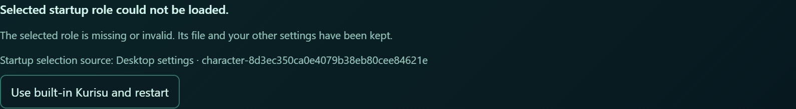

# M1 review fixes — 2026-10-09

First repair revision: `37fa6c19a3995b5f51842b5b7f9045b4eb18488b`. Review base: `341eab2`.
This repair covers findings 1–8, 10, 12 and 13 from the PR #167 review.
No role hot switching, per-role media, new default UI decoration, or prompt
assembly changes are added. Amadeus remains the application name.

## Latest follow-up: stop acknowledgements belong to a Wallpaper activation

Product revision: `522970f9ec8e815b9dc66f94fc37fb65e1dba4ed`. The prior latest-target check below is
superseded. It forgot that Wallpaper had restarted as soon as a later click
selected Render, allowing an old successful cleanup acknowledgement to clear the
new Wallpaper indicator after its own stop failed.

A monotonic activation generation now advances at manual start, startup
auto-start and `wallpaper.ready`. Both stop callers capture that generation;
only a matching successful acknowledgement can clear the Wallpaper state. The
old target field and type are removed. The existing latest-request counter
still owns start continuations. A normal fast switch where `ready` and `exited`
precede their corresponding RPC replies continues into Render successfully.

Eight regression cases reproduced the old defect: both stop callers crossed
manual, manual-plus-ready, ready-only and automatic starts, followed by a failed
new stop and a delayed old success. A ninth case preserves the normal fast-switch
path with actual FIFO event/reply ordering. All tests use the production App
callbacks, event subscriptions and stop helper with controlled completions.

- Projection and stop files: **31 passed**; full Electron: **321 passed**.
- `npm run build`: passed. Python contracts reading App.tsx: **25 passed**.
- Final unmodified desktop smoke: **11/11 passed**, owned processes exited.
- Python sources, prompt construction and assets are unchanged. The earlier
  full Python and prompt evidence remains scoped to its recorded revisions;
  no full Python or optional real-asset acceptance was repeated for this repair.

## Earlier follow-up: confirmed Wallpaper stops

Follow-up product revision: `17d15edc7398e45062eb6bab7ace5f9ad14a3d7c`. The second review found that a
cancelled Render request discarded a completed Wallpaper stop. The original
regression asserted only Render state and missed the Wallpaper state.

The normal backend path emits `wallpaper.exited` before its stop response; the
actual App subscription already clears the Wallpaper indicator. A callback-only
probe omitting that notification cannot establish a stale indicator on that
normal path. The gap matters when the notification is unavailable but desktop
cleanup confirms the stop, including recovery after a failed WebSocket request.

Moving the update unconditionally before the guard fixes that gap but creates
the opposite race: an old desktop cleanup acknowledgement can clear a newer
Wallpaper start. A probe of the actual callbacks and event subscription confirmed
both boundaries. The fix keeps one request marker, now including its target:
start continuations require current request ownership; a successful stop can
update Wallpaper state unless a newer Wallpaper start owns it. Explicit
Wallpaper stops use the same rule. Failure never invents a successful stop.

The regression harness now runs the production stop helper and actual Wallpaper
event subscriptions. Three tests failed on the previous product code: cancelled
Render with a confirmed stop, disconnected-RPC recovery confirmation, and an
explicit Wallpaper stop superseded by later Render cancellation. All pass after
the repair. Tests also preserve failed-stop state, normal exited handling and a
new Wallpaper start while an earlier cleanup acknowledgement is pending.

- Projection/stop regression files: **22 passed**.
- Full Electron: **312 passed**; `npm run build`: passed.
- Python contracts reading App.tsx: **25 passed**. Python sources and prompts
  are unchanged from the full 5398-pass run below; that full run was not repeated.
- Fresh unmodified desktop smoke: **11/11 passed**, with owned processes exited.
- Overlap ordering is covered deterministically using actual production
  callbacks/helper code with controlled transport and cleanup completions. The
  ordinary desktop smoke does not claim to reproduce that timing race.

## Repairs and regression boundaries

| Finding | Repair and evidence |
| --- | --- |
| 1 — VN argument parsing | The Host passes the owned helper's display name as one `--ui-name=value` argument. Tests feed actual launch arguments into the real CLI parser, including leading hyphens, quotes, markup and astral Unicode. External helpers retain their existing arguments. |
| 2 — stale Render results | A projection operation generation prevents old success/failure replies and suspended mode switches from overriding newer toggles. Deferred tests preserve FIFO response ordering for open → close and open → close → reopen; tests also cover switching between Wallpaper and Render while stop is pending. Original failed-start rollback and shared expression routing remain covered. |
| 3 — literal interpolation | i18n uses a replacement callback so `$` replacement syntax stays literal. Tests render the actual provider and avatar component in both locales with `$$`, `$&`, dollar-backtick and dollar-apostrophe names. |
| 4 — complete initials | Both avatar fallbacks select a complete Unicode code point. Tests cover an astral symbol and a rare CJK character, plus unchanged Kurisu and unknown-identity initials. These are synthetic test names, not new default UI icons. |
| 5 — Chinese labels | Added built-in, active and read-only explanations; tests use the real translator and rendered role label. |
| 6 — catalog feedback | Connection and manual refresh use one load path. Success clears the old error; expired requests cannot overwrite a newer connection, refresh or action failure. Reconnect, unmount and overlap regressions exercise the production callbacks. |
| 7 — runtime guide | Guidance now matches the Host ownership error and the desktop Settings path; explicit CLI startup-key guidance remains. |
| 8, 12 — shared desktop facts | Startup selection/types and source labels live in a pure shared module. Main retains process lifecycle/recovery. Renderer and preload no longer import the backend startup implementation. The shared runtime output is included in the package manifest. Actual settings-store snapshots test all four sources and environment authority. |
| 10 — lock ownership | Chat uses the existing `locked` fact. Fixtures now include the lock supplied by real environment-owned snapshots. |
| 13 — disabled deletion | Native disabled buttons remain disabled. Removed the unreachable notice branch; row clicks and tooltips continue to explain ownership. Tests no longer dispatch synthetic clicks on disabled buttons. |

## Validation

- `npm test`: **307 passed**; `npm run build`: passed.
- VN overlay launch/window tests: **27 passed**.
- Ruff: **1016 tracked Python paths** with repository exclusions respected, passed.
- Three isolated captures (Kurisu, name-only Mira, Kurisu with Japanese override):
  **465/465 identical** to the pre-M1 baseline. No prompt or phrase fixture was rewritten.
- Unmodified `tools/smoke_electron_model_less.py`: **11/11 passed**.
- Isolated cold invalid-role startup plus failed Render recovery: **6/6 passed**.
- Real desktop management extension: **22/22 passed**, including GUI creation,
  startup selection, restart, same-name identities, foreign-session rejection,
  pending edits, invalid-definition recovery and intact original Kurisu history.
  A synthetic rare-CJK name containing two dollar signs survived those flows.
  These additions are task-local acceptance, not claimed as coverage of the
  unchanged official smoke command. Owned processes exited and port 17777 was free.

- Full `tools/run_tests.py --shard-count 2 --shard-index 0|1`: **426 files,
  5398 passed, 16 skipped, 5 xfailed**, both shards exited 0. Shard 0:
  2427 passed/12 skipped; shard 1: 2971 passed/4 skipped/5 xfailed.
  [Machine-readable sanitized results](review-fixes-2026-10-09.json).

New name and asynchronous regressions reproduced the old defects before the
repair. One additional desktop attempt timed out waiting for Chat after a role
restart; its raw report remains failed. The next attempt waited for the full
Settings restart completion before navigation and passed without a product
change. This does not establish the root cause of that first navigation timeout.
An initial Ruff invocation misread Git-quoted non-ASCII filenames; rerunning with
NUL-separated paths passed. Neither instrumentation result was relabeled.

The earlier combined Live2D/Companion acceptance in `README.md` remains a separate
historical result: 48 functional checks passed but its strict raw smoke report
failed for four missing optional Companion-manifest requests. This round does
not claim to repeat real Live2D model/texture/Companion asset acceptance.

## Visible source-label correction

Only synthetic role IDs appear in these screenshots. Before:

After:

## Deferred

- Finding 9: full-catalog reads are unchanged. Lightweight summaries/caching need
  ownership and invalidation design when the unified Role page is built; no new
  API or speculative cache is added here.
- Finding 11: Python schema/storage/prompt-layer separation remains a later
  refactor. No currently failing startup path was established by the import
  direction alone.
