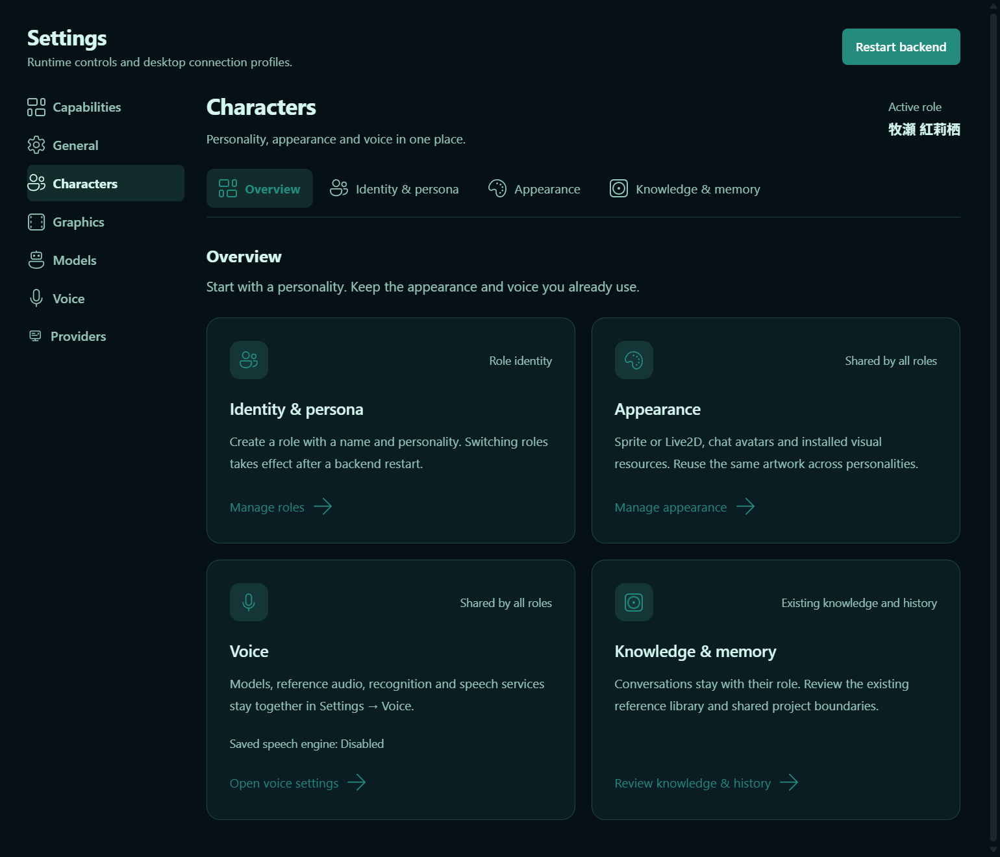
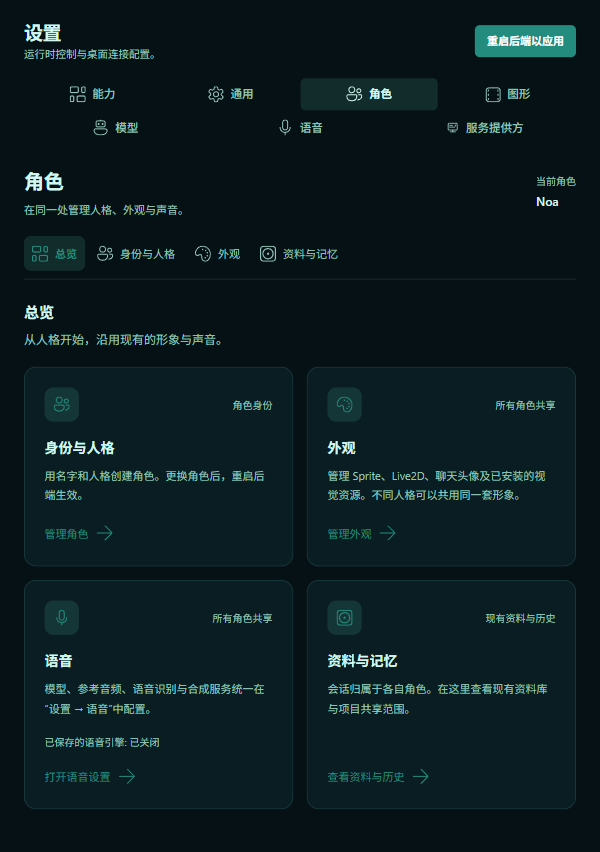

# Character setup inside Settings — 2026-10-09

Base: `5a353f0f753cb1b69563662ab0d07d1c9d4cb1bc` (merged #167).
This branch changes presentation and navigation. The separate Wallpaper startup
race repair is in #169; this branch does not depend on it.

## Product organization

- Settings keeps the main sidebar entry. **Settings → Characters** adds an
  overview and Identity & persona, Appearance, and Knowledge & memory tabs.
- Voice has **one editor, Settings → Voice**. The character overview only shows
  its saved synthesis-engine selection and a shortcut. Weight/checkpoint profiles,
  reference audio/transcripts, speech language, synthesis and recognition engines,
  remote services and credentials remain together. No second voice store exists.
- Appearance and voice are application-wide. Names/personality and conversation
  ownership are role-specific. A new role requires no new media setup; the UI does
  not add per-role asset bindings, a package installer, or a memory system.
- Existing Kurisu RAG controls move from optional model connections to Knowledge
  & memory. The page identifies this as Kurisu's existing library; it does not
  suggest that other roles have acquired that index.
- Settings owns save feedback, recovery and the restart action. The restart remains
  available for role-file edits that do not create a desktop-setting revision.
- Existing saved `visuals` navigation opens Characters → Appearance. Foreign-chat
  guidance points to the new identity editor. The runtime selection is not the
  pending next-start selection.

## Screenshots

[Before: existing M1 role editor](../character-management-2026-10-08/pending-role.png)
was inside Settings → General. This earlier evidence is a cropped editor view,
not a matching-viewport capture of the new overview.

The screenshots use an isolated model-less test profile and synthetic role Noa.
No user configuration, private media, model files or Live2D artwork is included.

## Verification

[Sanitized results](checks.json):

- `npm test` in `electron`: **330 passed**. Production Settings render tests cover
  the nested route, old visual destination migration, lazy panels and one copy of
  model/reference-audio controls in Voice, including while offline. Role lookup
  regressions cover loading labels and obsolete restart feedback after reconnect.
- `npm run build` in `electron`: passed. Only the existing large-bundle advisory.
- Targeted Python: **287 passed** across `test_attention_slice`,
  `test_auip_experience_surface`, `test_project_context_surface`,
  `test_character_profiles`, `test_character_startup`,
  `test_main_chat_character_prompt`, `test_system_settings`, `test_character_rag`,
  `test_session_character_scope`, and `test_visual_profile`. One existing Python
  `audioop` deprecation warning. Python runtime code is unchanged; the full Python
  suite was not rerun locally for this UI-only change.
- Fresh isolated prompt captures through
  `tests/test_character_prompt_snapshots.py --capture`: **465/465 byte-identical**
  to the saved pre-M1 `f66c5f9` captures (155 each for default Kurisu, name-only Mira,
  and Kurisu with `Synthetic persona override for regression.`). No fixture was
  recorded or changed. The older migration fixture's preheat exception remains
  outside this change.
- Extended actual Electron model-less journey: **22/22 checks passed**. This uses
  the unmodified official model-less smoke plus a local Playwright extension:
  open Settings → Characters; create Noa; select next start while Kurisu remains
  active; restart; verify Noa; verify restart remains available with no pending
  desktop revision; navigate tabs by keyboard; inspect Sprite without a preview;
  follow the Voice shortcut; save a synthetic Japanese reference transcript;
  navigate away/back and verify it persists without a second editor; reopen the
  old saved visual route; check English/Chinese and an 820 × 900 viewport. The
  native application and backend both exited normally.
- `electron/tests/characterVisuals.smoke.mjs` with caller-owned model/Core:
  **9 checks passed, errors=[]**. Production Settings navigation and the production
  Live2D preview rendered the real local model, saved/reloaded profiles, preserved
  drafts and disposed the preview on tab navigation. Control RPCs are fixtures;
  this does not qualify full Host Live2D execution or audio synthesis.

No live model conversation or ASR/TTS inference was invoked. Voice persistence
was verified, not voice quality. Local desktop configuration, assets and existing
conversations were not changed. Real-model preview screenshots stay local.

## Review follow-up

`character_pack` contains SpriteForge visual frames, not voice material. Its
resource card now joins Visual Runtime Pack and VN Companion Portraits under
Appearance. Voice's installed-resource group contains the emotion reference
audio pack. A production Settings rendering regression verifies both inclusions
and exclusions; it failed against the prior head and passes after the correction.

Fresh complete Electron tests: **331 passed**; production build: passed. This
classification repair changes no asset loading, prompt, identity, restart or
voice configuration behavior. Earlier Python, prompt-capture and native desktop
results above retain their original scope; they were not rerun for this card move.
