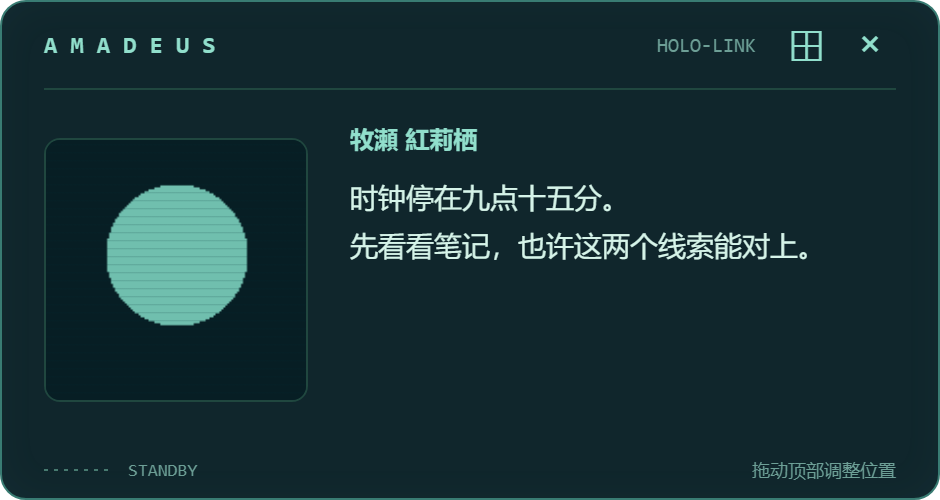
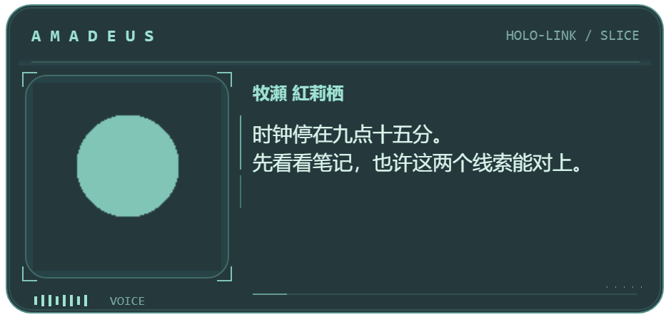
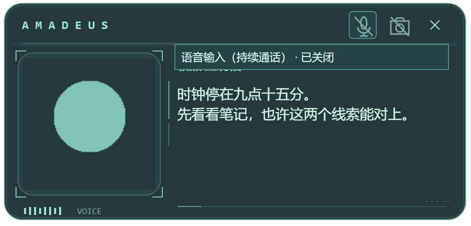

# Slice Companion visual alignment — 2026-10-03

The VN native card is the visual reference. These are real Electron compositor
captures with one synthetic portrait fixture and synthetic Host presentation/input
responses. No character media, conversations, credentials or machine paths are included.
Both before and after use 200% desktop scaling. Logical size changes from 470×250
to 470×226; the caption is the same. Before is standby and after is simulated speech,
so the signal bars differ as well as the frame. These are presentation references,
not a pixel-diff assertion or physical microphone/vision acceptance.

| Before | After |
| --- | --- |
|  |  |

The microphone and camera use the VN icon/off-state design. The focused hint describes
Slice's continuous voice input; the camera controls existing General vision observation.
There is no standalone dock or idle-motion toggle. Window controls stay contextual.

Validation: Electron production build; 177 frontend unit tests; 24 native card/input
checks at normal monitor scaling and a separate 150% run; real Host + installed Lite
atlas smoke (11 checks, no models/audio). Native inputs are fixtures; the Lite smoke
covers playback, hidden pause/resume, renderer release, missing art and legacy PNGs.
The native visibility test injects the visibility boundary event; the real Lite smoke
exercises actual hiding and showing. Keyboard-control screenshots activate only the
test-owned window, since an inactive window's DOM focus alone does not paint focus UI.
