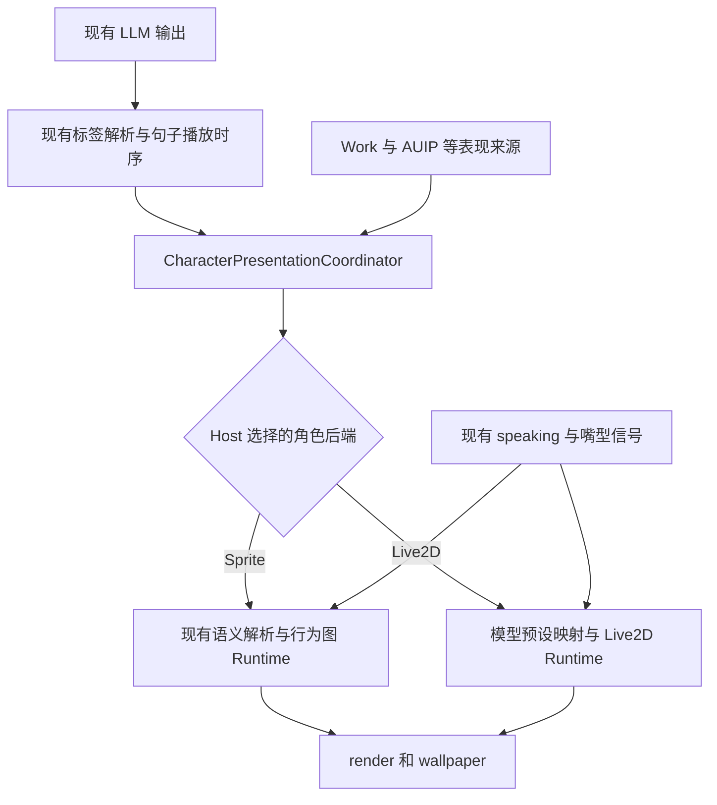

# Live2D 支持分支提案

日期：2026 年 10 月 8 日。状态：已在 `codex/live2d-character-renderer` 实施实验支持，已取得 P0、生产 Runtime 双展示面、Settings GUI 与原生 Main Host 的分层证据；Sprite 往返、连接恢复、SDK 错误/加载竞态及跨模型取景检查均已通过。

本文保留最初设计依据与目标，不能把设计表中的完成条件直接当作全部已验收。当前使用、职责、结果及限制见 [角色形象与 Live2D 实验支持](live2d_character_visuals.md)。

目标是在 LLM 输出、情绪标签和 TTS 播放链不变的前提下，增加可选择的 Live2D 角色后端。选择 Sprite 时继续使用现有行为图和 SpriteForge Runtime；选择 Live2D 时，在 Electron render 和 wallpaper 两个展示面显示同一个所选模型，并正确触发表情、随语音张嘴、结束和打断。

实施分支为 `codex/live2d-character-renderer`。本文最初设计审查基线为 `f66c5f95a693727453a6eb614118500e271a730d`；后续实现与验收在同一实验分支推进。

**旧 internal 实现仅用于理解功能与历史行为，不构成代码、格式、依赖或架构的复用要求。** 新实现按当前主线职责重新设计。应复用的是仍然正确的当前主线契约；旧 Qt、VTS 预设、hybrid 状态机及渲染器均可舍弃。

## 旧实现调研结论

internal checkout 位于本机 `amadeus` 目录，读取到的 HEAD 为 `1b93224c40c7a250fe41a161a7f2e9dc430d0fc8`。除当前归档代码外，还检查了历史提交 `821232417b06880ab270983228d5a0f8af7f417c`，其时间为 2026 年 5 月 27 日。不能将归档文件仍存在视为当前功能已经接通，也不能将旧实现视为真实模型验收结果。

| 历史能力 | 已核实的实现 | 对新方案的启示 |
| --- | --- | --- |
| 模型加载与就绪 | 旧 Web renderer 有 `loadModel`、`isReady`、`onModelLoaded`，关闭自动交互后自行接入拖动 | 新后端需要真实模型就绪回执；发出加载命令不等于加载成功 |
| 布局与交互 | 旧版按 `app.screen` 的逻辑尺寸、模型原始高度计算基础缩放，另加用户偏移/倍率；支持拖动和保存布局 | 模型原始尺寸、展示面视口、用户调整应分开，不能反复以已缩放的显示尺寸计算比例 |
| 嘴型 | 历史 renderer 直接写 `PARAM_MOUTH_OPEN_Y`，与本地模型声明一致 | 当前 `ParamMouthOpenY` 硬编码不适配本地模型；新实现应读取模型 LipSync 声明 |
| 表情预设页 | 旧 PyQt 页面支持淡入、淡出、overlap、自动回 idle、保存与热加载，以及测试按钮 | 预设配置和即时验证确有产品需求；旧 UI 代码与全局 timer 行为没有保留义务 |
| 预设目标 | `emotion_presets.json` 的 `expressions` 是 VTS 表情文件名，部分 `params` 是 VTS 输入参数，如 `EyeOpenL`、`BrowInnerUp` | VTS 参数名、Cubism 参数 ID、模型 expression 名是不同命名空间，不能直接导入等同使用 |
| hybrid | 待机显示 Live2D，说话时与 Sprite 交叉淡化，再返回 Live2D | 旧版目标和本次“人物持续由 Live2D 绘制”不同；新分支不恢复 hybrid |
| 本地运行资源 | internal 中存在 Cubism Core，public checkout 存在 Kurisu 模型与其引用资产；两个 checkout 的 Pixi Live2D adapter 文件散列相同 | 无需假设用户缺模型或整台机器缺 Core；已有二进制仍需确认版本匹配和运行结果 |

历史变更 `c9610b8e7e02e38f92a07d0c5da44c3d0fcce73f` 大幅精简了 renderer，移除了上述布局/拖动等代码，并将嘴型 ID 改为 `ParamMouthOpenY`。这一点解释了为什么当前保留的壳比旧实现薄；不要求反向恢复整次改动。

本地模型 `assets/models/live2d/Kurisu2_vts/kurisu.model3.json` 注册了 `Angry`、`Disappointed`、`Smile`、`Thinking` 四个表情，三个 Idle motion 和九个 Motion 条目，LipSync 参数为 `PARAM_MOUTH_OPEN_Y`。已检查的 20 个文件引用均存在。四个表情文件没有写开合参数；其中部分写 `PARAM_MOUTH_FORM`，因此可分别表达情绪嘴形和语音开合。motion 与嘴型更新的实际叠加仍需运行验证。

## 首版范围与完成定义

首版以 Windows 上当前 Electron render 与 Electron wallpaper 为验收对象。两者共享角色类型和模型选择，各自保存布局。外部 Wallpaper Engine、Lively、其他平台及 Companion/VN 专用形象，只有取得各自实机证据后才纳入支持声明。

首版必须完成：

- 用户能选择 Sprite 或 Live2D，选择本地 `.model3.json`，看到加载结果，并在重启后恢复选择。
- 四个已有模型表情可手动预览、配置到现有 `emo`，并在真实聊天播放时触发。
- Live2D 按现有 TTS 幅度连续开合；Sprite 保持现有嘴部动画；结束、抢话和切换后不残留张嘴状态。
- 两个展示面都能正确定位、缩放和裁剪 Live2D，字幕、背景、工作界面继续正常工作。
- 切换、重载和关闭具有明确资源生命周期；缺少 SDK 或坏模型不会阻断聊天/TTS，也不会假报模型就绪。

首版不制作睡觉、喝咖啡、电脑操作等新模型动作，不增加人脸追踪、音素级口型、MotionSync 插件或通用动画编辑器，也不承诺任意版本/任意模型可用。默认角色类型仍为 Sprite，Live2D 是用户显式选择的可选能力。

## 设计与职责

主要问题属于表现抽象与集成边界：当前协调器已经拥有来源优先级，但将语义过早转换为 SpriteForge 节点；现有 Live2D 壳没有接入同一生命周期。修复应落在这两个边界，不增加 LLM 调用、Host 情绪分类器或另一套表现仲裁器。

| 责任 | Owner 与约束 |
| --- | --- |
| LLM 标签及 TTS 情绪 | 现有 parser、ChatRuntime 和 TTS；标签语法、提示词和声音选择不变 |
| 来源优先级与释放 | 现有 `CharacterPresentationCoordinator`；保留 utterance/ambient、source ownership、`after_speech`/`immediate` |
| 角色类型及配置 | Host；`sprite/live2d` 与 `render/wallpaper` 分开。模型路径不成为角色人格、会话或 Work 身份 |
| 语义到具体表现 | 被选择的后端适配。Sprite 的随机节点选择仍在后端广播前执行一次，两个展示面不能独立抽签 |
| SDK 调用与每帧更新 | Live2D Runtime；不读取会话推断当前情绪，不申请执行权限 |
| 嘴型来源 | 当前音频播放链；不依赖 VTS 连接，不重新分析一次 TTS 或播放第二份音频 |
| 布局与可见性 | 展示面提供视口、mask 和可见性；模型按同一生命周期契约响应 |

在协调器的表现输出处选择适配器，保留原始语义供重新加载或切换后恢复。不要先生成 `speaking_trans` 再尝试反推 `thinking`。SpriteForge 的图资源、纹理、节点执行逻辑维持原有职责；Live2D 不伪装成行为图节点，也不加载 Sprite 纹理来驱动嘴型。

建议将现有语义 intent/release 的传输边界改为角色通用命名，例如 `render.character_intent` 和 `render.character_release`，沿用必要的 source、handoff 信息；具体名称在实施时定稿。同步更新所有仓库内生产者、订阅白名单和两个展示面，替代旧语义事件，而非长时间双播。图资源加载等真正属于 SpriteForge 的命令继续专用。只有发现外部活跃调用者时才保留明确的版本兼容入口。

这是一处已有边界的调整，不建设通用插件框架或新的表现协议平台。切换后的恢复读取当前有效 claim 和播放状态，不制造新 claim，不重放已经结束的语句。

## Live2D Runtime

新写职责集中的适配器，提供加载/卸载、应用表情、接收嘴型/说话状态、设置视口、暂停/恢复和销毁。由真实异步结果报告 `loading/ready/error`，模型替换时防止较早加载请求覆盖用户较新的选择。

SDK 组合由第一阶段的真实模型验证决定，**不以复用旧 `pixi-live2d-display@0.4.0` 为前提**。优先评估能与当前 Pixi 场景可靠组合的 Cubism Web 集成；官方 Framework 直接集成也是候选。判断依据是本地模型、mask/图层、更新时钟、错误反馈和资源释放，不以代码新旧决定。若需要换依赖，应固定可验证版本；不为迁就适配器无依据地升级整套 Pixi，也不同时维护两个 Live2D 引擎。

若验证结果要求独立 canvas/WebGL context，必须同时证明 wallpaper 的裁剪、图层、颜色效果及资源开销可接受，再确定该方案。不能只以空白网页中的模型显示成功作为选型结果。

SDK 已支持从模型设置读取表情、加载 `.exp3.json`、播放 expression/motion、更新模型参数。表情混合与淡入淡出由所选 SDK 层管理；Host 不再复制一组同用途的 Qt/Python timer。[官方表情说明](https://docs.live2d.com/en/cubism-sdk-manual/expression/)

模型更新使用展示面统一时钟，接入现有帧率/可见性策略，避免渲染暂停而模型仍独立高频更新。旧 Pixi wrapper 的默认自动更新使用 shared ticker，实施时不能把 `app.ticker` 的限帧误当作所有更新均已限帧。[适配器更新接口](https://github.com/guansss/pixi-live2d-display/wiki/Complete-Guide#updating-a-model)

## 模型预设与配置页面

使用新的模型级预设配置。配置只包含模型入口、语义映射、必要嘴型设置及展示面布局，不继承旧 `emotion_presets.json` 的混合 VTS/Sprite 字段。模型包中的表情列表是实际能力来源，用户配置负责语义映射；不再维护一份手写能力清单。

角色类型/所选模型通过现有桌面设置与 Host 配置路径持久化；模型配置由一个明确的 store 保存并校验。渲染页使用 Host 下发的配置，不再自行读写另一份 localStorage 模型配置。用户预设与原始模型素材分开存储，修改预设不改写用户原始 `.exp3.json`。

本地模型的初始映射建议如下，作为可编辑配置而非硬编码角色特例：

| 现有语义 | 初始模型表现 |
| --- | --- |
| `smile`、`happy` | `Smile` |
| `thinking` | `Thinking` |
| `angry` | `Angry` |
| `sad`、`disappointed` | `Disappointed` |
| `normal`、neutral/释放 | 默认姿态或恢复仍有效的背景 claim |
| `work`、`serious_speaking` | 可配置为 `Thinking`，页面标明这是近似映射 |
| `shy`、`blush`、`surprised` | 明确使用默认姿态并标注缺少独立表现；允许用户改映射 |

`normal` 的默认表现只在 Live2D 适配内定义；不借此改写 Sprite 现有忽略 normal 的行为。释放 utterance 时若 Work 仍有有效 claim，应恢复 Work，而不是无条件清除全局状态。未识别标签使用明确默认表现并给出诊断，不假报存在对应表情。

新页面首版提供模型选择/状态、模型表情列表、EMO 映射、预览/复位、保存、嘴型测试以及两个展示面的缩放/位置设置。自动播放与预览调用同一 Runtime API。预览应使用独立预览实例，关闭后销毁，不通过全局 speaking 脉冲干扰正在播放的聊天；保存映射后重新应用当前有效表现。

表情默认持续到替换或来源释放，淡入淡出使用 SDK。参数滑块、复合多表情、可编辑持续时间及复杂 overlap 后置，避免首版同时引入多种结束规则。现有废弃 `ExpressionPage` 可以替换；不要求恢复其 UI 或 handler。VTS 的显式 EXPR/PARAM/HOTKEY 兼容输出不自动转译为 Cubism 参数。

## 嘴型与展示面

继续使用现有 `render.mouth` 幅度与 speaking/interrupt 信号。Sprite 保留现有嘴部覆盖逻辑；Live2D 缓存最新目标幅度，在每帧确定的更新阶段经过增益、限幅和适当平滑后应用。参数 ID 从 `.model3.json` 的 LipSync 组读取，并核对实际模型参数范围；只有模型未声明时才允许用户指定经过验证的参数。

表情负责如 `PARAM_MOUTH_FORM` 的情绪嘴形，语音负责开合。处理 motion/表情/physics 的更新顺序，避免最新嘴型被下一次 motion 更新覆盖。播放停止、打断、卸载和模型切换时清零语音嘴型目标；旧播放任务的尾部事件不得重新张嘴。SDK 官方支持以音频幅度驱动开合，首版不需要音素识别或 MotionSync。[官方嘴型说明](https://docs.live2d.com/en/cubism-sdk-manual/lipsync/)

render 与 wallpaper 共用 Runtime 实现和配置语义，各有实例与布局。render 使用角色区域，wallpaper 使用 CRT 视口与 mask；尺寸采用逻辑坐标，缩放基于模型原始尺寸。壁纸交互编辑只能在明确编辑状态发生，不能让模型自动交互破坏桌面点击穿透。

**Live2D 模式下停用现有角色场景替换。** 当前 scenario runtime 会隐藏前景角色并播放带旧人物的电脑操作、睡觉、喝咖啡等素材。如果不处理，壁纸仍会切回旧人物。首版保持 Live2D 可见，保留背景、环境层、字幕和工作 Canvas；相关 Work/AUIP 活动仍更新 Host 事实与表现 claim，只是不播放这些角色素材及其专属动作音效。切回 Sprite 后恢复原场景能力。以后制作 Live2D 活动动作应作为独立扩展。

## 实施阶段

| 阶段 | 交付与主要范围 | 完成条件 |
| --- | --- | --- |
| P0 真实模型与依赖验证 | 独立最小探针；本地 Kurisu、Core/Framework/adapter 版本；同当前 Pixi 场景组合 | 真正显示模型，四表情可切换，嘴型可开合，viewport/mask 可用；记录版本、截图与失败证据后选定一套 Runtime |
| P1 角色后端边界 | `server/character_presentation.py`、`render/spriteforge_intent.py`、协议与订阅、Host 配置 | 同一语义按选择进入一种后端；Sprite 随机路由仍只解析一次，来源释放与优先级不变 |
| P2 Live2D 角色与 render | 新的模型配置/Runtime、`render/headless_bridge.py`、render handler、页面加载 | 从正常 UI 启动 render，可选择模型，真实句子触发表情与嘴型，正常结束/打断可复位 |
| P3 预设页面 | 表情列表、映射保存、隔离预览、嘴型与布局设置；替换废弃页面接线 | 保存重启生效，错误可见，预览不改变正在运行的聊天，缺失表现有明确说明 |
| P4 wallpaper | wallpaper handler/bridge、`wallpaper_scene.js`、角色视口接口与场景策略 | 与 render 使用同一模型/语义，CRT 布局正确，活动场景不换回旧人物，Sprite 回切恢复原行为 |
| P5 生命周期与收敛 | 加载竞态、就绪重放、切换/关闭、限帧/暂停与释放；测试和文档 | 双展示面真实验收通过，清除被替代的旧 Live2D 壳和无活跃调用者的兼容入口 |

此表保留最初实施分解。P0 已取得真实模型与 RenderTexture/mask 结果，选用现有 Pixi 7.4.3 与 vendor adapter 0.4.0；后续改动在同一实验分支推进。正式支持范围依照已取得的分层证据声明，不由阶段名称或 mock 自动推出，也不因此重写 SpriteForge 或主线聊天。

## 验收矩阵

| 场景 | 必须观察到的结果 |
| --- | --- |
| Sprite 回归 | 同一 LLM/TTS 输入保留既有图选择、嘴型、收尾和工作姿态恢复；不加载 Live2D 依赖 |
| 依赖与坏模型 | 未选择 Live2D 时无影响；显式选择后报告具体错误，不回报 ready，不阻断音频/聊天；用户可明确切回 Sprite |
| 四表情与标签覆盖 | 手动预览与真实 EMO 触发相同表情；别名、缺失映射、默认姿态都有确定结果 |
| 嘴型 | 带停顿的固定音频上可见开合；不同情绪下仍有效；结束和抢话后闭嘴；不靠 VTS 在线 |
| 来源恢复 | Work 思考 → 聊天表情 → 聊天结束恢复 Work → Work 结束回默认；结束其他来源不能清掉当前说话者 |
| 同时展示 | render 与 wallpaper 启动顺序任意，获得同一选择/语义，不独立随机选择不同 Sprite 路由 |
| 重连与晚加载 | 模型加载成功后恢复当前状态；不会重放已取消表情、旧语句或旧嘴型 |
| 连续切换 | 加载过程中再次切换、坏模型后重试、往返 Sprite/Live2D；最后选择生效且没有残留模型/ticker/listener |
| 布局与壁纸 | 不同比例、DPI、窗口缩放下位置稳定，CRT 裁剪正确，字幕/Canvas/点击穿透保持正常 |
| 壁纸活动 | 电脑操作和闲置场景不隐藏 Live2D 或出现旧角色；切回 Sprite 恢复既有场景 |
| 资源与时钟 | 固定条件记录单面/双面 CPU、RAM、GPU、帧时间；重复加载卸载后无持续资源增长；隐藏/恢复遵守应用策略 |
| 配置与预览 | 保存后重启可恢复，模型缺失可修正；关闭预览后释放实例，聊天不被测试按钮打断 |

逻辑测试覆盖语义边界与双向回归；真实模型测试验证像素输出、运动与资源生命周期。mock、源码字符串断言和“调用了 expression”不能替代表情实际可见。性能先记录基线与测量条件，不预先声称 Live2D 比 KTX2 帧动画更省显存或 CPU。

## 证据与限制

以下路径相对各自 checkout。internal 内容仅用于本地调研，没有复制其业务实现或上传外部服务。

| 证据 | 定位 |
| --- | --- |
| 完整一些的历史 Live2D renderer | internal `821232417b06880ab270983228d5a0f8af7f417c:render/web/renderer.js`，1391–1561 行为模型/布局/嘴型；1760–1845 行为路由；1991 行起为 hybrid |
| 历史精简 | internal `c9610b8e7e02e38f92a07d0c5da44c3d0fcce73f`，`render/web/renderer.js` |
| 旧预设 UI | internal `legacy/pyqt/archive/chatGui.py.deprecated`，4000 行起；4046–4093 行为读写/热加载，4467–4497 行为测试 |
| 旧加载与布局桥 | internal `legacy/pyqt/render_engine.py`，266–270、515–605 行；归档 GUI 1331 行起 |
| 旧 VTS 预设 | internal `emotion_presets.json`；`vts/expression_controller.py` 的 `_fade_in_emotion` 将 expressions/params 发送给 VTS |
| 表现 owner | [character_presentation.py](../server/character_presentation.py)；当前职责与协议见 [实现说明](live2d_character_visuals.md#架构边界) |
| 实施前默认选择（调研基线） | 原基线 `server/app.py:1111–1207` 与 `server/handlers/wallpaper_handler.py:101–136,484`；现行选择见 [VisualProfileStore](../render/visual_profile.py) |
| 实施前 Live2D 壳与当前替代 | 原调研基线的 `render/web/renderer.js`；现由 [Live2DCharacter](../render/web/live2d_character.js) 与 [模型工厂](../render/web/model_character.js) 接入；[vendor compatibility](render_vendor_compatibility.md) |
| 实施前预设页断点与当前替代 | 原基线 `ExpressionPage.tsx` 请求未支持的 presets，现已移除；[Settings 内形象管理](../electron/src/renderer/components/CharacterVisualsPage.tsx) 与 [VisualHandler](../server/handlers/visual_handler.py) 使用模型能力及独立配置 store |
| 嘴型信号 | public [mouth_signal.py](../tts/mouth_signal.py) 与 `server/app.py:1205`，本地渲染为 primary sink |
| 实施前壁纸角色切换（调研基线） | 原基线 `render/web/wallpaper_scene.js:1654,1783,2099` 的角色隐藏及 Sprite 专用 mask/viewport；当前行为见 [实现说明](live2d_character_visuals.md#架构边界) |
| 资源发布边界 | [Core exclusion notice](../LICENSES/Live2D-Cubism-Core-NOTICE.md)、[release policy](../release/source_release_policy.json)；本地 Core/模型不自动获得 public 分发资格 |

可在 internal checkout 运行 `git show 821232417b06880ab270983228d5a0f8af7f417c:render/web/renderer.js` 复查历史实现。调研中 Git 历史读取成功；部分 worktree 状态查询受本地访问限制，因此未声称 internal 工作目录完全等于 HEAD。

最初调研仅有代码、历史与资产证据。后续已取得真实 P0 四表情/口型/mask、生产 Runtime 双展示面与独立 Settings GUI 预览证据，详见 [当前验收记录](live2d_character_visuals.md#已取得证据与限制)。

当前 GUI 入口为 Settings → 角色形象，配置使用独立美术 `profile_id`，默认仍为 Sprite。旧 `ExpressionPage` 已移除；未来 E-mote 只复用模型工厂与现有薄生命周期边界，本分支不提供 E-mote 实现。

真实原生 Main Host render 的 parser/controller/PCM/status 与真实 Host SSE 壁纸页已接通，统一可见人物 fit 已有截图；Sprite 往返、断线闭嘴与同 iframe 新 Host 恢复的 12 项真实检查、SDK 错误/加载竞态与跨模型取景的 9 项检查均已通过。最终相关 Python 回归为 29 个文件、210 passed/1 skipped，完整 Electron suite 为 262/262；独立 Settings GUI 9 项检查、TypeScript 和生产 build 通过。Electron Slice/WorkerW 仅验证 Canvas、keyboard、Companion 叠层，不包含 Live2D。默认 Lively 2.2.1.0/WebView2 的 production helper 已实际 mounted 并回报正确 profile ready，runtime/live2d-lively/report.json success=true；5 张原生 JPEG 覆盖模型、Smile 开闭嘴、Thinking 与 Work 活动保持 Live2D。真实 parser/controller 与固定 PCM 验证结束后恢复 Thinking。截图时临时将 AppFullscreenPause 从 0 改为 Ignore=1，finally 已恢复 0；这是验收播放条件，没有修改产品时钟或布局。测试 Host 已正常 shutdown，无 owned Host 进程残留；helper 已退出，测试 journal 与临时认证文件已清除。旧壁纸恢复要求已取消，未恢复旧画面。外部 Wallpaper Engine、其他平台、任意模型动作及长期性能未由这些结果验收。原生 GPU 信息识别 RTX 4070 系且加速 enabled；短 SwiftShader 样本与有限次销毁检查不能推断 VRAM/长期资源表现。模型 physics/4 motion 告警仍存在。
