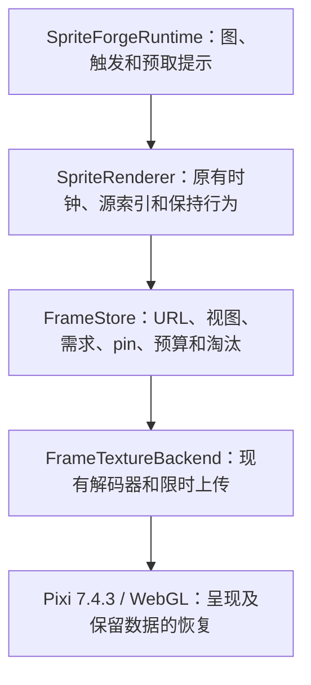

# 纹理管线：实现与自动验收记录

修订日期：2026-10-04。原主线基线为 `0e7b4840fc4dd7d036b5c76532af5becedd0ed13`。当前实现位于 PR #155 的 `codex/texture-pipeline-draft` 分支；后续修正在独立 worktree 完成。主目录和 main 未随本次审查修正而切换或更新。

**状态：统一 2 GiB 合计预算，审查后修正循环保留、预取暂停和增量记账；当前 eGPU 验收结果见第 7 节。PR 保持 draft。可见壁纸宿主、场景激活和语音模型并行负载仍未完成验收。**

本文件记录实际实现；离线研究脚本和统计保存在 [texture-pipeline-2026-10-03](evidence/texture-pipeline-2026-10-03/)。本轮只实施 WP0、修订后的 WP2/WP1、只管理纹理生命周期的 WP3。WP4–WP8 不自动进入施工。

## 1. 产品行为边界

以下是当前主线的实际契约，不是理想化的新播放模型。

- 不改变图节点、边权、随机抽签的代码触发条件与调用顺序、触发优先级、说话路由、闭嘴保持、过渡保持、释放计时和字幕/场景逻辑；不提前抽签。
- `RENDER_TEXTURE_SAMPLING` 仍默认关闭。关闭时保留每 tick 最多推进四个源帧和索引零循环通知；开启时保留现有采样时钟、必要帧和原始源索引。比如 120 帧、5 ms、30 FPS 呈现的片段，关闭采样时仍按旧路径约一秒播放。本轮不把它改成 0.6 秒。
- 缺帧时保留当前实际纹理；只有没有有效显示纹理时使用原有首次加载兜底。没有 `nearestResident`，不重新选择源帧来掩盖加载不足。
- URL 数组长度与索引、`anchorTrack`、`opennessByFrame`、`closedFrameIdx` 的含义保持。生命周期管理不重排素材、不修改像素或帧间隔。
- 画布尺寸只用于适配缩放；原始帧尺寸与底部居中定位保留。960 宽帧不能被当作 764 宽画布来设置 `Texture.orig`。
- 冷 hold 帧和嘴型资源到达时必须刷新实际显示；过期视图或被替换资源的异步完成不能覆盖当前画面。
- 保留 PNG 回退和公开的旧 transition API。它们是有实际接口调用者的资源路径，也必须登记所有权，不能销毁仍在播放队列中的纹理。

契约检查见 [采样/时钟测试](../tests/sprite_frame_sampling.test.cjs)、[画布测试](../tests/sprite_canvas_fit.test.cjs)、[纹理生命周期集成测试](../tests/sprite_texture_lifecycle.test.cjs)。另外执行了与 `0e7b484` 的只读差分检查：采样开/关、30/60 FPS、5/8/17/21 ms、不同片段长度、规则与不规则 tick、说话、hold、切换标签和循环通知共 24,000 次状态变化全部一致。该检查使用已驻留的帧；异步资源行为由生命周期测试与硬件探针另行验证。

上述等价指相同 tick 输入下的播放规则，不承诺不同实际调度和加载状态下的整场轨迹逐帧相同。WP1 修正节流、WP3 让资源及时可用后，实际绘制次数、循环通知和抽签发生的墙钟时间可能变化；不能将“规则未变”表述为新旧实机事件时间线完全一致。

## 2. 已验证的根因与设计取舍

原主线没有统一的应用纹理所有者和字节预算：帧数组、URL Promise、Assets loader/cache 长期持有资源，清掉一处引用不足以释放。Pixi GPU GC 可以回收 GPU 纹理，但不会释放应用保留的 CPU 数据。

原加载队列按片段串行，逐帧解码并让出时间，当前动作可能排在长期预载之后。旧 `_prepareTexture` 访问的是 `renderer.plugins.prepare`，而 bundled Pixi 7.4.3 的 Prepare 是 renderer system。只修这一行会给数千帧做无界预上传，因此上传必须纳入预算和生命周期。

呈现尾延迟是另一个独立问题。当前主线两轮 60 秒探针中，原始 rAF P99 约 16.8 ms，Pixi ticker P99 约 50 ms；原案门控又在正常 vsync 时丢弃余量，导致 75/165 Hz 下达不到目标平均帧率。

本轮保留**有预算的 CPU 数据**，继续利用 Pixi 的上下文恢复。没有新写 Basis worker、释放所有 CPU 副本、增加应急副本、干预 TextureGC，也没有保留一套默认打开的新旧加载路径开关。现有 parser 已提供资源解码和 worker 池接口，足以先完成这个边界。

## 3. WP0：可复现的当前源码测量

文件：[Electron 探针](../electron/tests/fpsTextures.probe.mjs)、[探针辅助代码](../electron/tests/textureProbe.mjs)、[隔离 Host](../tools/probes/wallpaper_memory_host.py)、[脱敏汇总工具](../tools/probes/summarize_texture_runs.py)。

- baseline/sample 模式都运行当前检出源码，不再偷偷替换成历史 renderer `c86177c`。mode 只表示采样开关；新旧实现由检出提交及源码 SHA-256 区分。
- 使用独立本地端口、浏览器 profile 和 model-less wallpaper Host，不连接用户后端、不调用模型、不发送聊天，音频静音。
- 固定输入时序和随机种子，直接调用真实 runtime；探针仅在同步图选择期间设置随机源，并在 finally 恢复。重复输入不等于已经预热，快照记录当前片段加载情况。
- 分开保存 `metadata.json`、`samples.ndjson`、`events.ndjson`、`journey.ndjson`、`summary.json`。浏览器事件定期排出，避免把完整历史在每次快照里复制一遍。
- 分开度量 renderer、GPU、Host 进程内存，另记 store 的驻留字节。原始 rAF 与 ticker 的时间间隔也分开记录。
- companion 测实际角色层抑制/恢复；scenario 只在可用资源存在时请求，未验证激活的状态仍写明 unverified。
- 上下文恢复不仅检查事件，还保持同一帧，分别从 GPU 提取像素并比较校验和及 GL 错误。旧探针曾将“已恢复事件但黑色矩形”误当成功，不能沿用这类结果作视觉验收。
- 原始文件保存在忽略的 `output/diagnostics/fps-textures/`。发布汇总排除个人路径、PID、端口和设备标识，保留相关版本、包、设置、指标与失败状态。

## 4. WP2：重验证、流式发送与连接复用

实现：[render/server.py](../render/server.py)。测试：[HTTP 合约](../tests/test_asset_server_http.py)、[本地服务安全](../tests/test_local_bridge_security.py)。

静态 GET/HEAD 共用安全路径解析与已经打开的文件。ETag 使用文件 size + mtime_ns 的弱校验器，附带 Last-Modified；If-None-Match 优先，匹配时返回无正文 304。所有 URL，包括带 `v=` 的 URL，都保留 `Cache-Control: no-cache`，不把 manifest.version 当成不可变内容身份。

HTTP/1.1 复用连接，正文按声明长度有界流式发送。文件增长不能越过本次响应边界，中途截短则关闭连接。动态路由、错误、HEAD、OPTIONS、304 的 framing 均有测试；服务关闭时释放空闲持久连接。没有改 URL 或 bridge 身份协议。

局限：刻意同时保留文件大小和纳秒 mtime 的内容替换不在元数据 ETag 的保证范围。304 的 transferSize 可能包含重验证响应头，不能仅凭 transferSize 为零判定成功。

## 5. WP1：保留相位余量的呈现门控

实现：[render_budget.js](../render/web/render_budget.js)。测试：[真实 Pixi 与时间戳测试](../tests/render_frame_gate.test.cjs)。

controller 关闭 Pixi 自带 maxFPS 节流，包裹该 ticker 的 update，在最接近目标时刻的 vsync 上呈现。正常超额余量结转；长停顿只丢掉完整错过的周期，不连续补发。未呈现的 vsync 不更新 Pixi 的 lastTime，因此下一次 update 仍获得完整经过时间，并保留 Pixi 的原有 delta 上限。

`controller.effectiveMaxFps` 是有效上限的来源。采样器在启动时从这里锁定采样率，不能再读取已经置零的 `ticker.maxFPS`。项目与宿主取较低有效上限，重复 apply 不重复包裹，宿主更改上限后重置相位。

测试覆盖 60/75/120/144/165/240 Hz，10/24/30/60/90/120/240 FPS 上限、抖动、停顿、重复时间戳和实际 bundled Pixi ticker。非整数刷新率下的长短间隔仍存在，但平均呈现率不能因为实现丢失余量而系统性降低。短程硬件测量中，无缺帧 idle 阶段 P99 已从约 50 ms 降至约 35 ms；这不是所有显示器/宿主的承诺。

## 6. WP3：唯一 URL 所有者与有界驻留

### 分层与 API



[frame_store.js](../render/web/frame_store.js) 不知道图、片段时长或采样规则。接口为：

```js
createFrameStore({ backend, budgetBytes, maxInFlight, onViewChange })
store.replaceViews(viewKey, urls)
store.replaceDemand(owner, [{ url, priority, deadline }], { load: true })
store.replacePins(owner, urls)
store.get(url)
store.stats()
store.destroy()
```

owner 的需求是替换，不是历史累计。多个 label/索引共享一个 URL 时只拥有一份纹理和一个字节账目。资源完成上传后才发布给当前视图；视图替换、取消和淘汰不能污染新数组。相同 URL 的新视图仍会重新获得现有资源，缩短数组也不会被旧索引回调重新撑长。

当前片段请求约 500 ms 前视窗口；图邻域/触发提示对循环片段请求约 250 ms 头部，对 `once_then_hold` 片段请求最多 750 ms，以覆盖 120 帧 × 5 ms 的短转场。图载入时从现有手动入口和 cfg 提取可能入口的头部提示，不调用 `_nextAutoNode`，不提前抽签。这一层由已拥有图语义的 runtime 提供信息，store 不解释图。

审查后增加当前循环的普通保留需求（优先级 80、`load: false`）：已播帧优先于全局 warm 头部（65）保留，仍可被当前窗口（100）和直接后继（90）淘汰。仅窗口启动加载，不预先解码整段，也不将整段 pin；片段本身装不下时仍遵守预算。一次性片段及 hold 不保留整个循环。

说话期间和结束后 900 ms，低优先级提示仍保留需求，只暂停新的加载；已经在途的任务可以完成。高优先级后继仍能加载。头部请求和循环成员按配置变化缓存；需求/显示 pin 只更新受影响 URL 的 owner，字节账目增量维护，pump 只考察待加载项，不再每帧扫描全部 7,552 个视图条目。预算压力下淘汰仍会考察驻留集合。

当前节点所有正概率直接后继都准备有限头部，包括 5% 这样的低概率分支；概率继续只参与原有播放选择，不提前抽签。这些直接后继统一使用 interactive（90），高于循环历史保留。runtime 也通过已有 `_postSpeechReleaseNode` 的确定性查询，保留说话结束后返回 root 或情绪释放节点的头部，不额外抽签。触发提示使用单个“最近触发” owner，新触发替换旧需求，完整 release 时撤回；空邻域撤回旧 graph-next 需求。这里改变的是资源需求的存续期和加载优先级，没有改变节点选择或随机调用次数。

显示帧、待显示 hold、海报/闭嘴必要帧、嘴型、旧 transition 注册和正在播放队列有显式 pin。切换节点不能先释放上一张实际显示的图。加载按优先级和截止时间调度，淘汰按需求优先级和 LRU；只有更弱的未 pin 资源可被新请求淘汰。已知容量不够时保留等待状态，不在每轮 pump 里反复解码。

加载失败不会定时重试。新的 owner 需求、重新进入当前播放窗口或优先级提升可以重试一次；相同需求和每帧截止时间刷新不会形成重试循环。永久必要帧 pin 不会阻止后来的实际播放需求重试。

### 预算与在途资源

所有 profile 统一使用 **2 GiB 的保留 CPU 数据 + 潜在 GPU 数据预算**，不新增公开配置。不是纯显存预算，也不是进程内存承诺。`graphicsProfile` 原有帧率、分辨率设置保持；默认关闭采样时，省电档仍会访问同样的源帧，不能按呈现率机械减半纹理预算。

初版把 standard/custom 合计限制在 1 GiB、省电档限制在 512 MiB，过于偏重内存。用户明确要求流畅优先后提高预算：2 GiB 标准档的一分钟重取从 1,415 次降至 87 次（仅提高预算的对照），但首次短转场尾部仍缺帧，因此再修订上述预取策略。省电档合计 1 GiB 的中间候选在加长一次性转场预取后仍有换入压力，最终也统一为 2 GiB；没有为了维持较小内存而默认开启采样。

必要 pin 构成不可淘汰下限，超过普通预算时在 `pinnedOverageBytes` 明示。最多三个在途任务；解码完成前无法从 URL 精确知道成本，因此临时 fetch/WASM/解码分配不能伪装成严格进程上限。已知临时数据另报 transientBytes；取消的不可中断转码直到实际结束才释放并发名额。

compressed CPU 字节按唯一 backing buffer 计算，GPU 按所有 level 数据计费；raster CPU 是 RGBA 解码数据估计，GPU 包含 Pixi 实际生成的 mip 层。PNG 继承旧 `Texture.from(img)` 的 BaseTexture 默认设置，包括 POW2 mipmap；不通过关闭 mipmap 改变缩小画质。`renderApp.getTextureStats()` 提供驻留、预算、pin 超额、队列、加载、重取、淘汰、失败和显示缺帧计数。GUI 和壁纸各有独立 store。

`loads`/`refetches` 是 store 发起加载/重复尝试数，不能称为“完成解码”。后端另报 KTX2 fetch、实际完成转码（包括随后取消的结果）和资源上传提交次数。`fetchedPayloadBytes` 是收到的正文大小，包含缓存读取，不是网络线上传输量；`transcodeMs` 含异步排队/往返，`textureUploadMs` 是同步提交的 CPU 时间，均不是 GPU 执行时间。上传计数覆盖 Pixi GC/恢复绕过队列的重上传，但资源返回成功并不证明 GL 无错误；恢复验收仍单独检查 GL 错误和像素。

### 解码、上传与恢复

[frame_texture_backend.js](../render/web/frame_texture_backend.js) 复用 `KTX2Parser.loadTranscoder/transcode` 和两个 worker。主线程 fetch 保留现有 file:// 支持；直接创建有明确所有权的 BaseTexture/Texture，不进入 Assets 或 Texture.from 全局缓存。PNG 回退沿用旧 URL 规则，失败可见。

上传在 Pixi system ticker 的队列里逐项完成，每次回调约 2 ms 后停止继续处理；单次同步 GL 上传不可中断。保留 CPU 数据，按每个显示面的统一预算约束。没有 TextureGC 包裹或额外恢复状态机。

硬件测试发现 bundled Pixi 7.4.3 恢复后未重新启用压缩纹理扩展，导致 INVALID_ENUM 和黑色矩形，原 main 也能复现。后端在有压缩纹理需要恢复时，按新的 CONTEXT_UID 调用 context owner 的 `getExtensions()`，再恢复上传/绘制。该路径保留原 CPU 数据，无重新解码。未来升级 Pixi 时重新核对是否需要该适配。

上游已在 [PR #11299](https://github.com/pixijs/pixijs/pull/11299) 修复，不新建重复 issue。2026-10-04 核对的上游 main `3b6b5635deb9edd09f3eafd548b1e82685853ea7` 和默认 dev `5b41ee37fd36c61e089113345a8f12cf1c3323cf` 均包含刷新扩展的逻辑；[官方 v7.4.3](https://github.com/pixijs/pixijs/blob/07f7fc11546cdd4d54398f034dc5da628f8d47dd/packages/core/src/context/ContextSystem.ts#L343-L346) 缺少它。未对当前上游做硬件测试，未发布报告或分享实现。

## 7. 证据、命令和验收边界

### 审查后的 eGPU 对照

本次显卡环境已改变，实际 WebGL 渲染器为 **RTX 4070 Ti SUPER / ANGLE D3D11**。修正前基线为 `29a3bad`（PR 原逻辑 + 同样的测量计数），候选为 `7b20ffe`。两者均复用主目录依赖和素材，独立进程/profile 顺序运行；30 FPS、custom、采样关闭、resolution=1、DPR=1、seed=103、600 秒旅程，另测 companion 和上下文恢复。没有将这批绝对数值与旧 780M 的测量混为同机收益。

中间候选 `614ecbe` 在约 318 秒主动停止：第 69、99、144 秒说话结束时各缺少一次 idle 第 1 帧。当前循环保留暴露出原预取只覆盖图边、没有覆盖确定性说话退出路径的遗漏。随后补齐已知释放目标、提升直接后继到 90；新增测试在真实 store 预算压力下覆盖 root 和情绪退出路径，要求返回头部保留且不增加随机抽签。该中间记录作为未完成且发现回归的实验保存，不能当作通过结果。

| 600 秒播放期指标 | 审查前 | 本次修正 |
|---|---:|---:|
| KTX2 完成转码 | 22,601 | 17,193（−23.9%） |
| store 重复加载尝试 | 18,449 | 13,035（−29.3%） |
| renderer CPU 时间 | 326.08 s | 258.65 s（−20.7%） |
| Python Host CPU 时间 | 55.08 s | 42.97 s（−22.0%） |
| GPU 进程 CPU 时间 | 58.88 s | 58.15 s |
| 其他 Electron 进程 CPU 时间 | 106.99 s | 89.06 s |
| renderer 私有内存：结束 / 峰值 | 1,321 / 1,440 MiB | 1,365 / 1,428 MiB |
| GPU 进程私有内存：结束 | 1,621 MiB | 907 MiB |
| ticker P99 / 最大间隔 | 35.5 / 205.6 ms | 35.2 / 53.1 ms |
| ticker 间隔 >50 ms | 9 | 12 |
| store 缺帧尝试（含启动） | 16 | 20 |

候选缺帧集中于启动和第一次说话，后续旅程未再记录；不能宣称零缺帧，也不能凭一次成对实验认定最大间隔改进具有统计稳定性。两轮无失败加载、预算阻塞、pin 超额、掉事件或 GL 错误，源码未在测量中变化。候选上下文恢复前后像素 hash 均为 `f098e0fe`，companion 的抑制/恢复已观察；GPU 进程内存不等于 VRAM。驻留预算仍是 2 GiB 的 CPU+潜在 GPU 合计，renderer 内存峰值基本持平。

**剩余代价明确存在：17,193 次仍明显高于旧 main 记录的 6,150 次；这次没有满足“总解码接近 main”的审查目标。** 当前循环的反复解码已在容量实验中消除，但多片段切换仍会发生重取。先保留 CPU 副本及已验证的恢复路径；若继续压低跨片段重取，应把释放 CPU 副本、Pixi GC 重新上传和上下文丢失后的整体重载作为下一项完整生命周期改动验收，不能只把 CPU 预算改成零。PR 继续保持 draft。

补充的 60 秒检查均完整结束、源码未变化、无掉事件、GL 错误、加载失败或 pin 超额，恢复前后像素一致：

| 当前 eGPU 路径 | ticker P99 / 最大间隔 | store 缺帧尝试 | 重复加载尝试 |
|---|---:|---:|---:|
| standard / 60 FPS / 采样关 | 18.8 / 38.2 ms | 24，集中于启动和首次说话 | 128 |
| custom / 30 FPS / 采样开 | 35.0 / 35.7 ms | 18；含 repeat-speech、repeat-idle 各一次 | 0 |

采样开启的两次后续缺帧均保留了上一张实际纹理；本次仍不将该可选路径称为零缺帧。默认采样设置未改变。

CPU 统计用 Electron 各进程累计 CPU 秒及 Python `psutil` 的 user+system 秒，按同 PID 的有效相邻区间作差；100% 表示占满一个逻辑核。renderer（含转码 worker）、GPU、其他 Electron 进程和 Python Host 分别汇总。缺失值、PID 更换或计数倒退的区间标为 unavailable，不补零。没有测整机功耗。

每帧 API 合成实验使用相同的当前窗口和显示 pin 更新，以及随后的 pump：7,552 个注册条目、883 个 warm 驻留条目、120 帧循环。仅改变未使用的注册条目数到 15,104，验证空闲元数据不再让更新成本线性上升。它不含网络、真实解码或 GPU，不能代替硬件 CPU 测量。脚本见 [benchmark_frame_store.cjs](../tools/probes/benchmark_frame_store.cjs)。

| 注册条目 | 修改前 P50 / P99 | 修改后 P50 / P99 |
|---|---:|---:|
| 7,552 | 0.243 / 0.492 ms | 0.011 / 0.034 ms |
| 15,104 | 0.478 / 1.212 ms | 0.011 / 0.034 ms |

使用实际包帧尺寸、7,552 个 URL、883 个入口头部和静态 pin 的容量模拟：600 帧 butterfly 循环第二/三圈加载从 599/599 降为 0/0；738 帧 closed-eye 从 737/737 降为 0/0，预算均未超过 2 GiB。120/290/360 帧三个循环在该模拟中修改前后都为 0/0，因此未复现“360 帧必定每圈重解”的断言。模拟采用立即完成的假解码/上传，没有动态 graph-next/hold owner 或真实 GPU；相应边界另由实际 store 的预算压力测试和上述硬件旅程覆盖。

### 780M 历史对照及未采用结果

以下为原环境，保留用于说明 PR 的初始收益和审查发现，**不代表本次修正版的 eGPU 结果**。

| 600 秒旅程指标 | 原 main `0e7b484` | 审查前 PR，2 GiB 合计预算 |
|---|---:|---:|
| ticker P99 | 50.3 ms | 35.2 ms |
| 间隔 >50 ms | 274 | 10 |
| renderer 私有内存：结束 / 峰值 | 4,830 / 4,936 MiB | 1,353 / 1,451 MiB |
| GPU 进程私有内存：结束 / 峰值 | 2,325 / 2,384 MiB | 1,986 / 2,140 MiB |

审查前 PR 记录 store 加载尝试 20,672 次、重取 16,514 次。这不是“完成解码 20,672 次”；原 main 的 6,150 是不同计数边界的 completed 值，且没有 CPU 进程时间，不能据此直接计算 CPU 倍率。但持续重取本身确实暴露出驻留策略问题，促成本次循环保留和预取暂停修正。

审查前长测全程记录 15 次探针缺帧尝试（14 次启动、1 次首次说话），恢复像素一致，无 GL 错误。旧 main 的恢复曾出现黑色矩形和 GL 错误；旧探针只检查事件，`complete=true` 不能证明视觉恢复通过。早期上下文探针自身也有失败记录。

未采用的紧预算长测（1 GiB 合计）虽将 renderer 结束内存压到约 790 MiB，却有 29,761 次重复加载尝试、51 次探针缺帧；512 MiB 省电候选的 first-idle ticker P99 为 55.3 ms。早期较弱预取也曾在 5% 分支缺少开头帧。没有把这些失败删除后称原候选通过。完整 24 轮历史测量保存在本地忽略目录；仓库只保留原 main、审查前采用方案和本次前后对照的精简汇总及上述不利结论。

旧 standard/60 和 sampled/30 的通过记录属于审查前实现；本次修正另测并单列结果。采样仍默认关闭。原离线研究只抽样 796/7,552 帧（10.54%），Node 转码及静态画质样本不是浏览器吞吐或动态画质保证，不用作本轮收益。

证据见 [texture-store-2026-10-04.json](evidence/texture-store-2026-10-04.json)。`phaseSelection` 说明被省略的重复 soak 阶段；保留全部阶段合计、最差缺帧/失败/时延阶段、恢复结果和源码 hash。候选实际被测源码以逐文件 SHA-256 和 `sourceChangedDuringRun` 为准。

### 复现命令

本次修正相关 Node 契约 **99 项通过**，包含 17 项生命周期集成契约；相关 Python 检查 **72 项通过**，包含 26 项汇总工具测试。审查前 PR `4ef9370` 的 GitHub CI 已全部通过；新提交需要重新运行 CI，不能沿用旧提交的绿色状态。

历史完整 Python runner 为 4,882 通过、6 跳过、5 预期失败，另有一项本机配置相关失败：`test_gpt_sovits_sidecar_backend.py::test_embedded_backend_preserves_synthesis_request`。本机 `.env` 开启 V3 情绪路由后，FakeInferencer 缺少 `model_version`；原基线同样失败。仅在测试进程关闭该开关后套件 15 项通过，用户配置未修改。本次没有重跑整套 Python，也不把这一历史本机运行改写成全绿。

本次 Electron 191 项测试与构建、变更 Python 文件的 Ruff 检查通过。发布证据由约 1.20 MB / 24 轮全量结果收敛为约 176 KB，包含 6 轮基线/采用方案精简结果和一份中间回归摘要；完整记录保存在本地忽略目录。

从仓库根运行基本契约：

```powershell
node --test tests/render_frame_gate.test.cjs tests/frame_store.test.cjs tests/frame_texture_backend.test.cjs tests/sprite_texture_lifecycle.test.cjs tests/sprite_frame_sampling.test.cjs tests/sprite_canvas_fit.test.cjs electron/tests/textureProbe.test.mjs
.venv/Scripts/python.exe -m pytest -q tests/test_asset_server_http.py tests/test_local_bridge_security.py tests/test_render_budget.py tests/test_wallpaper_asset_revision.py tests/test_texture_probe_summary.py
npm --prefix electron test
npm --prefix electron run build
$env:UV_OFFLINE = 'true'
uv run --locked --no-sync python -X utf8 tools/run_tests.py
```

硬件探针需要本地已有 `.venv`、Electron 和合法安装的角色素材。分别检出基线/候选，不同时运行，不在测量期间修改源码或运行重负载测试。示例：

```powershell
$probeRoot = (Get-Location).Path
Start-Process -FilePath "$probeRoot/electron/node_modules/electron/dist/electron.exe" `
  -ArgumentList @('tests/fpsTextures.probe.mjs', 'baseline', '30', '--sampling', 'off', '--duration-seconds', '600', '--seed', '103', '--companion', '--scenario', '--context-loss') `
  -WorkingDirectory "$probeRoot/electron" -WindowStyle Hidden -Wait
```

另测 sampled/on、60 FPS、`--profile power_saving`（30 FPS）与 `--profile standard`（60 FPS）。baseline/off 仍表示当前源码关闭采样，不代表自动切回旧实现。

使用 `tools/probes/summarize_texture_runs.py --run name=RUN_DIRECTORY --compact --output FILE` 生成脱敏精简汇总；省略 `--compact` 保留全部阶段。汇总保留未完成、掉事件、源码变化、GL 错误和可选阶段的未验证状态；尾部 30 秒统计本身不等于稳态。`journeyMemory` / `journeyTailWindow` / `journeyCpu` 仅使用明确标记为 journey / journey-complete 的样本，以免上下文重置污染播放期比较；缺少 CPU 计数时明确不可用。`memory` / `tailWindow` 则保留全部样本。

`journeyGaps` 根据 metadata.journey 中明确列出的阶段汇总原始 RAF/ticker 间隔，不对各阶段 P99 求平均；缺少阶段标签或原始事件则标为 unavailable。诊断时可对单个探针进程设置 `TEXTURE_PROBE_CPU_PROFILE=1`，生成本地 `cpu-profile.cpuprofile`，metadata 与脱敏汇总会记录 `cpuProfiling=true`。CPU profile 含原始脚本 URL，仅保存在忽略目录，不纳入发布汇总；正式时延验收不启用它。

### 尚不能宣称的范围

- 离屏测量不等于可见 Lively/WebView2、Wallpaper Engine 或 macOS 宿主验收。
- 尚未验证 16 GB 机器长期同时运行语音模型，也没有以进程私有内存推算整机 RAM/显存节省。
- system ticker 上传队列、HTTP 条件重验证、CPU/GPU 驱动分配都存在平台差异；预算约束不等于首次所有动作在所有设备都零缺帧。
- scenario 请求不等于视频化；本轮没有新增视频播放路径，也未修改它的缓存管理、淡入淡出和时钟。

## 8. 后续工作包与回滚

WP4 提前抽签需要另证图决策等价；WP5 视频化涉及独立时钟、静态首帧开关和画质；WP6 裁边必须保留原始帧坐标，alpha > 2 不能当作完全透明；WP7 精确帧率、导出抽帧、分档和包 schema 都需生产端/消费端兼容验证。默认采样 D5 仍关闭。D3、D6 只影响相应未来工作包，不阻挡本轮。

回滚使用 PR 内可见提交，按逆依赖撤回；没有新增长期并存的旧加载开关。原加载代码的公开调用者已由 store 适配：帧、嘴型、旧 transition、PNG 回退均有契约覆盖。不要通过恢复无界缓存来掩盖缺帧，也不要为了达成内存目标修改时钟或默认开启采样。
