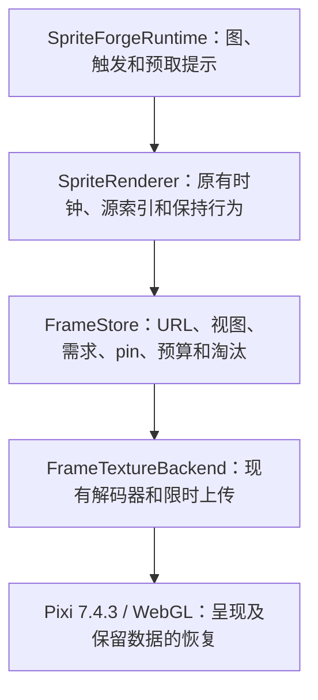

# 纹理管线：收窄后的施工方案与验收记录

修订日期：2026-10-04。开工基线：本地与远程 `main` 均为 `0e7b4840fc4dd7d036b5c76532af5becedd0ed13`。本轮在独立分支施工，未修改 main。当前实现分支为 `codex/texture-pipeline-wp3`；WP0、WP2、WP1 各自保存了前置分支与提交，便于分阶段审阅和回滚。

**状态：按用户“流畅优先，允许更高内存”的要求，采用统一 2 GiB 合计预算和修订后的预取调度，十分钟测量与恢复检查已完成。原 1 GiB / 512 MiB 候选仅作历史对照。完整 Python 测试有一项已在原基线上复现的本机配置相关失败。可见壁纸宿主和语音模型并行负载仍不在本次已验证范围。**

本文件取代原案中未经验证的伪代码。原始调研与工作包草案保存在本地历史提交 `2b20ed1` 的同名文件；离线研究脚本和原始统计继续保留在 [texture-pipeline-2026-10-03](evidence/texture-pipeline-2026-10-03/)。本轮只实施 WP0、修订后的 WP2/WP1、只管理纹理生命周期的 WP3。WP4–WP8 不自动进入施工。

## 1. 产品行为边界

以下是当前主线的实际契约，不是理想化的新播放模型。

- 不改变图节点、边权、随机抽签的代码触发条件与调用顺序、触发优先级、说话路由、闭嘴保持、过渡保持、释放计时和字幕/场景逻辑；不提前抽签。
- `RENDER_TEXTURE_SAMPLING` 仍默认关闭。关闭时保留每 tick 最多推进四个源帧和索引零循环通知；开启时保留现有采样时钟、必要帧和原始源索引。比如 120 帧、5 ms、30 FPS 呈现的片段，关闭采样时仍按旧路径约一秒播放。本轮不把它改成 0.6 秒。
- 缺帧时保留当前实际纹理；只有没有有效显示纹理时使用原有首次加载兜底。没有 `nearestResident`，不重新选择源帧来掩盖加载不足。
- URL 数组长度与索引、`anchorTrack`、`opennessByFrame`、`closedFrameIdx` 的含义保持。生命周期管理不重排素材、不修改像素或帧间隔。
- 画布尺寸只用于适配缩放；原始帧尺寸与底部居中定位保留。960 宽帧不能被当作 764 宽画布来设置 `Texture.orig`。
- 冷 hold 帧和嘴型资源到达时必须刷新实际显示；过期视图或被替换资源的异步完成不能覆盖当前画面。
- 保留 PNG 回退和公开的旧 transition API。它们是有实际接口调用者的资源路径，也必须登记所有权，不能销毁仍在播放队列中的纹理。

契约检查见 [采样/时钟测试](../tests/sprite_frame_sampling.test.cjs)、[画布测试](../tests/sprite_canvas_fit.test.cjs)、[纹理生命周期集成测试](../tests/sprite_texture_lifecycle.test.cjs)。另外执行了与 `0e7b484` 的只读差分检查：采样开/关、30/60 FPS、5/8/17/21 ms、不同片段长度、规则与不规则 tick、说话、hold、切换标签和循环通知共 24,000 次状态变化全部一致。该检查使用已驻留的帧；异步资源行为由生命周期测试与硬件探针另行验证。

上述等价指相同 tick 输入下的播放规则，不承诺不同实际调度和加载状态下的整场轨迹逐帧相同。WP1 修正节流、WP3 让资源及时可用后，实际绘制次数、循环通知和抽签发生的墙钟时间可能变化；不能将“规则未变”表述为新旧实机事件时间线完全一致。

## 2. 已验证的根因与设计取舍

原主线没有统一的应用纹理所有者和字节预算：帧数组、URL Promise、Assets loader/cache 长期持有资源，清掉一处引用不足以释放。Pixi GPU GC 可以回收 GPU 纹理，但不会释放应用保留的 CPU 数据。

原加载队列按片段串行，逐帧解码并让出时间，当前动作可能排在长期预载之后。旧 `_prepareTexture` 访问的是 `renderer.plugins.prepare`，而 bundled Pixi 7.4.3 的 Prepare 是 renderer system。只修这一行会给数千帧做无界预上传，因此上传必须纳入预算和生命周期。

呈现尾延迟是另一个独立问题。当前主线两轮 60 秒探针中，原始 rAF P99 约 16.8 ms，Pixi ticker P99 约 50 ms；原案门控又在正常 vsync 时丢弃余量，导致 75/165 Hz 下达不到目标平均帧率。

本轮保留**有预算的 CPU 数据**，继续利用 Pixi 的上下文恢复。没有新写 Basis worker、释放所有 CPU 副本、增加应急副本、干预 TextureGC，也没有保留一套默认打开的新旧加载路径开关。现有 parser 已提供资源解码和 worker 池接口，足以先完成这个边界。

## 3. WP0：可复现的当前源码测量

文件：[Electron 探针](../electron/tests/fpsTextures.probe.mjs)、[探针辅助代码](../electron/tests/textureProbe.mjs)、[隔离 Host](../tools/probes/wallpaper_memory_host.py)、[脱敏汇总工具](../tools/probes/summarize_texture_runs.py)。

- baseline/sample 模式都运行当前检出源码，不再偷偷替换成历史 renderer `c86177c`。mode 只表示采样开关；新旧实现由检出提交及源码 SHA-256 区分。
- 使用独立本地端口、浏览器 profile 和 model-less wallpaper Host，不连接用户后端、不调用模型、不发送聊天，音频静音。
- 固定输入时序和随机种子，直接调用真实 runtime；探针仅在同步图选择期间设置随机源，并在 finally 恢复。重复输入不等于已经预热，快照记录当前片段加载情况。
- 分开保存 `metadata.json`、`samples.ndjson`、`events.ndjson`、`journey.ndjson`、`summary.json`。浏览器事件定期排出，避免把完整历史在每次快照里复制一遍。
- 分开度量 renderer、GPU、Host 进程内存，另记 store 的驻留字节。原始 rAF 与 ticker 的时间间隔也分开记录。
- companion 测实际角色层抑制/恢复；scenario 只在可用资源存在时请求，未验证激活的状态仍写明 unverified。
- 上下文恢复不仅检查事件，还保持同一帧，分别从 GPU 提取像素并比较校验和及 GL 错误。旧探针曾将“已恢复事件但黑色矩形”误当成功，不能沿用这类结果作视觉验收。
- 原始文件保存在忽略的 `output/diagnostics/fps-textures/`。发布汇总排除个人路径、PID、端口和设备标识，保留相关版本、包、设置、指标与失败状态。

## 4. WP2：重验证、流式发送与连接复用

实现：[render/server.py](../render/server.py)。测试：[HTTP 合约](../tests/test_asset_server_http.py)、[本地服务安全](../tests/test_local_bridge_security.py)。

静态 GET/HEAD 共用安全路径解析与已经打开的文件。ETag 使用文件 size + mtime_ns 的弱校验器，附带 Last-Modified；If-None-Match 优先，匹配时返回无正文 304。所有 URL，包括带 `v=` 的 URL，都保留 `Cache-Control: no-cache`，不把 manifest.version 当成不可变内容身份。

HTTP/1.1 复用连接，正文按声明长度有界流式发送。文件增长不能越过本次响应边界，中途截短则关闭连接。动态路由、错误、HEAD、OPTIONS、304 的 framing 均有测试；服务关闭时释放空闲持久连接。没有改 URL 或 bridge 身份协议。

局限：刻意同时保留文件大小和纳秒 mtime 的内容替换不在元数据 ETag 的保证范围。304 的 transferSize 可能包含重验证响应头，不能仅凭 transferSize 为零判定成功。

## 5. WP1：保留相位余量的呈现门控

实现：[render_budget.js](../render/web/render_budget.js)。测试：[真实 Pixi 与时间戳测试](../tests/render_frame_gate.test.cjs)。

controller 关闭 Pixi 自带 maxFPS 节流，包裹该 ticker 的 update，在最接近目标时刻的 vsync 上呈现。正常超额余量结转；长停顿只丢掉完整错过的周期，不连续补发。未呈现的 vsync 不更新 Pixi 的 lastTime，因此下一次 update 仍获得完整经过时间，并保留 Pixi 的原有 delta 上限。

`controller.effectiveMaxFps` 是有效上限的来源。采样器在启动时从这里锁定采样率，不能再读取已经置零的 `ticker.maxFPS`。项目与宿主取较低有效上限，重复 apply 不重复包裹，宿主更改上限后重置相位。

测试覆盖 60/75/120/144/165/240 Hz，10/24/30/60/90/120/240 FPS 上限、抖动、停顿、重复时间戳和实际 bundled Pixi ticker。非整数刷新率下的长短间隔仍存在，但平均呈现率不能因为实现丢失余量而系统性降低。短程硬件测量中，无缺帧 idle 阶段 P99 已从约 50 ms 降至约 35 ms；这不是所有显示器/宿主的承诺。

## 6. WP3：唯一 URL 所有者与有界驻留

### 分层与 API



[frame_store.js](../render/web/frame_store.js) 不知道图、片段时长或采样规则。接口为：

```js
createFrameStore({ backend, budgetBytes, maxInFlight, onViewChange })
store.replaceViews(viewKey, urls)
store.replaceDemand(owner, [{ url, priority, deadline }])
store.replacePins(owner, urls)
store.get(url)
store.stats()
store.destroy()
```

owner 的需求是替换，不是历史累计。多个 label/索引共享一个 URL 时只拥有一份纹理和一个字节账目。资源完成上传后才发布给当前视图；视图替换、取消和淘汰不能污染新数组。相同 URL 的新视图仍会重新获得现有资源，缩短数组也不会被旧索引回调重新撑长。

当前片段请求约 500 ms 前视窗口；图邻域/触发提示对循环片段请求约 250 ms 头部，对 `once_then_hold` 片段请求最多 750 ms，以覆盖 120 帧 × 5 ms 的短转场。图载入时从现有手动入口和 cfg 提取可能入口的头部提示，不调用 `_nextAutoNode`，不提前抽签。这一层由已拥有图语义的 runtime 提供信息，store 不解释图。

当前节点所有正概率直接后继都准备有限头部，包括 5% 这样的低概率分支；概率继续只参与原有播放选择，不提前抽签。说话期间，这些后继使用现有 interactive 优先级，避免被后台预载延迟规则阻塞；非说话期间为 warm。触发提示使用单个“最近触发” owner，新触发替换旧需求，完整 release 时撤回；空邻域撤回旧 graph-next 需求。原先区分高概率/可丢弃低概率预取的逻辑已移除，因为实测仍会导致抽中稀有分支时头部缺帧。这里改变的是资源需求的存续期和加载优先级，没有改变节点选择或随机调用次数。

显示帧、待显示 hold、海报/闭嘴必要帧、嘴型、旧 transition 注册和正在播放队列有显式 pin。切换节点不能先释放上一张实际显示的图。普通驻留按需求优先级、截止时间、LRU 管理；只有更弱的未 pin 资源可被新请求淘汰。已知容量不够时保留等待状态，不在每轮 pump 里反复解码。

加载失败不会定时重试。新的 owner 需求、重新进入当前播放窗口或优先级提升可以重试一次；相同需求和每帧截止时间刷新不会形成重试循环。永久必要帧 pin 不会阻止后来的实际播放需求重试。

### 预算与在途资源

所有 profile 统一使用 **2 GiB 的保留 CPU 数据 + 潜在 GPU 数据预算**，不新增公开配置。不是纯显存预算，也不是进程内存承诺。`graphicsProfile` 原有帧率、分辨率设置保持；默认关闭采样时，省电档仍会访问同样的源帧，不能按呈现率机械减半纹理预算。

初版把 standard/custom 合计限制在 1 GiB、省电档限制在 512 MiB，过于偏重内存。用户明确要求流畅优先后提高预算：2 GiB 标准档的一分钟重取从 1,415 次降至 87 次（仅提高预算的对照），但首次短转场尾部仍缺帧，因此再修订上述预取策略。省电档合计 1 GiB 的中间候选在加长一次性转场预取后仍有换入压力，最终也统一为 2 GiB；没有为了维持较小内存而默认开启采样。

必要 pin 构成不可淘汰下限，超过普通预算时在 `pinnedOverageBytes` 明示。最多三个在途任务；解码完成前无法从 URL 精确知道成本，因此临时 fetch/WASM/解码分配不能伪装成严格进程上限。已知临时数据另报 transientBytes；取消的不可中断转码直到实际结束才释放并发名额。

compressed CPU 字节按唯一 backing buffer 计算，GPU 按所有 level 数据计费；raster CPU 是 RGBA 解码数据估计，GPU 包含 Pixi 实际生成的 mip 层。PNG 继承旧 `Texture.from(img)` 的 BaseTexture 默认设置，包括 POW2 mipmap；不通过关闭 mipmap 改变缩小画质。`renderApp.getTextureStats()` 提供驻留、预算、pin 超额、队列、加载、重取、淘汰、失败和显示缺帧计数。GUI 和壁纸各有独立 store。

### 解码、上传与恢复

[frame_texture_backend.js](../render/web/frame_texture_backend.js) 复用 `KTX2Parser.loadTranscoder/transcode` 和两个 worker。主线程 fetch 保留现有 file:// 支持；直接创建有明确所有权的 BaseTexture/Texture，不进入 Assets 或 Texture.from 全局缓存。PNG 回退沿用旧 URL 规则，失败可见。

上传在 Pixi system ticker 的队列里逐项完成，每次回调约 2 ms 后停止继续处理；单次同步 GL 上传不可中断。保留 CPU 数据，按每个显示面的统一预算约束。没有 TextureGC 包裹或额外恢复状态机。

硬件测试发现 bundled Pixi 7.4.3 恢复后未重新启用压缩纹理扩展，导致 INVALID_ENUM 和黑色矩形，原 main 也能复现。后端在有压缩纹理需要恢复时，按新的 CONTEXT_UID 调用 context owner 的 `getExtensions()`，再恢复上传/绘制。该路径保留原 CPU 数据，无重新解码。未来升级 Pixi 时重新核对是否需要该适配。

上游已在 [PR #11299](https://github.com/pixijs/pixijs/pull/11299) 修复，不新建重复 issue。2026-10-04 核对的上游 main `3b6b5635deb9edd09f3eafd548b1e82685853ea7` 和默认 dev `5b41ee37fd36c61e089113345a8f12cf1c3323cf` 均包含刷新扩展的逻辑；[官方 v7.4.3](https://github.com/pixijs/pixijs/blob/07f7fc11546cdd4d54398f034dc5da628f8d47dd/packages/core/src/context/ContextSystem.ts#L343-L346) 缺少它。未对当前上游做硬件测试，未发布报告或分享实现。

## 7. 证据、命令和验收边界

### 当前采用的流畅优先方案

两轮 600 秒对照均为同机、同包、30 FPS、采样关闭、实际 resolution=1、DPR=1。旧主线 profile 名为 custom，新一轮为 power_saving；传入的最大帧率/分辨率和实际呈现设置相同。新代码各 profile 纹理预算统一，不用低帧率推定更小素材工作集。

| 指标 | 原主线 `0e7b484` | 当前 2 GiB 合计方案 |
|---|---:|---:|
| 播放期 ticker 间隔整体 P99 | 50.3 ms | 35.2 ms |
| 播放期 ticker 间隔 > 50 ms 次数 | 274 / 17,515 | 10 / 17,844 |
| 播放期 ticker 间隔最大值 | 51.8 ms | 51.1 ms |
| renderer 私有内存：600 秒时 | 4,830 MiB | 1,353 MiB |
| renderer 私有内存：播放期峰值 | 4,936 MiB | 1,451 MiB |
| GPU 进程私有内存：600 秒时 | 2,325 MiB | 1,986 MiB |
| GPU 进程私有内存：播放期峰值 | 2,384 MiB | 2,140 MiB |

全记录探针缺帧尝试为 15 次，其中 14 次在启动阶段、1 次在首次说话开始；后续完整旅程未记录到缺帧。不要把这描述为绝对零缺帧或零帧时间波动。约第 461 秒抽中 `idle2` 的同一 5% 分支已再次发生，其源帧 1/3/4 没有重现上一版的缺帧，且未增加随机抽签。

store 驻留峰值 2,147,426,208 字节，预算阻塞、必要 pin 超额和加载失败均为零。完整记录重取 16,514 次，低于紧预算长测的 29,761 次；预算和预取策略同时改变，不能把收益全部归因于其中一项。CPU 采样未证明需求计算是主要瓶颈，因此没有增加静态需求缓存或重写解码器。诊断性 CPU 采样记录单独标记，不代替未开启采样器的性能验收。

记录完整、源码未变、零掉事件、零 GL 错误。companion 的角色层抑制/恢复已观察；上下文恢复前后角色纹理校验和均为 `6bff95cb`，尺寸、RGB/alpha 总和一致。scenario 激活仍为 unverified。内存表仅使用播放旅程样本，不混入上下文重置后的内存下降。

当前代码另完成两组 60 秒验证：standard / 60 FPS / 采样关，整体 ticker P99 19.2 ms、最大 45.5 ms、启动后零缺帧，首次转场完整显示 36 次；custom / 30 FPS / 采样开，整体 P99 35.0 ms、最大 38.3 ms，store 无淘汰、重取 3 次。两组均无预算阻塞、加载失败或 GL 错误。采样仍是显式可选项，默认关闭。

证据中 `accepted-*` 为当前采用方案，`wp3-tight-*` 为初版紧预算对照，其他 `wp3-*` 为诊断与中间方案。失败或有帧时间尖峰的中间记录一并保留，没有用一次通过的短跑覆盖不利证据。

### 初版紧预算候选的历史对照（已调整默认值）

同机、同包、30 FPS、采样关闭，AMD Radeon 780M / ANGLE D3D11 / Electron 离屏。首次说话在启动三秒后触发，首次转场在十一秒后触发。

同为 600 秒的播放旅程，以下内存只统计进入 companion/scenario/context-loss 之前的样本，单位 MiB。原主线在该窗口仍有加载活动；候选持续按需加载/淘汰，不能把尾部窗口称为完全静止的稳态。

| 指标 | 原主线 `0e7b484` | 初版 1 GiB 合计候选 |
|---|---:|---:|
| renderer 私有内存：600 秒时 | 4,830 | 790 |
| renderer 私有内存：播放期峰值 | 4,936 | 942 |
| renderer 私有内存：尾部约 30 秒均值 | 4,828 | 830 |
| GPU 进程私有内存：600 秒时 | 2,325 | 1,171 |
| GPU 进程私有内存：播放期峰值 | 2,384 | 1,188 |
| GPU 进程私有内存：尾部约 30 秒均值 | 2,211 | 1,139 |
| 首次说话：纹理切换 / 缺帧尝试 | 2 / 145 | 149 / 0 |
| 首次转场：纹理切换 / 缺帧尝试 | 1 / 31 | 30 / 0 |
| first-idle ticker P99 | 50.7 ms | 34.8 ms |

这次紧预算长测记录完整、零掉事件、源码未变化。store 驻留峰值 1,073,651,424 字节，低于 1 GiB；必要 pin 超额和加载失败均为零。完整记录仍有 51 次探针缺帧尝试（含启动），并非零缺帧；store 计数为 52 次，因它还覆盖安装探针前的调用。窗口淘汰带来 29,761 次重新加载尝试，说明单纯追求低驻留有明显解码/IO 代价；本轮没有测整机能耗，也不宣称 CPU 用量必然下降。

companion 角色层抑制/恢复已观察；scenario 仅发送请求，激活仍标为未验证。上下文恢复前后角色纹理均为 764 × 1028，像素校验和 `88f96f3`、RGB/alpha 总和一致，GL 错误为空；截图显示正常。原主线长测的恢复阶段出现黑色矩形与 GL 错误，其旧探针只检查事件，因此不能用旧 `complete=true` 声称视觉通过。

另外保留前期两次 60 秒原主线及入口头部候选短测，用来展示启动期的差异：

| 指标 | 当前主线 | 收窄后的候选 |
|---|---|---|
| 60 秒 renderer 私有内存 | 两次约 2,688 / 2,884 MiB，仍在加载 | 入口头部候选约 707 MiB（其他短跑有 GC 波动） |
| 首次说话 5 秒内纹理切换 | 约 1–2 次 | 约 150 次 |
| 首次转场 | 约 1 次 | 入口头部预取后 30 次，目标请求无缺帧 |
| 已有帧 idle 的 ticker P99 | 约 50 ms | 约 35 ms |
| 60 秒 GPU 进程私有内存 | 约 554 / 628 MiB | 入口头部候选约 1,137 MiB |

GPU 进程的短程私有内存有上升，原因是候选主动上传有预算的资源；不能只报 renderer 的下降。十分钟同窗口对照中 GPU 进程峰值和尾部均值则下降。GPU 进程内存不是 GPU 纹理字节，不能和 store 预算混用；上下文恢复后的分配另列，不混入播放期比较。

初版三组 60 秒补测均完整结束、零掉事件、零 GL 错误、零加载失败、零 pin 超额，但流畅度结果仍不足以接受原预算：

| 档位 | 结束时 renderer / GPU 进程 MiB | store 驻留 MiB / 预算 | 首次转场缺帧尝试 | first-idle ticker P99 |
|---|---:|---:|---:|---:|
| standard，60 FPS，采样关 | 771 / 1,164 | 1,023 / 1,024 | 11 | 18.6 ms |
| custom，30 FPS，采样开 | 711 / 1,197 | 1,023 / 1,024 | 0 | 34.9 ms |
| power_saving，30 FPS，采样关 | 468 / 693 | 511 / 512 | 0 | 55.3 ms |

60 FPS 冷转场仍有缺帧，省电档的更小预算也存在换入压力和较高的尾延迟；不能把 custom/30 的结果推广到所有档位。采样开组只用于验证既有可选路径，默认值未变。

完整脱敏结果见 [texture-store-2026-10-04.json](evidence/texture-store-2026-10-04.json)。候选在提交前的工作区测量，metadata 的 revision 是当时的前置提交；实际被测源码以逐文件 SHA-256 和 sourceChangedDuringRun 为准。旧 loader 的逐阶段计数在新路径下明确为 null，加载/重取计数改看独立 store 统计。汇总也保留探针修正前的失败记录，不与最终通过记录混淆。

原离线研究的证据范围：包画像是 796/7,552 帧抽样（10.54%）；67.07% 包围盒面积不是逐帧全量保证。8.58 ms 与 1.55 ms 是 Node 单线程 60 帧样本，不是浏览器吞吐保证；分辨率画质来自 12 帧静态样本，尚未包含重编码及时间闪烁。这些研究不作为本轮实现收益。

### 复现命令

当前验证记录：相关 Node 契约 92 项通过（含探针辅助测试和 14 项生命周期集成契约）；相关 Python 检查 73 项通过（含 24 项汇总工具测试）。完整 Python runner 执行了 410 个套件，汇总 4,882 项通过、6 项跳过，另有 5 项预期失败，唯一非预期失败是 `test_gpt_sovits_sidecar_backend.py::test_embedded_backend_preserves_synthesis_request`。本机 `.env` 开启实验性 V3 情绪路由后，测试的 FakeInferencer 缺少 `model_version`；原基线同样失败，相关生产/测试文件本轮没有修改。仅对测试进程设置 `ENABLE_EXPERIMENTAL_V3_EMOTION_ROUTING=false` 后，该套件 15 项通过；用户配置保持原样。因此不把完整运行标成全绿。

Electron 191 项测试与构建、Ruff 全库检查和两项架构生成一致性检查已通过。运行时原始日志保存在本地忽略目录。

从仓库根运行基本契约：

```powershell
node --test tests/render_frame_gate.test.cjs tests/frame_store.test.cjs tests/frame_texture_backend.test.cjs tests/sprite_texture_lifecycle.test.cjs tests/sprite_frame_sampling.test.cjs tests/sprite_canvas_fit.test.cjs
.venv/Scripts/python.exe -m pytest -q tests/test_asset_server_http.py tests/test_local_bridge_security.py tests/test_render_budget.py tests/test_wallpaper_asset_revision.py tests/test_texture_probe_summary.py
npm --prefix electron test
npm --prefix electron run build
$env:UV_OFFLINE = 'true'
uv run --locked --no-sync python -X utf8 tools/run_tests.py
```

硬件探针需要本地已有 `.venv`、Electron 和合法安装的角色素材。分别检出基线/候选，不同时运行，不在测量期间修改源码或运行重负载测试。示例：

```powershell
$probeRoot = (Get-Location).Path
Start-Process -FilePath "$probeRoot/electron/node_modules/electron/dist/electron.exe" `
  -ArgumentList @('tests/fpsTextures.probe.mjs', 'baseline', '30', '--sampling', 'off', '--duration-seconds', '600', '--seed', '103', '--companion', '--scenario', '--context-loss') `
  -WorkingDirectory "$probeRoot/electron" -WindowStyle Hidden -Wait
```

另测 sampled/on、60 FPS、`--profile power_saving`（30 FPS）与 `--profile standard`（60 FPS）。baseline/off 仍表示当前源码关闭采样，不代表自动切回旧实现。

使用 `tools/probes/summarize_texture_runs.py --run name=RUN_DIRECTORY --output FILE` 生成脱敏汇总。汇总保留未完成、掉事件、源码变化、GL 错误和可选阶段的未验证状态；尾部 30 秒统计本身不等于稳态。`journeyMemory` / `journeyTailWindow` 仅使用明确标记为 journey / journey-complete 的样本，以免上下文重置后的内存下降污染播放期比较；缺少阶段标签时明确不可用。`memory` / `tailWindow` 则保留全部样本。

`journeyGaps` 根据 metadata.journey 中明确列出的阶段汇总原始 RAF/ticker 间隔，不对各阶段 P99 求平均；缺少阶段标签或原始事件则标为 unavailable。诊断时可对单个探针进程设置 `TEXTURE_PROBE_CPU_PROFILE=1`，生成本地 `cpu-profile.cpuprofile`，metadata 与脱敏汇总会记录 `cpuProfiling=true`。CPU profile 含原始脚本 URL，仅保存在忽略目录，不纳入发布汇总；正式时延验收不启用它。

### 尚不能宣称的范围

- 离屏测量不等于可见 Lively/WebView2、Wallpaper Engine 或 macOS 宿主验收。
- 尚未验证 16 GB 机器长期同时运行语音模型，也没有以进程私有内存推算整机 RAM/显存节省。
- system ticker 上传队列、HTTP 条件重验证、CPU/GPU 驱动分配都存在平台差异；预算约束不等于首次所有动作在所有设备都零缺帧。
- scenario 请求不等于视频化；本轮没有新增视频播放路径，也未修改它的缓存管理、淡入淡出和时钟。

## 8. 后续工作包与回滚

WP4 提前抽签需要另证图决策等价；WP5 视频化涉及独立时钟、静态首帧开关和画质；WP6 裁边必须保留原始帧坐标，alpha > 2 不能当作完全透明；WP7 精确帧率、导出抽帧、分档和包 schema 都需生产端/消费端兼容验证。默认采样 D5 仍关闭。D3、D6 只影响相应未来工作包，不阻挡本轮。

回滚使用各工作包分支/提交，按逆依赖撤回；没有新增长期并存的旧加载开关。原加载代码的公开调用者已由 store 适配：帧、嘴型、旧 transition、PNG 回退均有契约覆盖。不要通过恢复无界缓存来掩盖缺帧，也不要为了达成内存目标修改时钟或默认开启采样。
